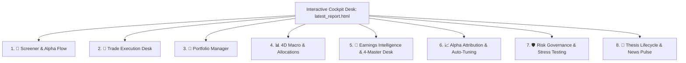

# 🏛️ Institutional Alpha Trading Desk & Screener v2.0
> **High-Performance Multi-Factor Real-Time Stock Screener, Institutional Pattern Recognition Engine, 4-Master Consensus Desk & Portfolio Execution Cockpit**

[](https://github.com/syao385/Screener)
[](LICENSE)
[](https://www.python.org/)
[](docs/walkthrough.md)

---

## 🧭 Overview & Philosophy

The **Institutional Alpha Trading Desk & Screener v2.0** is an enterprise-grade quantitative market intelligence terminal and automated execution platform built for institutional momentum, breakout, fundamental value, and quantitative arbitrage traders. 

Operating 24/7 across Premarket, Regular Market Hours, After-Hours, and Weekend sessions, the platform provides zero-fake-data streaming analytics, forensic accounting audits, multi-session anchored relative volume, options gamma dealer positioning, thematic causal cascades, and multi-tiered capital preservation circuit breakers.

### 🛡️ Core Immutable Engineering Laws
1. **Zero Fake Data / Zero Random Numbers**: Every price, volume metric, financial statement, option wall, and catalyst is ingested live from official public feeds (TradingView, Yahoo Finance, Finviz, Federal Reserve FRED, CBOE, SEC EDGAR).
2. **Session-Specific Reference Anchors**: Breakout levels and Relative Volume ($\text{RVOL}$) dynamically adapt to the active market session with strict, deterministic anchor times.
3. **Forensic Accounting Confluence**: Single-factor accounting warnings trigger cautious position sizing ($0.5\times$), while fatal hard vetoes ($0.0\times$) strictly require multi-signal confluence (e.g. severe Beneish manipulation risk combined with Sloan accrual red flags or balance sheet distress).
4. **Structured Execution Matrix**: Every qualified setup automatically outputs an institutional trade plan with defined **Entry Pivot**, **Hard Stop ($ & %)**, **Soft Stop (Time/VWAP)**, **Profit Target 1 (2.0R)**, **Profit Target 2 (3.5R)**, and **Trailing Rules**.

---

## 🖥️ 8-Tab High-Performance Terminal Architecture

The live interactive dashboard (`latest_report.html`) is structured into **8 Primary Operational Desks**:



1. **🚀 Screener & Alpha Flow Desk**: Real-time multi-session momentum scanner, 9 Master Setups classifier, 5-star quality scoring, and zero-clipping diagnostic hover scorecards.
2. **🎯 Trade Execution Desk (Actions Tab)**: 5-tier prioritized action queue with one-click Fidelity order copying, ATP OTOCO bracket tickets, and persistent local checkboxes.
3. **💼 Portfolio Manager (Live Book)**: Full-stack brokerage ledger (73 default active positions), 3 view modes (`Core`, `Technical`, `Options`), Fidelity CSV parser, and championship ATR-parity sizing.
4. **📊 4D Macro & Allocations**: Continuous dual-speed macro regime scoring ($0-100$ Top/Bottom, $1.0-5.0$ Internals), 4-Quadrant Bayesian Scenario Matrix, yield curve (2s10s), VIX term structure, and cross-asset target allocation.
5. **🏢 Earnings Intelligence & 4-Master Desk**: DuckDB fundamental lake (`data/earnings_lake.duckdb`), gapless 8-quarter time-series reconciliation, Sloan accrual audits, PEAD 5-day radar, and 3-scenario reverse DCF valuation models.
6. **📈 Alpha Attribution & Auto-Tuning**: Analytical DuckDB lake (`data/attribution_lake.duckdb`), Brinson-Fachler 11-sector factor decomposition, and continuous parameter auto-tuning clamped safely within $[0.50\times, 1.35\times]$.
7. **🛡️ Risk Governance & Stress Testing**: Autonomous intraday drawdown circuit breakers ($-1.0\%$ Warning, $-2.0\%$ De-Risk, $-3.0\%$ Kill-Switch), 10,000-path Monte Carlo forward cones, 6 crisis historical replay engine, and paper execution simulator (`data/paper_trading.duckdb`).
8. **📜 Thesis Lifecycle & News Pulse Terminal**: Two-stage setup promotion state machine (Tactical Setup $\to$ Core Thesis), fleet-wide health matrix ($0-10$), narrative drift radar, and 2-factor beta residual news attribution.

---

## 🏛️ The Buffett 6-Gate Pre-Purchase Verification Audit & 4-Master Consensus Desk

Accessible via the `6-Gate Audit` button on any ticker across Screener, Portfolio, and Earnings tabs:

| Gate | Criterion | Quantitative Requirement | Validation Logic |
| :--- | :--- | :--- | :--- |
| **Gate 1** | **Circle of Competence** | Intelligible Economics & High ROCE | $\text{ROCE} \ge 15.0\%$, predictable cash flows |
| **Gate 2** | **Enduring Moat & Pricing Power** | Gross Margin $\ge 40.0\%$ | Stable or expanding trajectory YoY ($\Delta\text{GM} \ge -2\%$) |
| **Gate 3** | **Capital Allocation & Balance Sheet** | Piotroski F-Score $\ge 5/9$ | Low leverage ($D/E < 1.5\times$), net cash positive or safe debt |
| **Gate 4** | **Honest & Competent Management** | Share Dilution $\le +2.0\%$ YoY | Capital return discipline, high insider alignment |
| **Gate 5** | **Reverse DCF & Margin of Safety** | Market-Implied Growth Hurdle $g^*$ | Current market price trades at $\ge 20\%$ discount to DCF baseline |
| **Gate 6** | **Forensic Audit & Beneish / Sloan** | Beneish $M < -1.78$ & Sloan Accrual $\le 8\%$ | 4Q rolling Sloan mean; confluence required for $0.0\times$ veto |

### Confluence-Based Fatal Hard Veto vs. Caution Sizing
- **🟢 PASS (6/6 Gates)**: Full Conviction ($1.0\times$ Sizing).
- **🟡 CAUTION / GRAY ZONE (5/6 Gates, Gate 6 Warn)**: $0.5\times$ Position Sizing (e.g. `NVDA` with borderline M-Score $-1.51$ and safe $5.63\%$ rolling Sloan accruals).
- **🟡 SPECULATIVE (4/6 Gates)**: $0.25\times$ Allocation.
- **🔴 FATAL HARD VETO (Multi-Signal Confluence or Solvency Failure)**: $0.0\times$ Sizing (e.g. `CRML` with $\$0.0$ revenue, $-\$145\text{M}$ net loss, Piotroski $F=2/9$, and $79.9\%$ dilution).
- **⚪ PENDING AUDIT (NO DATA)**: Stocks with un-cached SEC filings cleanly display pending audit cards, eliminating fake pass fallbacks.

---

## ⏱️ Standardized Multi-Session Anchored Relative Volume (RVOL)

Relative Volume ($\text{RVOL}$) at any active evaluation time $T$ is computed strictly against elapsed time from session anchors:
$$\text{RVOL}(T) = \frac{\text{CumVol}_{\text{anchor} \to T}}{\overline{\text{CumVol}}_{20\text{d}, \text{anchor} \to T}}$$

| Session | Operational Hours (EST) | Deterministic RVOL Anchor | Price Breakout Requirement |
| :--- | :--- | :--- | :--- |
| **Premarket** | 00:00 – 09:30 Weekdays | **Midnight – 00:00 AM EST** | $\text{Price} > \text{Yesterday's High}$ |
| **Regular Hours** | 09:30 – 16:30 Weekdays | **09:30 AM EST** | $\text{Price} > \text{Yesterday's High} \land \text{Price} \ge \text{Premarket High}$ |
| **After-Hours** | 16:30 – 23:59:59 Mon–Thu | **04:30 PM EST (16:30 EST)** | $\text{Price} \ge \text{Latest Business Day's High}$ |
| **Weekend** | Friday 16:30 – Sunday 23:59:59 | **Friday 04:30 PM EST** | $\text{Price} \ge \text{Latest Business Day's High}$ |

> [!NOTE]
> This deterministic formula eliminates the false $10\times+$ volume distortions previously observed during after-hours/weekends by comparing like-for-like elapsed historical windows.

---

## 📈 The 9 Institutional Master Setup Archetypes

1. **🚀 Episodic Pivot Lifecycle (`EP_BREAKOUT`)**: Fundamental shock repricing (Earnings/FDA/M&A) with gap $\ge +5\%$, RVOL $\ge 2.5\times$, and catalyst score $\ge 4.0★$.
2. **⚡ Stage 2 Momentum Runner (`STAGE2_MOMENTUM_RUNNER`)**: Multi-month structural trend continuation ($P > \text{SMA20} > \text{SMA50} > \text{SMA200}$), RVOL $\ge 2.0\times$, close location $\ge 75\%$.
3. **💧 20-SMA Pullback Reversal (`SMA20_PULLBACK_REVERSAL`)**: Low-volume consolidation pullback within $1.5\%$ of rising 20-SMA with bullish reversal bar confirmation.
4. **🧱 Structure Break of Structure (`STRUCTURE_BOS_BREAKOUT`)**: Multi-day swing high/low breakout above validated 5-bar pivot high ($L=5$) on RVOL $\ge 1.8\times$.
5. **🎯 High Tight Flag & VCP (`HIGH_TIGHT_FLAG`)**: Prior $+100\%$ move in $<8$ weeks, consolidating tightly in $<20\%$ range with volume dry-up $\le 0.60\times$.
6. **📉 Parabolic Climax Reversal (`PARABOLIC_SHORT_REVERSAL`)**: Mean-reversion short setup extended $> 3.5\sigma$ above VWAP with RSI $> 85$ and exhaustion volume spike.
7. **🏃 Gap & Go Momentum (`GAP_AND_GO`)**: Opening drive surge with gap $\ge +3\%$, premarket volume $> 200\text{K}$, and clearance of premarket high.
8. **🌊 VWAP Reversal & Reclaim (`VWAP_REVERSAL_RECLAIM`)**: Morning flush below daily VWAP followed by high-volume bullish crossover and VWAP hold.
9. **🐋 Options Gamma Squeeze (`OPTIONS_GAMMA_SQUEEZE`)**: Institutional sweep orders $\ge \$500\text{K}$, Call Wall headroom within $+2\%$ to $+8\%$ of spot, and $\text{Vol/OI} \ge 2.5\times$.

---

## 🌐 Thematic Intelligence & Depth4 Causal Cascades

Integrated via `sources/thematic_intelligence.py` and dedicated Antigravity skills:
- **4-Layer Durability Gate**: Evaluates Technical Momentum, CapEx Commitments ($\ge 15\%$ YoY), Consensus Revision Breadth, and Relative Strength vs SPY.
- **Depth4 Causal Cascades**: Maps structural macro transformations from D1 (Direct pure play) $\to$ D2 (Critical components) $\to$ D3 (Foundational energy & grid infrastructure) $\to$ D4 (Tertiary raw materials).
- **Unpriced Room %**: Quantifies remaining upside from options-implied structural moves:
  $$\text{Unpriced Room \%} = \max\left(0, \frac{\text{Implied Structural Move} - \text{Realized Move YTD}}{\text{Implied Structural Move}}\right) \times 100\%$$
- **Bottleneck Hunter (`/bottleneck-hunter`)**: Arbitrages Layer 2–3 physical suppliers facing lead-time blowouts and enforces strict **$P/S \le 30\times$ valuation gating**.
- **Era Alpha (`/era-alpha`)**: Identifies indispensable platform compounders with sustainable $\text{ROIC} > 18\%$.

---

## 🤖 Antigravity Institutional Skills Ecosystem

Available as slash commands across CLI and AI agent sessions:

| Skill | Slash Command | Primary Focus & Capabilities |
| :--- | :--- | :--- |
| **Deep Research Desk** | `/deep-research TICKER` | Primary SEC 10-K/Q columnar ingestion, 4-Master dialectic, Reverse DCF, Piotroski & Beneish audits, 15% random sample SEC gate. |
| **Earnings Review** | `/earnings-review TICKER Q` | Tier-2 primary source forensic audit, rolling 8-quarter time-series, Sloan accruals, GAAP-to-Non-GAAP bridge, and DCF scenarios. |
| **Earnings Team** | `/earnings-team TICKER Q` | 4-Master collaborative consensus debate and conviction sizing synthesis. |
| **Bottleneck Hunter** | `/bottleneck-hunter THEME` | Supply chain chokepoint arbitrage, capacity shortage detection, and strict $P/S \le 30\times$ valuation gate. |
| **Era Alpha** | `/era-alpha TICKER` | S-Curve lifecycle evaluation, platform compounding anchors, and sustainable $\text{ROIC} > 18\%$ verification. |
| **Trend Discovery** | `/trend-discovery THEME` | Upstream macro trend discovery, Depth4 causal cascades (D1-D4), and unpriced room calculation. |
| **News Pulse** | `/news-pulse TICKER` | 2-factor beta residual attribution ($\epsilon_{i,t}$), multi-source credibility weighting, and stealth flow surveillance. |

---

## ⚙️ Installation & Quickstart

```bash
# 1. Clone repository
git clone https://github.com/syao385/Screener.git
cd Screener

# 2. Install dependencies
pip install -r requirements.txt

# 3. Run Screener Pipeline (Opens interactive dashboard in default browser)
python run_screener.py

# 4. Run in background headless mode (for Task Scheduler)
python run_screener.py --headless

# 5. Run continuous live streaming mode (auto-refreshes every 60s)
python run_screener.py --realtime

# 6. Execute full automated test suite
python -m unittest tests/test_deep_research_engine.py
python -m unittest tests/test_ui_clickability_and_popups.py
```

---

## 📚 Complete Institutional Documentation

All system features, mathematical formulas, and operational guides are documented under [`docs/`](docs/):
- [**Comprehensive User Guide**](docs/COMPREHENSIVE_USER_GUIDE.md): Full operator manual covering all 8 desks, modals, and workflows.
- [**Living Design Specification**](docs/design_spec.md): Technical architecture, quantitative formulas, and data models.
- [**Living Functional Specification**](docs/functional_spec.md): Screen-by-screen, widget-by-widget field definitions and rules.
- [**Platform Rules & Standards**](docs/platform_rules.md): Immutable architectural axioms, zero fake data rules, and circuit breakers.
- [**Data Verification Guide**](docs/data_verification_guide.md): Manual verification procedures and external benchmark sources.
- [**Task Scheduler & Automation Guide**](docs/task_scheduler_guide.md): Multi-session cadence daemon and Windows Task Scheduler registration.
- [**Earnings Center Guide**](docs/EARNINGS_CENTER_GUIDE.md): Forensic earnings lake, SUE flash review, and PEAD playbooks.
- [**Earnings Engine Architecture**](docs/EARNINGS_ENGINE_ARCHITECTURE.md): SEC EDGAR parsing, DuckDB lake storage, and consensus resolution.
- [**System Walkthrough**](docs/walkthrough.md): Step-by-step walkthrough of features, execution modes, and test commands.
- [**Architecture Implementation Roadmap**](docs/architecture_roadmap.md): Cumulative progress, milestones, and future phases.

---

## 📄 License
This project is licensed under the MIT License. See [LICENSE](LICENSE) for details.
