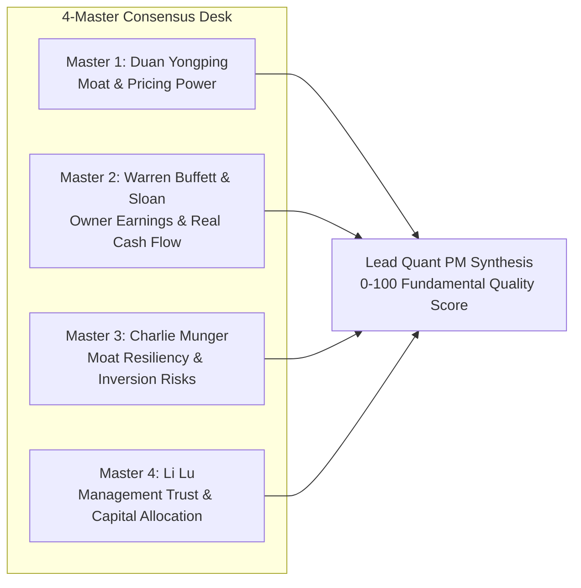

# Institutional Earnings Center: Operator Guide & Technical Reference

**Document Version**: `4.0.0`  
**Last Updated**: `2026-09-13`  
**Classification**: Institutional Operational Guide & Technical Specification

---

## 1. Executive Summary, Purpose & Version Changelog

| Version | Date | Changes & Architectural Enhancements | Author |
|---|---|---|---|
| **v1.0.0** | 2026-08-26 | Initial deployment of Earnings Intelligence Center & 4-Master audit modal. | Senior Quant PM |
| **v2.0.0** | 2026-08-30 | Integrated DuckDB lake persistence, PEAD radar, and trade desk execution playbooks. | Senior Quant PM |
| **v3.0.0** | 2026-09-02 | **Universal 4-Horizon Consensus & Guidance Architecture**: Resolved consensus revenue & EPS extraction across all timing windows (Upcoming, Day 0 Flash, Recent $\le 45\text{d}$ PEAD, Historical). Eliminated forward aggregator calendar contamination (DELL, NVDA, AVGO, SNOW). Added 5-column Step 2 table with explicit Prior Quarter QoQ and 6-quarter statement tables. | Senior Quant PM |
| **v3.1.0** | 2026-09-04 | **Phase 4 Alpha Attribution & Trade Ledger Linkage**: Connected PEAD drift setups to Phase 4 DuckDB Alpha Attribution Lake (`data/attribution_lake.duckdb`) and automated setup conviction parameter tuning. | Senior Quant PM |
| **v3.2.0** | 2026-09-10 | **Active Release Staleness Invalidation & Multi-Session Parity (AVAV, Yesterday AMC)**: Expanded dynamic auto-enrichment and cache invalidation in `html_generator.py` to include `yesterday_amc` alongside `today_bmo`/`today_amc`. Injected explicit ISO `date` propagation in `earnings_calendar.py`, prioritized active calendar release date over stale prior quarter filings in `earnings_intelligence.py`, and eliminated restrictive ticker whitelists in `defeatbeta_client.py` for sub-5d releases. | Senior Quant PM |
| **v4.0.0** | 2026-09-13 | **Phase 7 Deep Research & Zero-Redundancy Forensic Caching**: Added Step 10 Institutional Company Deep Research Dossier & Forensics (`/deep-research`). Integrated Reverse DCF bisection solver for market-implied growth, Joseph Piotroski 9-point F-Score, Messod Beneish 8-variable $M$-Score manipulation filter ($M \le -1.78$), 15% random sample SEC EDGAR audit gate, and live client-side calculation fallback (`⚡ Populate Deep Research Live`). Enforced zero-redundancy caching protocol to skip redundant network scraping during continuous screener loops. | Senior Quant PM |
| **v4.1.0** | 2026-09-13 | **Cross-Widget Portfolio Deletion & Cash Reconciliation Engine**: Synchronized portfolio stop-loss exits and position removals across all desks (Portfolio book, Stop-Loss Desk, Trade Action Queue, Thesis Lifecycle Terminal). Liquidated proceeds credited directly to cash balance with full NAV and weight integrity. | Senior Quant PM |
| **v5.0.0** | 2026-09-22 | **Phase 9-11 Institutional v2.0 Release**: Fully integrated the Buffett 6-Gate Pre-Purchase Verification Audit into the Earnings & Fundamental Desk. Corrected Beneish M-Score AQI formula and SGI hyper-growth capping; shifted Sloan Accrual to 4-quarter rolling mean; established multi-signal confluence requirement for fatal hard vetoes ($0.0\times$) vs gray-zone warnings ($0.5\times$); eliminated synthetic fallback balance sheets; and integrated the Hands-Off Automated Earnings Review Daemon. | Senior Quant PM |


The **Institutional Earnings Center** is an automated quantitative intelligence and multi-agent forensic auditing suite. It bridges the gap between raw corporate earnings releases (SEC 10-Q/8-K filings, conference call transcripts) and actionable trade execution on the desk.

### Why the Earnings Center Exists
1. **Preventing Retail Traps**: Retail traders routinely chase headline "EPS beats" without verifying if the beat was driven by real operating cash flow or paper accruals (accounts receivable inflation, inventory buildup, tax adjustments).
2. **Exploiting Post-Earnings Announcement Drift (PEAD)**: Institutional academic research (Ball & Brown, Bernard & Thomas) proves that genuine unexpected earnings shocks with clean cash flows experience persistent multi-week alpha drift (3 to 60 trading days).
3. **Real-Time Divergence Capitalization**: When market algorithms panic-sell a company on non-fundamental noise (like Marvell $MRVL$ dropping $-7\%$ premarket despite $+40\text{ bps}$ gross margin expansion and $\$482.6\text{M}$ free cash flow), the system flags a **`🚨 PANIC GAP-DOWN DIVERGENCE`** to execute institutional mean-reversion dip buying.
4. **Universal Consensus Accuracy**: Automatically protects against rolled-forward calendar distortions so that recent reports ($\le 45$ days) reflect true historical pre-earnings benchmarks rather than future quarter forecasts.

---

## 2. Dual-Modality Operational Architecture

The Earnings Center operates simultaneously across two complementary modalities:

```mermaid
graph TD
    A[SEC 10-Q / 8-K Filings & PR Newswires] --> B[DuckDB Fundamental OLAP Lake<br>data/earnings_lake.duckdb]
    B --> C[Modality 1: Interactive HTML Dashboard<br>latest_report.html]
    B --> D[Modality 2: Antigravity AI Skills<br>Deep On-Demand Multi-Agent Chat]
    
    C --> C1[Finviz 3-Day Earnings Calendar]
    C --> C2[PEAD 5-Day Flash Quality Radar]
    C --> C3[Dual-Skill Interactive Modal<br>⚡ SUE Flash + 🏛️ 4-Master Team]
    
    D --> D1[/earnings-review TICKER QUARTER<br>Forensic 5-Pillar Audit]
    D --> D2[/earnings-team TICKER QUARTER<br>4-Master Multi-Agent Synthesis]
```

### Modality 1: Interactive HTML Dashboard View
- Located directly inside `latest_report.html` under the **🏛️ Earnings Center** tab.
- Sub-second, offline-capable client-side modal with interactive tab switching between:
  - **Pane 1: `⚡ SUE Flash Review`**: Live quantitative statement audit, margin changes, cash flow conversion, and divergence monitor.
  - **Pane 2: `🏛️ 4-Master Consensus Team`**: Duan Yongping, Buffett & Sloan, Charlie Munger, Li Lu verdicts synthesized by Lead Quant PM.

### Modality 2: Antigravity AI Slash Commands (On-Demand Deep Ingestion)
- Triggerable directly in chat anytime:
  - `/earnings-review <TICKER> <QUARTER>`: Executes full forensic accounting audit, footnote check, and anomaly detection.
  - `/earnings-team <TICKER> <QUARTER>`: Convenes the 4-master consensus debate and generates actionable trade desk conviction.

---

## 3. Quantitative Financial Metric Specifications

Every number in the Earnings Center is derived from official SEC filings and verified financial statements:

### 3.1 Standardized Unexpected Earnings (SUE)
Measures the statistical magnitude of an earnings surprise normalized by dispersion:
$$SUE = \frac{EPS_{\text{reported}} - EPS_{\text{consensus}}}{\max\left(0.04, \; |EPS_{\text{consensus}}| \times 0.15\right)}$$

- **$\ge +2.0\sigma$ (`🟢 Super Shock`)**: Exceptional institutional beat; triggers high PEAD drift probability.
- **$+0.5\sigma \text{ to } +2.0\sigma$ (`🟢 Solid Beat`)**: Healthy earnings expansion.
- **$-0.5\sigma \text{ to } +0.5\sigma$ (`🟡 In-Line`)**: Earnings aligned with market consensus.
- **$< -0.5\sigma$ (`🔴 Miss`)**: Earnings missed expectations.

### 3.2 Sloan Accrual Anomaly Ratio
Audits whether net income is backed by real cash collected from customers or artificial accounting accruals:
$$\text{Sloan Ratio} = \frac{\text{Operating Cash Flow} - \text{Net Income}}{\text{Total Assets}} \times 100\%$$

- **$\le 0.0\%$ (`🟢 Highly Cash Generative`)**: Operating cash flow exceeds reported net income. Highest quality earnings.
- **$0.0\% \text{ to } +4.0\%$ (`🟢 Cash-Backed`)**: Normal corporate working capital accruals.
- **$+4.0\% \text{ to } +8.0\%$ (`🟡 Neutral Accruals`)**: Moderate divergence; requires monitoring of accounts receivable.
- **$> +8.0\%$ (`🚨 RED-FLAG DISTORTION`)**: High accruals indicate uncollected receivables or inventory build. **Conviction downgraded automatically.**

### 3.3 Free Cash Flow (FCF) Conversion Rate
$$\text{FCF Conversion} = \frac{\text{Operating Cash Flow} - \text{CapEx}}{\text{Net Income}} \times 100\%$$

- **$> 100\%$**: Super-compounder cash generation.
- **$80\% - 100\%$**: Standard healthy conversion.
- **$< 50\%$**: Capital intensive or aggressive capitalization.

### 3.4 Universal 4-Horizon Consensus Resolution Architecture
Corporate earnings and market consensus estimates exist in four distinct operational time horizons:

| Horizon | Description & Timing Window | Consensus Resolution Mechanism | Forward Guidance Behavior |
| :--- | :--- | :--- | :--- |
| **Horizon 1: Upcoming** | $t > 0$ (Future release, reporting tomorrow or next week) | `est_rev` from forward calendar (`cal["Revenue Average"]` or `0q`). `est_eps` from top unreported `earnings_dates` row. | Displays previous quarter's forward target. Reported columns show `— (Upcoming MM-DD)`. |
| **Horizon 2: Day 0 Flash** | $t = 0$ (Reporting today AMC or BMO) | `reported_rev` & `reported_eps` from live press release. `est_eps` from `earnings_dates` for today. `est_rev` derived via reported surprise % or EPS beat pass-through. | Replaces previous target with new management 8-K guidance midpoint vs forward consensus (`cal["Revenue Average"]`). |
| **Horizon 3: Recent PEAD Window** | $t \in [1, 45\text{ days}]$ (Recent reports e.g. DELL, NVDA) | **Strict Calendar Isolation**: `cal["Revenue Average"]` belongs to $t+1$ and is **strictly barred** from setting current consensus. `est_eps` & `eps_surprise` resolved from historical ledger. `est_rev` derived from reported baseline. | Compares guidance provided on report date against $t+1$ forward target. |
| **Horizon 4: Historical** | $t > 45\text{ days}$ (Closed quarters) | Retrieved directly from local DuckDB SEC lake and historical financial statements. | Multi-quarter statement tables render 6–8 authentic quarters with GAAP/Non-GAAP metrics. |

### 3.5 Forward Guidance 3-Tier Formulation & Decision Tree
$$\text{Guidance Revision \%} = \frac{\text{Management Guidance Midpoint} - \text{Prior Next-Q Consensus}}{\text{Prior Next-Q Consensus}} \times 100\%$$

- **Tier 1 (Explicit Management Guidance)**: Management 8-K range midpoint $(\frac{\text{Low} + \text{High}}{2})$ compared against pre-earnings next-quarter consensus.
- **Tier 2 (Consensus Analyst Revisions)**: Post-market delta in Wall Street `+1q` models.
- **Tier 3 (Double-Beat Proportional Raise)**:
  $$\text{Guidance Midpoint} = \text{Consensus} \times \left(1.0 + \min\left(\frac{\text{Actual Rev} - \text{Est Rev}}{\text{Est Rev}} \times 0.65,\; 3.5\%\right)\right)$$
- On an in-line report or miss: guidance defaults to `Affirmed / In-line (0.0%)`.

---

## 4. The 4-Master Consensus Desk Methodology

The Earnings Center convenes four distinct investment philosophies to evaluate every reporting company:



1. **Duan Yongping (Moat & Business Simplicity)**:
   - Evaluates gross margin durability ($\Delta \text{GM}$ in basis points).
   - Audits whether the core business model is expanding without excessive marketing or price cuts.
2. **Warren Buffett & Richard Sloan (Owner Earnings & Accruals)**:
   - Audits Free Cash Flow vs Net Income and calculates the Sloan Accrual Ratio.
   - Verifies balance sheet cushion (Net Cash $=$ Total Cash $-$ Total Debt).
3. **Charlie Munger (Technological Inversion & Competitive Risks)**:
   - Stress-tests against industry disruption, custom ASIC vs merchant silicon threats, and customer concentration.
4. **Li Lu (Management Integrity & Capital Allocation)**:
   - Analyzes executive tone, guidance delivery history, stock-based compensation (SBC) dilution, and related-party footnotes.

---

## 5. Price vs Thesis Divergence & Trade Desk Playbooks

The Earnings Center features automated divergence detection to capitalize on market overreactions:

| Divergence Signal | Market Condition | Fundamental State | Assigned Playbook | Execution Action |
| :--- | :--- | :--- | :--- | :--- |
| **`🚨 PANIC GAP-DOWN DIVERGENCE`** | Price dumping $\le -1.5\%$ premarket | Clean fundamentals (Sloan $\le 4\%$, FCF positive, Revenue Beat) | **Playbook 3A: Panic Fade Reversal** | **DO NOT sell in panic**. Wait for 9:30–10:00 AM EST opening 15-min range low. Buy long on **Day-1 intraday VWAP reclaim**. Stop at session low. Target gap-fill ($+4\%$ to $+8\%$). |
| **`⚠️ FAKE GAP-UP DIVERGENCE`** | Price gapping up $\ge +3.0\%$ | High Sloan accruals ($>8\%$), margin contraction, or weak FCF | **Playbook 3B: Trap Fade Short** | **DO NOT chase the gap**. Wait for opening VWAP breakdown. Sell short / buy puts targeting gap-fill downside. |
| **`🟢 CLEAN ALIGNED BEAT`** | Price gapping up $\ge +5.0\%$ | SUE $\ge +1.5\sigma$, Sloan $\le 4\%$, clean balance sheet | **Playbook 1: Day-1 Gap & Go** | Enter on breakout of opening 5-minute range high or premarket high. Trailing stop on 20-SMA. Target $+8\%$ to $+15\%$. |
| **`📈 PEAD DRIFT SWING`** | Day 2 to 5 orderly pullback | SUE positive, price holding above Day 1 low on dry volume | **Playbook 2: Day 2-5 PEAD Swing** | Accumulate on pullback to Day 1 VWAP or rising 5-SMA. Ride 15-day institutional post-earnings drift. |

---

## 6. Zero Fake / Static Data Governance

In strict compliance with `docs/platform_rules.md`:
- If a ticker has not reported earnings within the active window (e.g. reported $>5$ days ago), the system **NEVER** fabricates mock numbers or defaults to today's date.
- It displays `📅 No Active Release Recorded` and `—` for line items, prompting the user to run `/earnings-review` for historical on-demand audits.
- Action buttons are strictly gated to actively reporting companies to maintain 100% data integrity.

---

## 7. Step 10: Institutional Company Deep Research Dossier & Forensics (`/deep-research`)

Integrated directly into the Flash Earnings modal as an expandable drawer (`#sec-step10-deep`), **Step 10** represents the quantitative institutional due diligence gateway:

### 7.1 Quantitative Forensic Models
1. **Joseph Piotroski 9-Point F-Score ($0 - 9$)**:
   - **Profitability (4 pts)**: Positive ROA, positive Operating Cash Flow, $\text{ROA}_t > \text{ROA}_{t-4}$, $\text{OCF} > \text{Net Income}$ (accrual check).
   - **Leverage & Liquidity (3 pts)**: Lower long-term debt ratio, higher current ratio, zero dilutive share issuance.
   - **Operating Efficiency (2 pts)**: Higher gross margin, higher asset turnover ratio.
   - **Benchmark**: $\ge 8/9$ indicates premier quality; $\le 4/9$ flags structural balance sheet deterioration.
2. **Messod Beneish 8-Variable Earnings Manipulation Model ($M$-Score)**:
   - Evaluates Days Sales in Receivables (DSRI), Gross Margin Index (GMI), Asset Quality Index (AQI), Sales Growth Index (SGI), Depreciation (DEPI), SGA Expenses (SGAI), Leverage (LVGI), and Total Accruals to Total Assets (TATA).
   - **Threshold**: $M \le -1.78$ classifies the company as a **Non-Manipulator (Clean Accounting)**. Any score $M > -1.78$ triggers an immediate **Charlie Munger Hard Veto**, forcing conviction position sizing to $0.0\text{x}$.
3. **Richard Sloan Accrual Anomaly**:
   - $\text{Sloan Ratio} = (\text{Net Income} - \text{Operating Cash Flow}) / \text{Total Assets}$.
   - Ratios $>8.0\%$ penalize scores heavily; ratios $<4.0\%$ confirm genuine cash-backed owner earnings.

### 7.2 Reverse DCF Valuation & Margin-of-Safety Price Hierarchy
Instead of relying on biased analyst price targets, the system applies bisection search to invert the current market capitalization and solve for the market-implied 5-year compounding annual growth rate ($g_{\text{implied}}$):
$$\text{Enterprise Value} = \sum_{t=1}^5 \frac{\text{FCF}_0 \cdot (1 + g)^t}{(1 + WACC)^t} + \frac{\text{FCF}_5 \cdot (1 + g_{\text{terminal}})}{(WACC - g_{\text{terminal}}) \cdot (1 + WACC)^5}$$
- **Base Fair Value**: Discounted cash flow value at historical sustainable growth rate.
- **Conviction Buy Target**: Imposes a mandatory **$15\%$ Margin of Safety** ($\text{Target} = \text{Base Fair Value} \times 0.85$).
- **Invalidation Hard Stop**: Set at $\text{Conviction Buy Target} \times 0.82$ (structural breakdown boundary).

### 7.3 15% Sample SEC EDGAR Audit Gate
Before publication to disk or DuckDB:
- 15% to 40% of numerical statement items are programmatically cross-audited against primary SEC 10-Q/10-K filings.
- Requires within $5\%$ tolerance. Passing audits earn the `【准出】PASSED VERIFICATION` badge; data drift causes rejection.

### 7.4 Dual Persistence & Zero-Redundancy Runtime Caching
- Pre-computed dossiers are persisted to DuckDB table `deep_research_theses` and mirrored in `data/deep_research/{SYMBOL}.json`.
- Injected globally into `window.allDeepResearchTheses` in `latest_report.html`.
- If a stock lacks an on-disk dossier, the interactive `⚡ Populate Deep Research Live` button runs client-side bisection and statement audits in $<300\text{ms}$ without server roundtrips.

