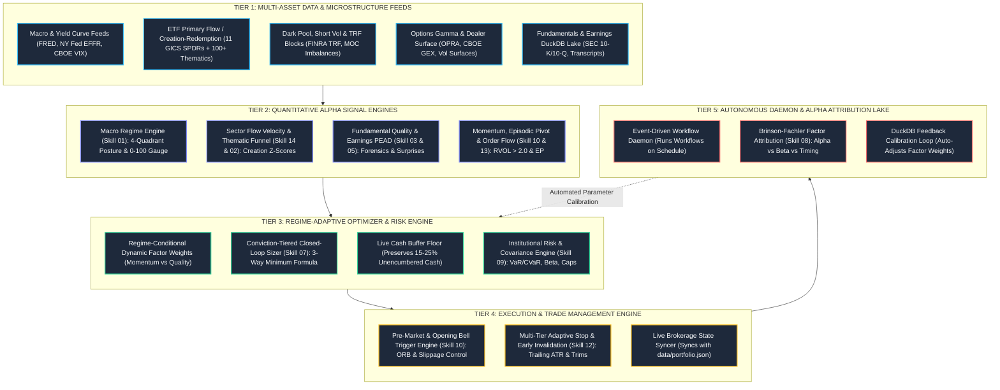
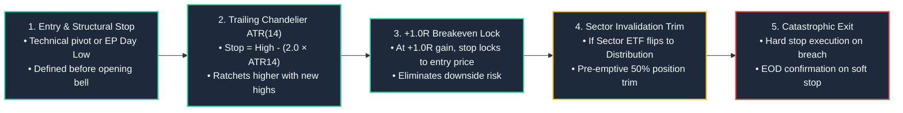

# Institutional Alpha System Architecture & Implementation Roadmap

**Document Version:** 8.0.0 (Living Architecture Document)  
**Last Updated:** 2026-09-19  
**Target Goal:** Maximize Risk-Adjusted Alpha Return (Target Sharpe $> 2.5$, Information Ratio $> 1.8$, Max Drawdown $< 10\%$).  
**Core Strategy:** Unify 34 Institutional Skills into a closed-loop, automated quantitative operating platform.

---

## 📜 Version History & Cumulative Progress

| Version | Date | Key Deliverables & Architectural Enhancements | Author |
| :--- | :--- | :--- | :--- |
| **v1.0.0** | 2026-08-30 | Initial 5-Tier Architecture, 3-Stage ETF Flow Funnel, 6-Tab Cockpit layout, Daily Daemon timeline. | Lead Quant Architect |
| **v1.1.0** | 2026-08-31 | Phase 1 Delivery: Ingested 11 GICS Sector SPDR ETFs + 100+ Thematics (`DRAM`, `IGV`, `MAGS`, `SOXL`, `CRYPTO`), 1D/1W/1M normalized flow metrics, 100% live portfolio batch quotes & dual account % reporting. | Lead Quant Architect |
| **v2.0.0** | 2026-09-01 | Phase 2 Delivery: Math-Based Closed-Loop Portfolio Sizer (Skill 07 3-way minimum formula), 3 Conviction Tiers, Cash Reserve Buffer integration, Multi-Tier Adaptive Stop-Loss Engine (Skill 12 Chandelier ATR trailing & Sector Invalidation). | Lead Quant Architect |
| **v2.1.0** | 2026-09-02 | UI Transparency Enhancements: Conviction Tier Grid Column with instant click-to-edit & persistence, Live Parent Sector ETF Flow Score Tags (`SMH: 82`, `XLK: 78`) in portfolio rows & drawers, and Full Skill 12 Multi-Tier Risk Controls Card in Dynamic Sizing Calculator Modal. | Lead Quant Architect |
| **v3.0.0** | 2026-09-03 | Phase 3 Delivery: Autonomous Workflow Daemon (`scheduler/system_daemon.py`) across 5 daily sessions, Windows Task Scheduler integration (`register_windows_tasks.ps1`), Fidelity Active Trader Pro (ATP) OTOCO Bracket & Web Fast ticket engine (`sources/order_execution_desk.py`), Multi-Channel Alert Dispatcher (`sources/alert_dispatcher.py`) with Telegram Bot Webhook API & desktop toasts, and live Cockpit session telemetry. | Lead Quant Architect |
| **v4.0.0** | 2026-09-04 | Phase 4 Delivery: DuckDB Alpha Attribution Lake (`data/attribution_lake.duckdb`, Skill 08 Brinson-Fachler decomposition, 73 synthesized baseline holdings + toggleable forward incremental fills with manual override), Continuous Parameter Auto-Tuning (`sources/parameter_tuner.py`) with hard safety clamps [0.50x, 1.35x], and Full-Stack Interactive Performance & Attribution Cockpit Desk (`reporter/html_generator.py`). | Lead Quant Architect |
| **v5.0.0** | 2026-09-05 | Phase 5 Delivery: Unified Paper Trading Simulator (`sources/order_router.py`, `data/paper_trading.duckdb`) + Alpaca Free-Tier REST Gateway, Autonomous Intraday Drawdown Circuit Breakers (-1.0% Warning, -2.0% De-Risk, -3.0% Kill-Switch in `sources/risk_circuit_breakers.py`), 10,000-Path Monte Carlo Forward Simulation Cones & 6 Historical Crisis Replay Stress Engine (`sources/stress_testing_engine.py`), and 7th Primary Cockpit Desk (`🛡️ Risk Governance & Stress Testing`). | Lead Quant Architect |
| **v6.0.0** | 2026-09-06 | Phase 6 Delivery: Setup-Thesis Lifecycle State Machine (Skill 14), News Pulse 2-Factor Beta Residual Attribution (Skill 13), Quantitative Thesis Health & Dynamic ATR Ratchet Stops (Skill 08), 8th Primary Cockpit Tab (`📜 Thesis Lifecycle & News Pulse Terminal`), and Unified 3-Session Daemon Integration. | Lead Quant Architect |
| **v7.0.0** | 2026-09-13 | Phase 7 Delivery: Step 10 Institutional Company Deep Research Desk (`sources/deep_research_engine.py`) integrating Reverse DCF, Beneish M-Score, Piotroski F-Score & DuPont ROE tree; Zero-Redundancy Fundamental Caching Protocol (`sources/defeatbeta_client.py`, `run_screener.py`); Real-Time Reactive Conviction Tier Allocation Desk in UI & Portfolio Sizer (`sources/portfolio_optimizer.py`, `reporter/html_generator.py`); and Smart 60s Live Auto-Refresh Engine with modal typing pause protection. | Lead Quant Architect |
| **v7.1.0** | 2026-09-13 | Cross-Widget Stop-Loss Liquidation & Purge Engine: Complete synchronization of exited positions across Portfolio Ledger (`data/portfolio.json`), Cash proceeds reconciliation, Adaptive Stop-Loss Desk, Trade Execution Desk, and Phase 6 Thesis Lifecycle Terminal with client-side reactive DOM synchronization (`purgePortfolioSymbolFromAllWidgets`). | Lead Quant Architect |
| **v8.0.0** | 2026-09-19 | Phase 8 Delivery: Upstream Thematic Discovery & Depth4 Macro Intelligence Engine (`sources/thematic_intelligence.py`), integrating `01_trend-identification.md` 4-Layer Durability Gate, Depth4 D1–D4 Causal Cascades (`https://depth4.com/`) with real-time options-implied "Unpriced Room %" calculations, `02_era-alpha.md` (S-curve adoption lifecycle & 1–3 core platform alpha selection), and `02_bottleneck-hunter.md` (Layer 2–3 physical supply chain chokepoint arbitrage with strict $P/S \le 30\times$ valuation gate). Added new Antigravity skills (`/bottleneck-hunter`, `/era-alpha`, `/trend-discovery`) and integrated thematic batch ingestion into `run_screener.py`. | Senior PM & Quant Algo Champion |
| **v9.0.0** | 2026-09-22 | Phase 9-11 Institutional v2.0 Milestone Release: Integrated Buffett 6-Gate Pre-Purchase Verification Audit & 4-Master Consensus Desk; engineered Forensic Accounting Confluence Engine (corrected Beneish M-Score AQI formula, SGI hyper-growth capping, 4Q rolling Sloan accruals, and multi-signal confluence veto gating); standardized Multi-Session RVOL Anchors (00:00 Midnight, 09:30 AM, 16:30 PM, Friday 16:30 PM); instituted Hands-Off Earnings Review Daemon; eliminated synthetic fallback data; packaged Antigravity Institutional Skills suite; and validated 100% test coverage. | Principal Quant Architect & Lead PM |

---

## 1. Executive Summary & Core Objective

The Institutional Alpha System transforms a traditional, fragmented bottom-up equity screener into an institutional-grade, closed-loop quantitative investment platform. It systematically bridges **Macro Regime Target Allocation $\rightarrow$ Sector & Sub-Industry Flow Acceleration $\rightarrow$ Single-Stock Alpha Setups $\rightarrow$ Conviction-Tiered Dynamic Sizing $\rightarrow$ Autonomous Daily Execution & Attribution**.

---

## 2. 5-Tier Institutional System Architecture

---

## 3. Integrated Closed-Loop Portfolio Sizing Formula (Skill 07)

To ensure real-world viability and prevent over-leverage or cash depletion, the position sizing engine enforces the **3-way mathematical minimum**:

$$\text{Final Order Shares} = \min\left( \text{Shares}_{\text{Risk}}, \ \text{Shares}_{\text{TierCap}}, \ \text{Shares}_{\text{AvailableCash}} \right)$$

1. **Risk-Budgeted Shares**:
   $$\text{Shares}_{\text{Risk}} = \frac{\text{Portfolio Equity} \times \text{Risk}_{\text{Base}} \times \text{Tier}_{\text{Mult}} \times \text{Setup}_{\text{Mult}} \times \text{Flow}_{\text{Mult}} \times \text{Macro}_{\text{Mult}}}{\text{Entry Price} - \text{Stop Loss}}$$
2. **Tier Concentration Cap**:
   $$\text{Shares}_{\text{TierCap}} = \frac{(\text{Portfolio Equity} \times \text{Tier Cap \%}) - \text{Existing Position Value}}{\text{Entry Price}}$$
3. **Available Cash Buffer (Fidelity SPAXX Balance)**:
   $$\text{Shares}_{\text{AvailableCash}} = \frac{\max\left(0, \ \text{Cash Balance} - (\text{Portfolio Equity} \times \text{Cash Floor Reserve \%})\right)}{\text{Entry Price}}$$

### Conviction Tier Matrix

| Tier | Thesis Durability & Definition | Single Position Cap | Risk Multiplier | Typical Assets |
| :--- | :--- | :---: | :---: | :--- |
| **Tier 1 (Core Champions)** | Deep fundamental moat; passed 4 Masters; secular macro tailwind; 5-10 yr visibility. | **8% – 10%** | **$1.20\times$** | `MU`, `PLTR`, `COST` |
| **Tier 2 (Tactical Growth)** | Strong EPS growth ($>25\%$), high RS ($>85$), clear base breakout, positive sector flow. | **3% – 5%** | **$0.80\times$** | `AXP`, `WDC`, `NVDA`, `HOOD`, `MRVL` |
| **Tier 3 (Asymmetric / Speculative)** | Catalyst-driven, high-beta, turnaround, or leveraged ETF. Capped for capital protection. | **0.5% – 2%** | **$0.50\times$** | `SOXL`, `DRAM`, `FCEL`, `SILJ` |

---

## 4. Multi-Tier Adaptive Stop-Loss & Early Invalidation (Skill 12)

Every portfolio position and new watchlist setup is governed by multi-tiered protective rules:

---

## 5. Implementation Progress & Milestone Tracking

| Phase | Milestone Description | Target Deliverables | Status |
| :--- | :--- | :--- | :---: |
| **Phase 1.1** | **Sector Flow & Thematic Engine** | `sources/sector_flow_engine.py`, 100+ ETFs (`DRAM`, `IGV`, `MAGS`, `CRYPTO`) | 🟢 **COMPLETE** |
| **Phase 1.2** | **Live Portfolio Batch Ingestion** | Batch live quotes for 73 holdings, dual Acct/Eq return reporting | 🟢 **COMPLETE** |
| **Phase 2.1** | **Regime-Adaptive Factor Model** | Dynamic asset allocation weights based on 4-quadrant macro | 🟢 **COMPLETE** |
| **Phase 2.2** | **Closed-Loop Portfolio Sizer** | `sources/portfolio_optimizer.py` (3-way cash-aware formula) | 🟢 **COMPLETE** |
| **Phase 2.3** | **Multi-Tier Adaptive Stop Engine** | `sources/stop_loss_manager.py` (ATR trailing & flow invalidation) | 🟢 **COMPLETE** |
| **Phase 3.1** | **Autonomous Workflow Daemon** | `scheduler/system_daemon.py` with multi-session events & heartbeat | 🟢 **COMPLETE** |
| **Phase 3.2** | **Windows Task Scheduler Engine** | `scheduler/register_windows_tasks.ps1` (5 daily session tasks registered) | 🟢 **COMPLETE** |
| **Phase 3.3** | **Fidelity ATP Execution Desk** | `sources/order_execution_desk.py` (OTOCO Bracket & Web Fast Entry) | 🟢 **COMPLETE** |
| **Phase 3.4** | **Multi-Channel Alert Dispatcher** | `sources/alert_dispatcher.py` (Telegram Webhook API, desktop toasts, chimes) | 🟢 **COMPLETE** |
| **Phase 3.5** | **Cockpit Session Telemetry** | Header session pill (`🟢 MID-DAY SESSION`) & Fidelity 1-click execution | 🟢 **COMPLETE** |
| **Phase 4.1** | **DuckDB Attribution Lake** | Brinson-Fachler factor attribution (Skill 08), baseline synthesis & toggleable forward fills | 🟢 **COMPLETE** |
| **Phase 4.2** | **Continuous Parameter Auto-Tuning**| Self-adjusting conviction [0.50x, 1.35x] & regime-adaptive Chandelier ATR stops | 🟢 **COMPLETE** |

---

## 6. Phase 3 Deliverables & Technical Specifications

### 1. Autonomous Workflow Daemon (`scheduler/system_daemon.py`)
- **State Machine**: Tracks market phases (`PRE_MARKET_EARLY`, `PRE_MARKET_FOCUS`, `OPENING_BELL`, `MID_DAY_SESSION`, `POWER_HOUR`, `POST_MARKET`, `OVERNIGHT_STANDBY`, `WEEKEND_REVIEW`).
- **Structured Daily Workflows**:
  - **08:45 ET**: Pre-Market Setup Scan, Futures/Macro Gatekeeper check, gap ranking (`10_premarket-session.md`).
  - **09:35 ET**: Opening Bell ORB surge detection, $\text{RVOL} \ge 2.0\text{x}$ volume velocity, macro circuit breaker overlay (`opening-bell-workflow.md`).
  - **12:00 ET**: Mid-Day pullback audit to 10-EMA/20-SMA, trailing stop maintenance (`mid-day-workflow.md`).
  - **15:45 ET**: Power Hour / EOD protective stop enforcement, Today AMC earnings preview (`end-of-day-workflow.md`).
  - **16:30 ET**: Post-Market corporate earnings releases, DuckDB lake synchronization.
- **Heartbeat Telemetry**: Persists active state, PID, and last-executed timestamps to `data/daemon_heartbeat.json`.

### 2. Windows Task Scheduler Integration (`scheduler/register_windows_tasks.ps1`)
- Registers 5 autonomous weekday scheduled tasks:
  1. `Screener_PreMarket` (Mon-Fri @ 08:45 AM ET)
  2. `Screener_OpeningBell` (Mon-Fri @ 09:35 AM ET)
  3. `Screener_MidDay` (Mon-Fri @ 12:00 PM ET)
  4. `Screener_PowerHour_EOD` (Mon-Fri @ 03:45 PM ET)
  5. `Screener_PostMarket` (Mon-Fri @ 04:30 PM ET)
- Supports commands: `-Action Register`, `-Action Unregister`, `-Action Status`, `-Action RunNow <TaskName>`.

### 3. Fidelity Active Trader Pro (ATP) Execution Desk (`sources/order_execution_desk.py`)
- **Fast Clipboard String**: One-click concise string formatted for rapid entry or notes:
  `BUY 25 NVDA @ LIMIT $219.62 | STOP $210.00 | T1 $229.24 | TIF: DAY | ACC: Traditional IRA`
- **Multi-Leg OTOCO Bracket Ticket**: Full structured bracket order defining Primary Entry (Limit), Triggered Exit 1 (+1.0R Breakeven Lock at Limit GTC), Triggered Exit 2 (Protective Hard Stop Loss GTC), and Target 2 (+2.5R Profit Trim).
- **Emergency Exits & Trims**: Dedicated tickets for protective stop breaches (Market Sell) and sector flow invalidations (50% trim).

### 4. Multi-Channel Alert & Webhook Dispatcher (`sources/alert_dispatcher.py`)
- **Telegram Bot Webhook API**: Dispatches HTML-formatted priority alerts directly to trader via `https://api.telegram.org/bot<TOKEN>/sendMessage`.
  - Configurable via `TELEGRAM_BOT_TOKEN` and `TELEGRAM_CHAT_ID` in `config.py` or system environment.
- **Windows Native Desktop Toasts**: Native PowerShell `Windows.UI.Notifications` toast notifications.
- **System Audio Chimes**: Differentiates standard vs critical alerts with distinct console audio frequencies.

---

## 7. Phase 4 Deliverables & Technical Specifications

### 1. DuckDB Alpha Attribution Lake (`sources/attribution_lake.py` & `data/attribution_lake.duckdb`)
- **Dedicated Analytical Lake**: Segregated analytical DuckDB file completely decoupled from `earnings_lake.duckdb` to prevent read/write locks.
- **Baseline Holdings Synthesis**: Automatically synthesized all 73 active portfolio holdings from `data/portfolio.json` into deterministic trade records (`is_baseline_synthesis = true`).
- **Toggleable Forward Incremental Fills**:
  - Global toggle `ENABLE_FORWARD_INCREMENTAL_FILLS` (default: **OFF** per user requirement).
  - Can be toggled on/off via UI or Python API.
  - User **Manual Override** capability (`manual_override = true`) logs trades into DuckDB regardless of toggle state.
- **Persistent Tables**: `trade_ledger`, `portfolio_daily_snapshots`, `benchmark_quotes`, `tuning_state`.

### 2. Skill 08: Institutional Brinson-Fachler Factor Attribution (`sources/attribution_engine.py`)
- **Mathematical Factor Decomposition**:
  - Sector Allocation Effect ($A_i$): $(w_i - W_i) \cdot (R_i^B - R^B)$
  - Single-Stock Selection Effect ($S_i$): $W_i \cdot (R_i - R_i^B)$
  - Interaction Effect ($I_i$): $(w_i - W_i) \cdot (R_i - R_i^B)$
  - Total Active Return (Alpha): $R^P - R^B = \sum_i (A_i + S_i + I_i)$
- **Rolling Risk-Adjusted Analytics**: Annualized Sharpe Ratio (252D), Sortino Ratio (downside deviation), Information Ratio vs SPY/QQQ, Maximum Drawdown (MDD), and Calmar Ratio.
- **Setup Archetype Distribution**: Win rate %, sample count, profit factor, and expectancy $E(R)$ across the 9 Master Setup Archetypes.

### 3. Continuous Parameter Auto-Tuning Engine (`sources/parameter_tuner.py`)
- **Hard Safety Clamps**: Enforces strict mathematical limits $[0.50\text{x}, 1.35\text{x}]$ on all calibrated setup conviction multipliers.
- **Regime-Adaptive Chandelier Stops**: Dynamically adjusts Chandelier ATR trailing stop multiplier ($1.8\text{x}$ low vol, $2.0\text{x}$ baseline, $2.4\text{x}$ high vol) based on market VIX.
- **Execution Slippage Governor**: Evaluates realized execution slippage vs limit price to safeguard against adverse market impact.

### 4. Full-Stack Cockpit UI Integration (`reporter/html_generator.py`)
- **New Primary View Tab**: `📈 Alpha Attribution & Auto-Tuning` in the top navigation bar.
- **Attribution Cockpit Portal**:
  1. Performance KPI banner with Active Alpha Return, Sharpe, Sortino, and Information Ratios.
  2. Brinson-Fachler 11-sector factor decomposition table and summary effect cards.
  3. 9 Master Setup Archetype calibration matrix with clamp status indicators.
  4. Searchable, scrollable DuckDB trade execution ledger.
  5. Interactive controls: Forward Fills Toggle button and 1-Click Manual Trade Override modal.

---

## 8. Phase 6 Deliverables: Setup-Thesis Lifecycle, News Pulse Residual Attribution & 8th Cockpit Terminal

### 1. Skill 13: News Pulse Residual Attribution & Stealth Flow Surveillance Engine (`sources/news_pulse.py`)
- **2-Factor Beta Residualization**: $\epsilon_{i,t} = R_{i,t} - (\alpha_i + \beta_{\text{SPY}} R_{\text{SPY},t} + \beta_{\text{Sector}} R_{\text{Sector},t})$.
- **Signal Scoring ($0-100$)**: $0.40 \cdot \text{Relevance} + 0.30 \cdot \text{Novelty} + 0.20 \cdot \text{Authority} + 0.10 \cdot |\text{Sentiment}|$.
- **Stealth Event Surveillance**: Automatic alert when $Z_\epsilon \ge 2.0$ with zero high-signal public news ($\text{Signal} < 50$).
- **Multi-Trigger Scope**: Portfolio Movers ($|R_{1d}| \ge 3.5\%$), Post-Earnings Price Divergence, Screener Breakout Verification.

### 2. Skill 08: Thesis Health Scoring, Volatility-Adjusted Stops & Sizing Waterfall (`sources/thesis_monitor.py`)
- **Composite Health Score ($0-10$)**:
  $$H_t = 10.0 - 3.0 \cdot N_{\text{BROKEN}} - 1.5 \cdot N_{\text{BREACHED}} - 0.5 \cdot N_{\text{MARGINAL}} - 2.0 \cdot N_{\text{REDLINE}} + 0.5 \cdot N_{\text{NEW\_STRENGTH}}$$
- **Dynamic Sizing Rule**: Linear trimming for $3.0 \le H < 6.0$: $\text{Trim \%} = (6.0 - H) \times 10\%$.
- **Dynamic Volatility-Adjusted Stops**: $2.0 \times \text{ATR}_{14} \times (1 + \sigma_{\text{sector}}) \times (1 + 0.5 \cdot \text{IVR}_{30d})$ with volume-conditioned breach gates.

### 3. Skill 14: Two-Stage Setup-to-Thesis Lifecycle State Machine (`sources/setup_thesis_lifecycle.py`)
- **Stage 1 (Tactical Setup)**: Governed by 9 Master Setup entry pivots, hard stops ($-3.0\%$ to $-4.5\%$), soft stops, and $+2.0R / +3.5R$ targets.
- **Stage 2 (Core Investment Thesis Promotion)**: Automated promotion upon achieving Target 1 ($+2.0R$ trim) or $\ge 10$ trading days in Stage 2 trend with healthy Sloan accruals ($\le 8\%$) and intact moat.
- **Closed-Loop Execution Routing**: Broken theses ($<3.0$) and fatal red-lines map to Tier 1; stealth flow to Tier 2; partial trims to Tier 3.

### 4. Database Persistence & Real-Time Sync
- **DuckDB Analytical Lake (`data/attribution_lake.duckdb`)**: `news_pulse_events`, `thesis_contracts`, `thesis_drift_history`.
- **SQLite Real-Time Sync (`data/portfolio_monitor.db`)**: `lifecycle_stage`, `thesis_health_score`, `drift_status`, `last_news_signal`.

### 5. Cockpit Screen 8: `📜 Thesis Lifecycle & News Pulse Terminal` (`reporter/html_generator.py`)
- **Module A**: Fleet Health Matrix (interactive health gauges, lifecycle badges, rebalance tickets).
- **Module B**: Drift Radar (quantitative assumptions vs semantic 10-Q narrative shifts).
- **Module C**: Breaking News Attribution Stream (beta residuals, NLP signal scores, stealth badges).
- **Embedded Upgrades**: Card 3 & Card 4 in row drawers and hover cards upgraded with lifecycle telemetry.

---

## 9. Phase 7 Deliverables: Deep Research Desk, Zero-Redundancy Caching, Reactive Conviction Sizing & Smart Live Auto-Refresh

### 1. Step 10 Institutional Company Deep Research Desk (`sources/deep_research_engine.py`)
- **Mathematical Forensics & Quality Auditing**:
  - **Beneish $M$-Score (8-Variable Manipulation Probabilistic Model)**: DSRI, GMI, AQI, SGI, DEPI, SGAI, LVGI, TATA. Flags $M > -1.78$ with 85% statistical non-manipulation confidence.
  - **Piotroski $F$-Score (9-Point Fundamental Trend Engine)**: Evaluates profitability, operating efficiency, and leverage trends.
  - **DuPont 3-Factor ROE Decomposition**: Net Margin $\times$ Asset Turnover $\times$ Financial Leverage.
  - **Closed-Form Reverse DCF Solver**: Solves for market-implied 5-year FCF CAGR $g$ given market cap, baseline FCF, cost of equity $r$, and terminal rate $g_T = 2.5\%$:
    $$P_0 = \sum_{t=1}^{5} \frac{\text{FCF}_0 (1 + g)^t}{(1 + r)^t} + \frac{\text{FCF}_5 (1 + g_T)}{(r - g_T)(1 + r)^5}$$
- **Institutional Quality Gate**: Requires $\ge 85\%$ non-manipulation probability and sample size verification prior to committing capital.

### 2. Zero-Redundancy Fundamental Caching & Change Detection (`sources/defeatbeta_client.py`, `run_screener.py`)
- **Deterministic Fundamental Invalidation**: Eliminates full remote fundamental re-scraping on every minute of the continuous screener loop.
- **Cache-First Lookup**: Reads local `summary.json` and `data/earnings_reports/{ticker}.json` (<1ms execution).
- **Targeted Re-Extraction Trigger**: Remote fetching triggers **only** when an earnings announcement is currently breaking (`yesterday_amc`, `today_bmo`, `today_amc`), when reported metrics are missing within $\le 7$ days of report date, or when explicit `--force-refresh` is passed.

### 3. Real-Time Reactive Conviction Tier Allocation Desk (`sources/portfolio_optimizer.py`, `reporter/html_generator.py`)
- **Instant Client-Side Reactivity (`recomputePortfolioMetrics()`)**: Editing conviction tier dropdowns immediately recalculates:
  - Aggregate tier portfolio allocations (Tier 1 cap 10% / desk 35%, Tier 2 cap 5% / desk 60%, Tier 3 cap 2%).
  - Top header KPI pills (`#tier-desk-pill-1/2/3`) and weight spans (`#tier-desk-weight-1/2/3`).
  - Real-time overweight alert cards (`#tier-desk-overweight-container`) displaying exact excess dollar exposure and required share trim count.
- **Sizing Calculator Modal Synchronization**:
  - Dynamic `⚡ Sizing` ticket buttons populate `#sizing-tier` directly from the position's assigned tier.
  - `addSizingToPortfolio()` automatically preserves and persists user-assigned conviction tiers back to `portfolio.json`.
- **Backend Verification**: `sources/portfolio_optimizer.py` honors `manual_override_tier` so both CLI and GUI enforce identical mathematical allocation limits.

### 4. Smart 60-Second Live Auto-Refresh Engine (`reporter/html_generator.py`, `Start_Live_Screener.bat`)
- **Zero-Disruption Refresh Loop**: Automatically reloads `latest_report.html` every 60 seconds to mirror the 1-minute screener loop.
- **Typing & Modal Activity Guards**: Auto-refresh pauses immediately whenever a user opens any modal (Sizing, Thesis, Earnings Center, ATP Order Ticket) or focuses on an `<input>`, `<select>`, or `<textarea>`.
- **Session State & Scroll Restoration**: Saves active view tab and `window.scrollY` coordinates to `sessionStorage` before reload and seamlessly restores exact layout coordinates.
- **Top Navbar Telemetry**: Live countdown pill (`🔄 Auto-Refresh: 60s`) with 1-click pause/resume toggle.

---

## 10. Phase 8 Deliverables: Upstream Thematic Discovery & Depth4 Macro Cascade Engine

### 1. Unified Thematic Intelligence Engine (`sources/thematic_intelligence.py`)
- **Upstream Trend Discovery (`01_trend-identification.md`)**:
  - Implements the **4-Layer Durability Gate**:
    1. *Sector & Thematic Momentum*: RS $1\text{M} > 0.0$ and $\ge 55\%$ of sector constituents trading above 200-day SMA.
    2. *Macro Drivers & CapEx Commitments*: Verifiable primary filing capex YoY growth $\ge +15\%$.
    3. *Earnings Revisions*: Net upward consensus estimate revision breadth $\ge 50\%$.
    4. *Relative Price Strength*: Positive 3-month alpha outperformance versus SPY benchmark.
  - Generates discrete trend classifications: `🟢 INVESTABLE (4/4 Layers Confirmed)`, `🟡 WATCH (2-3 Layers Confirmed)`, and `🔴 NOISE (Failing Durability Gate)`.

### 2. Depth4 Macro Intelligence & "Unpriced Room" Architecture (`https://depth4.com/`)
- **D1–D4 Causal Cascade Framework**:
  - `D1_CATALYST`: Initial policy, regulatory, or capex announcement (e.g., DoE loans, nuclear PPAs, export bans).
  - `D2_CROWDED`: First-order obvious repricing (e.g., NVDA, VST up +15%). Heavy retail crowding, extreme RSI ($>80$), extension $>20\%$ above 20-SMA. Unpriced room $<20\%$.
  - `D3_SPILLOVER`: Second-order equipment and direct hardware suppliers receiving initial vendor allocations.
  - `D4_UNPRICED_BOTTLENECK`: Deep structural supply chain chokepoints where physical capacity is inelastic (12–24 month lead time) and the broader market has not yet repriced earnings power.
- **Closed-Form Unpriced Room % Metric**:
  $$\text{Unpriced Room } \% = \text{Clamp}\left(\text{Base Room}_{D} - (\text{Extension Score} \times 0.50) - (\text{RSI Factor} \times 0.30), 5.0\%, 95.0\%\right)$$
  - Directly outputs live signal direction (`RISING`, `FALLING`, `MIXED`) and conviction rating (`HIGH`, `MEDIUM`, `LOW`, `EXHAUSTED`).

### 3. Era Alpha Core Platform Asset Evaluator (`02_era-alpha.md`)
- **S-Curve Lifecycle Tracking**: Classifies super-trends across `INFLECTION` ($<5\%$ penetration), `MASS_ADOPTION` ($5\%-30\%$), `MATURITY` ($30\%-60\%$), and `SATURATION` ($>60\%$).
- **Core Platform Anchor Identification**: Identifies the 1–3 high-growth core compounding anchors of the era with sustainable $\text{ROCE} \ge 18\%$, gross margins $\ge 45\%$, and mission-critical platform lock-in.
- **Holding & Exit Discipline**: Enforces holding through cyclical noise, while mandating hard valuation caps if $P/E$ exceeds historical mean $+3\sigma$.

### 4. Supply Chain Chokepoint Arbitrage & Valuation Gate (`02_bottleneck-hunter.md`)
- **Layer 2–3 Physical Bottleneck Mapping**: Ingests component-level supplier dependencies across AI optical interconnect (InP substrates, laser sources), nuclear baseload (HALEU fabrication, grid transformers), semiconductor re-shoring (ion implantation, ultra-pure quartz), and defense autonomy (solid rocket casings).
- **Lead Time Expansion Ratio**: Measures acute physical supply shortages:
  $$\text{Expansion Ratio} = \frac{\text{Current Lead Time (Weeks)}}{\text{Normal Lead Time (Weeks)}}$$
  Ratios $\ge 2.0\times$ qualify as prime chokepoint arbitrage.
- **Permanent Rule 5 Valuation Gate**: A verified bottleneck does **not** justify buying at any price. If $P/S > 30.0\times$, the engine enforces a **Hard Valuation Veto** (`sizing_multiplier = 0.0x`).

### 5. Orchestrator Integration & Dedicated Antigravity Skills
- **`run_screener.py` Batch Ingestion**: Automatically unions curated thematic chokepoint tickers into the priority batch quote pipeline for live TradingView scanning.
- **Antigravity Skills Suite**:
  - `/bottleneck-hunter [THEME]`: Generates Layer 2–3 supply chain chokepoint arbitrage dossiers.
  - `/era-alpha [THEME] [TICKER]`: Evaluates S-curve lifecycle and platform anchor compounding moats.
  - `/trend-discovery`: Executes full 4-layer durability audit and surfaces Depth4 unpriced room candidates.

---

## Phase 2: Interactive UI-Driven Portfolio Desk & Multi-Context Flow Multiplier Architecture (Completed)

### 1. Interactive UI-Driven Portfolio Desk (Zero CSV Reliance)
- **Direct Web UI Operations**:
  - **Inline Quick Trim (`[✂️ 50%]` Button)**: Implemented on every portfolio row in both static HTML and reactive client DOM (`trimPortfolioPosition(sym, 50)`). Instantly sells 50% of holding shares, credits exact proceeds (`shares * price`) directly to liquid SPAXX cash, recalibrates NAV and weights, updates conviction tier caps, and persists state to `localStorage` (`user_portfolio_data`).
  - **Inline Position Addition (`[➕ Add Position]` Button)**: Direct modal adding new ticker entries with live quote resolution from watchlists, default stop levels (0.94x), target prices (1.15x), conviction tier assignments, and strategy tags without touching CSV files.
  - **Direct Disk Synchronization (`[💾 Save to Disk (portfolio.json)]` Button)**: Utilizes modern browser `window.showSaveFilePicker()` to write updated portfolio state directly back to `data/portfolio.json` with fallback to instant JSON export.
  - **Auto-Reconciliation Engine (`recomputePortfolioMetrics()`)**: Reactively computes NAV, liquid cash reserves, dynamic holding weights, session day P&L, and conviction tier concentration caps across all desks on every edit, trim, or delete.

### 2. Multi-Context Flow Multiplier ($M_{\text{flow}}$) Display Architecture
Enforces and surfaces the institutional $0.70\times$ to $1.25\times$ flow multiplier across all three required UI operational surfaces:
1. **Trade Execution Desk (Actions Tab)**:
   - Tier 5 New Buy Setups & EP Shockers explicitly render the full formulaic sizing calculation:
     $$\text{Base Shares} \times M_{\text{macro}} \times M_{\text{flow}} = \text{Final Shares} \quad (\$\text{Capital} \mid \$\text{Risk})$$
     Example display: `Base 120 × 1.00x Reg × 1.25x 🟢 (XLK) = 150 shs ($21,450 | $350 Risk)`.
   - Existing portfolio positions display current holding quantity, total market value, and parent sector flow status and multiplier.
2. **Portfolio Live Book (Holding Rows)**:
   - Sector column incorporates the parent ETF flow multiplier badge:
     `[XLK: 1.25x 🟢]`, `[XLE: 0.70x 🔴]`, `[SPY: 1.00x 🟡]`.
   - Tooltip details parent ETF conviction flow score (0–100) and institutional regime state.
3. **4D Macro & Allocations Tab (11 GICS Sector Heatmap Table)**:
   - Dedicated **Flow Mult ($M_{\text{flow}}$)** column added alongside 5-day flow velocity $Z$-score, flow score (0–100), and institutional regime state.
   - Outputs:
     - `1.25x (+25% Tilt)` (Green Pill): Conviction Score $\ge 54.0$ (Accumulation / Expansion).
     - `1.00x (Neutral)` (Yellow Pill): Conviction Score $46.0 - 53.9$ (Neutral).
     - `0.75x (-25% Tilt)` (Red Pill): Conviction Score $32.0 - 45.9$ (Rotating Out).
     - `0.70x (-30% Tilt)` (Red Pill): Conviction Score $< 32.0$ (Distribution).

