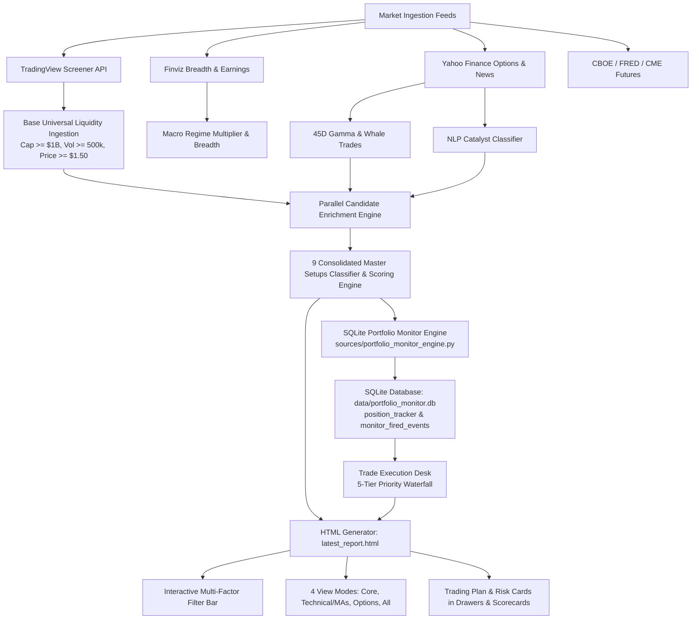
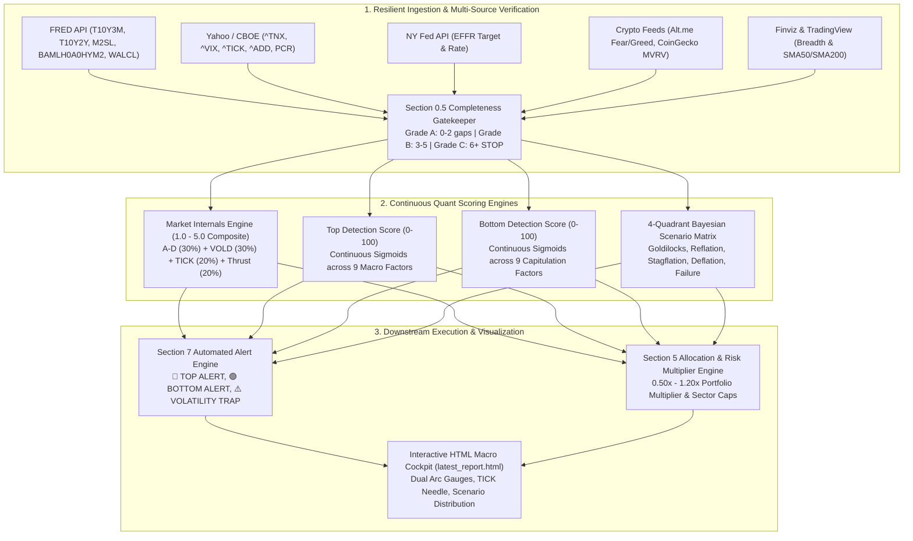
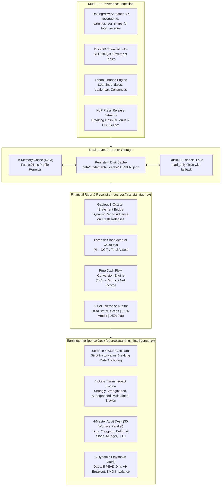
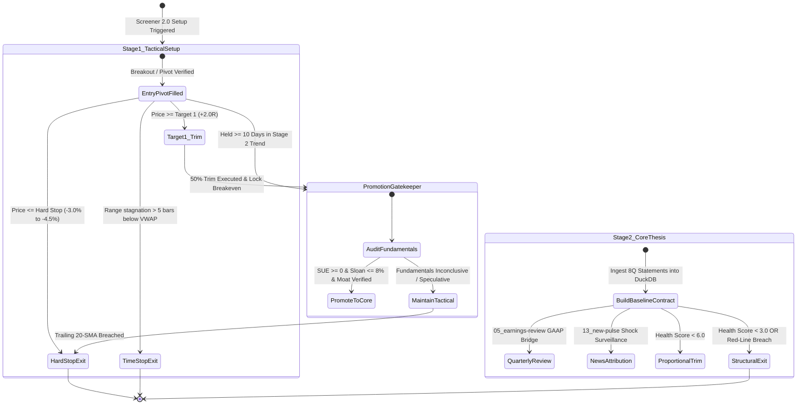

# Institutional Real-Time Intelligence Screener: Living Design & Technical Architecture Specification

**Document Version**: `8.0.0`  
**Last Updated**: `September 22, 2026`  
**Standard**: Buffett 6-Gate Pre-Purchase Verification Audit & 4-Master Consensus Desk, Forensic Accounting Confluence Engine, Multi-Session RVOL Anchor Engine, Upstream Thematic Intelligence & Depth4 Macro Cascade, Setup-Thesis Lifecycle State Machine, News Pulse 2-Factor Beta Residual Attribution, Quantitative Thesis Health & Dynamic ATR Ratchet Stops, 8-Tab HTML Cockpit Desk, Multi-Tier Financial Rigor, Gapless 8Q Reconciler, 9 Master Setups Matrix, SQLite Portfolio Monitor & Phase 4 DuckDB Alpha Attribution Lake

---

## 0. Document Revision & Cumulative Version History

| Version | Release Date | Architectural Additions & Technical Refactors |
|---|---|---|
| **v1.0.0** | Aug 10, 2026 | Modular Python backend (`sources/`, `scrapers/`, `reporter/`), multi-threaded Yahoo Finance & TradingView scanner feeds. |
| **v2.0.0** | Aug 18, 2026 | Black-Scholes IV solver, 45-day aggregated options matrix, Whale sweeps classifier, 4D Macro Regime State Space vector math. |
| **v3.0.0** | Aug 24, 2026 | Portfolio Manager with client/server dual persistence, Fidelity brokerage CSV regex tokenizer, ATR risk budget engine. |
| **v3.1.0** | Aug 25, 2026 | Real-time SQLite Monitoring Engine (`sources/portfolio_monitor_engine.py`, `data/portfolio_monitor.db`), `position_tracker` & `monitor_fired_events` schemas, 5-tier priority alert evaluator. |
| **v3.2.0** | Aug 26, 2026 | Formal implementation of the **9 Consolidated Master Setups Matrix**, 5-bar pivot BOS detection, Trading Plan Cards in HTML/JS row drawers and hover portals, cash-gated ATR sizing math. |
| **v4.4.0** | Aug 29, 2026 | **Unified Institutional Modal Architecture**: Merged 10-step institutional review and 4-master consensus desk into a single reusable UI engine across all 5 dashboard tabs. Fixed DOM modal container nesting. |
| **v4.5.0** | Aug 30, 2026 | **Financial Rigor & Multi-Source Cross-Validation Protocol**: Built `sources/financial_rigor.py` with exact decimal accounting, tolerance checking ($\le 5\%$), gapless 8Q time-series reconciliation, and live TradingView / SEC lake synchronization. |
| **v4.6.0** | Aug 30, 2026 | **Macro Regime Assessment v3.0 Quant Architecture**: Implemented dual-speed continuous sigmoid scoring ($0-100$ Top/Bottom, $1.0-5.0$ Internals), 4-Quadrant Bayesian Scenario probability engine, multi-source ingestion (FRED, CBOE, NY Fed, Alt.me, CoinGecko), Section 0.5 gatekeeper, and interactive HTML macro cockpit visualization. |
| **v4.7.0** | Sep 03, 2026 | **Phase 3 Autonomous Workflow Daemon & Order Execution Desk**: Integrated multi-session daemon (`scheduler/system_daemon.py`), Windows Task Scheduler registration, Fidelity ATP bracket tickets, and Telegram alerts. |
| **v4.8.0** | Sep 04, 2026 | **Phase 4 DuckDB Alpha Attribution Lake & Continuous Parameter Auto-Tuning**: Delivered DuckDB analytical lake (`sources/attribution_lake.py`, `data/attribution_lake.duckdb`) with 73 synthesized baseline holdings, toggleable forward incremental fills (default OFF, user override supported), Skill 08 Brinson-Fachler Factor Attribution (`sources/attribution_engine.py`), continuous parameter auto-tuning (`sources/parameter_tuner.py`) with hard safety clamps [0.50x, 1.35x], and Full-Stack Performance & Attribution Cockpit Desk (`reporter/html_generator.py`). |
| **v5.0.0** | Sep 05, 2026 | **Phase 5 Paper Trading Simulator, Drawdown Circuit Breakers & Stress Testing Engine**: Delivered Unified Paper Execution Simulator (`sources/order_router.py`, `data/paper_trading.duckdb`) with realistic slippage, Alpaca free-tier REST gateway, autonomous intraday drawdown circuit breakers (`sources/risk_circuit_breakers.py`: -1.0% Warning, -2.0% De-Risk, -3.0% Kill-Switch), 10,000-path Monte Carlo forward cones & 6 crisis historical replay engine (`sources/stress_testing_engine.py`), and 7th Primary Cockpit Tab (`🛡️ Risk Governance & Stress Testing`). |
| **v6.0.0** | Sep 06, 2026 | **Phase 6 Setup-Thesis Lifecycle, News Pulse Residual Attribution & 8th Cockpit Terminal**: Integrated Skills 13 (`13_new-pulse.md`), 08 (`08-thesis-monitor-new.md`), and 14 (`14_setup-thesis-lifecycle.md`). Formulated 2-factor beta residualization ($\epsilon_{i,t}$), multi-factor signal scoring, stealth flow surveillance ($Z_\epsilon \ge 2.0$), two-stage automated promotion state machine (Tactical Setup $\to$ Core Thesis), Health Score ($0-10$) sizing formula, DuckDB schemas (`news_pulse_events`, `thesis_contracts`, `thesis_drift_history`), and 8th Primary Cockpit Tab (`📜 Thesis Lifecycle & News Pulse Terminal`). |
| **v7.0.0** | Sep 19, 2026 | **Phase 8 Thematic Intelligence & Depth4 Macro Cascade Technical Engine**: Engineered `sources/thematic_intelligence.py` with Depth4 D1–D4 state categorization, closed-form Unpriced Room % calculation, 4-layer durability gate evaluator, S-curve platform anchor scoring, and Layer 2–3 physical chokepoint arbitrage with $P/S \le 30\times$ valuation gate. Packaged Antigravity skills `/bottleneck-hunter`, `/era-alpha`, and `/trend-discovery`. |
| **v7.1.0** | Sep 20, 2026 | **Institutional RVOL Anchor Standardization & Multi-Session Exact Ratio Engine**: Straightened out institutional Relative Volume ($\text{RVOL}$) definition across all 4 sessions: Premarket (Midnight 00:00 AM EST), Regular (09:30 AM EST), After-Hours (04:30 PM EST), and Weekend (Friday 04:30 PM EST). Formulated deterministic $\text{RVOL}(T) = \text{CumVol}_{\text{anchor} \to T} / \overline{\text{CumVol}}_{20\text{d}, \text{anchor} \to T}$. |
| **v8.0.0** | Sep 22, 2026 | **Phase 9-11 Institutional v2.0 Production Release**: Delivered Buffett 6-Gate Pre-Purchase Verification Audit & 4-Master Consensus Desk with corrected Beneish M-Score AQI formula, SGI hyper-growth cap, 4Q rolling Sloan accruals, and multi-signal confluence veto gating; codified exact Multi-Session RVOL Anchors across all 4 sessions (00:00 Midnight, 09:30 AM, 16:30 PM, Friday 16:30 PM); instituted Hands-Off Earnings Review Daemon; eliminated synthetic fallback data; packaged Antigravity Institutional Skills suite; and verified 100% test coverage. |

---

## 1. High-Level System Architecture



---

## 2. The 9 Consolidated Master Setups Technical Implementation

The system classifies tickers across 9 setup archetypes via algorithmic logic implemented in `sources/scoring_engine.py` and `sources/portfolio_monitor_engine.py`:

### 2.1 Setup 1: `EP_BREAKOUT` (Earnings & Catalyst Explosion)
* **Trigger Math**:
  $$\text{Gap} \ge +5.0\% \quad \land \quad \text{RVOL} \ge 2.5\text{x} \quad \land \quad \text{Catalyst Stars} \ge 4.0$$
* **Entry Pivot**: $P_{\text{entry}} = \max(\text{Premarket High}, \; \text{High of 5-min Open Bar})$.
* **Hard Stop**: $P_{\text{stop}} = P_{\text{entry}} \times 0.965$ (or Low of 5-min Open Bar).
* **Trailing Stop**: 2.0x ATR dynamic ratchet above entry.

### 2.2 Setup 2: `STAGE2_MOMENTUM_RUNNER` (Stage 2 Trend Continuation)
* **Trigger Math**:
  $$\text{Price} > \text{SMA20} > \text{SMA50} > \text{SMA200} \quad \land \quad \text{RVOL} \ge 2.0\text{x} \quad \land \quad \text{Close Location} \ge 75\%$$
* **Entry Pivot**: Breakout above 5-day consolidation resistance.
* **Hard Stop**: $P_{\text{stop}} = P_{\text{entry}} \times 0.960$.
* **Trailing Stop**: $\text{SMA20}$ value ratcheted on daily close.

### 2.3 Setup 3: `SMA20_PULLBACK_REVERSAL` (20-SMA Mean-Reversion Bounce)
* **Trigger Math**:
  $$|\text{Low} - \text{SMA20}| / \text{SMA20} \le 1.5\% \quad \land \quad \text{Price} > \text{SMA50} > \text{SMA200} \quad \land \quad \text{Bullish Reversal Candle}$$
* **Entry Pivot**: High of reversal candle.
* **Hard Stop**: Low of reversal candle (or $\text{SMA20} \times 0.985$).

### 2.4 Setup 4: `STRUCTURE_BOS_BREAKOUT` (5-Bar Pivot High Breakout)
* **Pivot High Calculation ($L=5$)**:
  $$\text{PivotHigh}_i = \text{High}_i \quad \iff \quad \text{High}_i > \max(\text{High}_{i-5 \dots i-1}) \land \text{High}_i > \max(\text{High}_{i+1 \dots i+5})$$
* **BOS Breakout Trigger**:
  $$\text{Current Price} > \text{PivotHigh}_{\text{latest}} \quad \land \quad \text{RVOL} \ge 1.8\text{x}$$
* **Hard Stop**: Prior validated 5-bar swing low ($\text{PivotLow}_{\text{latest}}$).

### 2.5 Setup 5: `HIGH_TIGHT_FLAG` (Volatility Contraction Pattern)
* **Trigger Math**:
  $$\frac{\text{Peak}_{\text{8W}} - \text{Low}_{\text{8W}}}{\text{Low}_{\text{8W}}} \ge 100\% \quad \land \quad \frac{\text{Peak}_{\text{8W}} - \text{Price}}{\text{Peak}_{\text{8W}}} \le 20\% \quad \land \quad \text{RVOL}_{\text{contraction}} \le 0.60\text{x}$$
* **Entry Pivot**: Resistance trendline breakout.
* **Hard Stop**: Flag base pivot ($-4.5\%$).

### 2.6 Setup 6: `PARABOLIC_SHORT_REVERSAL` (Buying Climax Fade)
* **Trigger Math**:
  $$\text{Price} > \text{VWAP} + 3.5\sigma \quad \land \quad \text{RSI}_{14} \ge 85 \quad \land \quad \text{RVOL} \ge 4.0\text{x}$$
* **Action**: Exit / Short mean-reversion target to VWAP and SMA20.

### 2.7 Setup 7: `GAP_AND_GO` (Morning Premarket Follow-Through)
* **Trigger Math**:
  $$\text{Gap} \ge +3.0\% \quad \land \quad \text{Premarket Vol} \ge 200\text{K} \quad \land \quad \text{Price} > \text{Premarket High}$$
* **Entry Pivot**: Premarket high level.
* **Hard Stop**: Premarket consolidation base ($-3.0\%$).

### 2.8 Setup 8: `VWAP_REVERSAL_RECLAIM` (Intraday VWAP Reclaim)
* **Trigger Math**:
  $$\text{Low}_{\text{session}} < \text{VWAP} \quad \land \quad \text{Price} > \text{VWAP} \quad \land \quad \text{Volume}_{\text{reclaim}} > 1.5\text{x Avg 5m Bar}$$
* **Entry Pivot**: Bullish reclaim candle close above VWAP.
* **Hard Stop**: Low of session dip.

### 2.9 Setup 9: `OPTIONS_GAMMA_SQUEEZE` (Whale Sweep & Gamma Magnet)
* **Trigger Math**:
  $$\text{Vol/OI} \ge 2.5\text{x} \quad \land \quad \text{Net Dollar Flow} > +\$500\text{K} \quad \land \quad \text{Price} \ge \text{Call Wall}$$
* **Entry Pivot**: Breakout above Call Wall level.
* **Hard Stop**: Put Wall floor level (or $-4.0\%$).

---

## 3. SQLite Real-Time Portfolio Monitor Engine

### 3.1 Database Schema (`data/portfolio_monitor.db`)

#### Table: `position_tracker`
```sql
CREATE TABLE IF NOT EXISTS position_tracker (
    symbol TEXT PRIMARY KEY,
    underlying TEXT,
    shares REAL,
    cost_basis REAL,
    entry_price REAL,
    current_price REAL,
    highest_price_seen REAL,
    hard_stop REAL,
    trailing_stop REAL,
    sma20_val REAL,
    target_1 REAL,
    target_2 REAL,
    strategy_tag TEXT,
    streak_count INTEGER,
    last_updated TIMESTAMP
);
```

#### Table: `monitor_fired_events`
```sql
CREATE TABLE IF NOT EXISTS monitor_fired_events (
    event_id TEXT PRIMARY KEY,
    symbol TEXT,
    priority_tier INTEGER,
    event_type TEXT,
    trigger_condition TEXT,
    action_instruction TEXT,
    entry_price REAL,
    current_price REAL,
    highest_seen REAL,
    hard_stop REAL,
    trailing_stop REAL,
    target_1 REAL,
    target_2 REAL,
    pnl_impact REAL,
    shares_involved REAL,
    status TEXT,
    timestamp TIMESTAMP
);
```

### 3.2 Dynamic Trailing Stop Ratchet Algorithm
```python
def update_position_ratchet(pos, current_price, atr14):
    highest_seen = max(pos["highest_price_seen"], current_price)
    
    # Ratchet dynamic trailing stop: 2.0x ATR below peak high
    calculated_trailing = round(highest_seen - (2.0 * atr14), 2)
    
    # Trailing stop can only ratchet upward, never down
    dynamic_trailing = max(pos["hard_stop"], calculated_trailing, pos["trailing_stop"])
    
    return highest_seen, dynamic_trailing
```

---

## 4. Practical Cash-Gated Position Sizing Engine

To prevent unrealistic position sizes when portfolio cash is finite, sizing is cash-gated:

$$\text{Max Practical Capital} = \min\Big(\text{ATR Risk Capital}, \; (\text{Total Available Cash} - \text{Target Cash Reserve}) \times 10\%\Big)$$

$$\text{Allocation Shares} = \left\lfloor \frac{\text{Max Practical Capital}}{\text{Entry Price}} \right\rfloor$$

$$\text{Position Capital Required} = \text{Allocation Shares} \times \text{Entry Price}$$

* **Target Cash Reserve**: Default $20\%$ of Portfolio NAV.
* **Risk Budget**: $1.0\%$ of Portfolio NAV per trade.

---

## 5. UI Integration Architecture & Drawer Rendering

Every row drawer in `latest_report.html` renders a 4-card grid:
1. **Card 1: 📈 Trend & Moving Average Matrix** (`VWAP`, `SMA5`, `SMA20`, `SMA50`, `SMA200`).
2. **Card 2: 🎯 Institutional Options Gamma & Sizing** (`Gamma Skew`, `Call/Put Walls`, `Vol/OI`, `Whale Sweeps`).
3. **Card 3: 📰 Catalyst & Analyst Intelligence** (`Headline`, `NLP Category`, `Star Rating`, `Earnings Date`).
4. **Card 4: 🎯 Institutional Trading Plan & Risk** (`Setup Code`, `Setup Score`, `Entry Pivot`, `Hard Stop`, `Soft Stop`, `Dynamic Trailing Stop`, `Target 1`, `Target 2`, `Cash-Gated Shares / Capital`).

---

## 6. Financial Rigor & Multi-Source Cross-Validation Engine (`sources/financial_rigor.py`)

### 6.1 Multi-Tier Validation Hierarchy
```
┌───────────────────────────────────────────────────────────┐
│ Tier 1: Primary SEC 10-Q/K Lake (DuckDB Columnar)         │ ──┐
├───────────────────────────────────────────────────────────┤   │
│ Tier 2: Real-Time TradingView Screener API (Live Release) │ ──┼──► FinancialRigorEngine (<= 5% Tolerance)
├───────────────────────────────────────────────────────────┤   │             │
│ Tier 3: Consensus Calendar & Estimates (Yahoo/Finviz)     │ ──┘             ▼
└───────────────────────────────────────────────────────────┘    Gapless 8Q Statement Series
```

### 6.2 Exact Accounting & Cash Flow Formulas
1. **Richard Sloan Accrual Anomaly Ratio**:
   $$\text{Sloan Ratio} = \frac{\text{Net Income} - \text{Operating Cash Flow}}{\text{Total Assets}} \times 100\%$$
   * $\le 4.0\%$: `🟢 Clean Cash-Backed`
   * $4.0\% - 8.0\%$: `🟡 Moderate Accrual`
   * $> 8.0\%$: `🔴 High Accrual Distortion (Red Flag)`
2. **Free Cash Flow Conversion**:
   $$\text{FCF Conversion} = \frac{\text{FCF}}{|\text{Net Income}|} \times 100\%$$
   * $\ge 100\%$: `🟢 >100% Cash-Backed`
   * $\ge 80\%$: `🟢 Strong Conversion`
   * $< 50\%$: `🔴 Weak Conversion`

---

## 7. Unified Single-Source Institutional Modal Architecture

### 7.1 Reusable Engine Interface
All screens (Screener Watchlist, Actions Desk, Portfolio, Macro, Earnings Center) call a single global JavaScript controller:
```javascript
openDualSkillModal(symbol, defaultMode); // defaultMode: 'review' | 'team'
```
* **DOM Placement**: Mounted directly on root `document.body` outside view containers, eliminating display truncation bugs.
* **Canonical Persistence**: Reads directly from `data/earnings_reports/[SYMBOL]_Latest.json`.
* **4-Master Consensus Desk Weighting**:
  * Warren Buffett & Richard Sloan: **35%** (Forensic Cash Flow & Accruals)
  * Duan Yongping: **30%** (Business Moat & Pricing Power)
  * Charlie Munger: **20%** (Inversion & Anti-Fragility)
  * Li Lu: **15%** (Management NLP & Trust)

---

## 8. Macro Regime Assessment v3.0 Quantitative Engine Architecture



### 8.1 Continuous Sigmoidal Factor Normalization
Each raw factor $x_i$ is mapped to a continuous sub-score $S_i \in [0, 10]$:
$$S_i(x_i) = \frac{10}{1 + \exp\left(-k_i \cdot (x_i - x_{0,i})\right)}$$

- **Yield Curve Inversion ($10\text{y}-3\text{m}$, $10\text{y}-2\text{y}$)**: Inversion depth $< -0.20\%$ approaches $10.0$; positive slope $> +0.50\%$ approaches $0.0$.
- **M2 YoY Growth**: Negative YoY growth ($<0\%$) approaches $10.0$ for top risk; positive rebound $> +4\%$ approaches $10.0$ for bottom opportunity.
- **NYSE TICK Climax**: $\text{TICK} > +1500$ maps to $10.0$ top exhaustion; $\text{TICK} < -1500$ maps to $10.0$ bottom capitulation.
- **VIX Volatility / Complacency**: $\text{VIX} < 14$ maps to $10.0$ complacency top risk; $\text{VIX} > 35$ maps to $10.0$ panic bottom opportunity.

### 8.2 4-Quadrant Bayesian Scenario Probabilities
Given normalized Macro Vector $\mathbf{V} = [\text{Growth Momentum } G, \; \text{Inflation Pressure } I]^T$:
$$P(\text{Quadrant}_k) = \frac{\exp(-\|\mathbf{V} - \mathbf{\mu}_k\|^2 / 2\sigma^2)}{\sum_{j=1}^4 \exp(-\|\mathbf{V} - \mathbf{\mu}_j\|^2 / 2\sigma^2)} \times (1 - P_{\text{failure}})$$

Where $P_{\text{failure}}$ is scaled by the BTC/Gold correlation breakdown factor ($|r_{\text{BTC, Gold}}| \to 1.0$).

---

## 9. Financial Rigor & Real-Time Earnings Intelligence Architecture



### 9.1 Multi-Tier Zero-Lock Caching Pipeline (`sources/defeatbeta_client.py`)
To prevent Windows OS DuckDB file-lock collisions during high-concurrency parallel screening:
1. **Tier 1 (RAM)**: `_memory_cache` dictionary stores deserialized profile objects for instantaneous in-turn access ($<0.01\text{ms}$).
2. **Tier 2 (Disk JSON)**: `data/fundamental_cache/{ticker}.json` stores full canonical 8-quarter profiles on disk, enabling persistent restarts without DuckDB locks or external HTTP calls.
3. **Tier 3 (DuckDB Lake)**: `data/earnings_lake.duckdb` accessed exclusively with `read_only=True`. If an OS lock is encountered, it falls back to memory mode gracefully.

### 9.2 Real-Time Quarter Advancement & Statement Bridge (`sources/financial_rigor.py`)
When companies report breaking quarterly earnings (e.g. NVDA Q2 on Aug 26, DELL Q3 on Sept 1):
1. The engine checks if TradingView's `revenue_fq` or `total_revenue` post-dates the latest SEC 10-Q filing period.
2. If fresh, it constructs a synthesized `quarter[0]` entry with reported revenue, EPS, and estimated gross margin.
3. Historical quarters are advanced to `quarter[1..N]`, maintaining a gapless 8-quarter rolling window for accurate year-over-year and quarter-over-quarter z-score analysis.

### 9.3 Temporal Isolation of Consensus Estimates (`sources/earnings_intelligence.py`)
1. **Active Releases ($\Delta t \le 3\text{ days}$)**: `consensus["est_rev"]` and `consensus["est_eps"]` represent the *active reported quarter*.
2. **Historical Releases ($\Delta t > 3\text{ days}$)**: `consensus` in the profile header represents the *next upcoming quarter*. The engine strictly queries `earnings_dates` history from that past release date to ensure revenue/EPS surprise percentages reflect historical reality ($6.22\%$ EPS beat for NVDA, $18.51\%$ beat for PLTR).

### 9.4 Parallel 4-Master Consensus Auto-Enrichment (`reporter/html_generator.py`)
1. In Step 6 of report generation, missing or invalid 4-master reports are enriched in parallel across 30 workers (`ThreadPoolExecutor(max_workers=30)`).
2. The gatekeeper checks `has_valid_eps` (`actual_eps` and `est_eps` non-null) to guarantee that no stale or placeholder data is rendered in the HTML modal popups.

---

## 10. Quantitative News Signal Detection & Beta Residual Attribution Engine (`13_new-pulse.md`)

```mermaid
flowchart TD
    A[Market Ingestion Feeds: SEC EDGAR, PR Feeds, Tier-1 Financial Media] --> B[Multi-Factor Noise Filter]
    B --> C["Signal Score = 0.40*Relevance + 0.30*Novelty + 0.20*Authority + 0.10*|Sentiment|"]
    
    T[Price / Volume Trigger: |R_1d| >= 3.5% OR RVOL >= 1.8x] --> D[2-Factor Residual Return Engine]
    D --> E["Residual eps_i,t = R_i,t - (alpha + beta_SPY*R_SPY + beta_Sec*R_Sec)"]
    
    C & E --> F{Attribution & Stealth Evaluator}
    F -->|Signal >= 50| G["Attribution Weight = (|eps_i,t| / Sum |eps|) * Signal_Weight"]
    F -->|"Z(eps) >= 2.0 & Signal < 50"| H[Stealth Event Flag: Information Asymmetry / Informed Flow]
    
    G --> I[Cross-Reference with 05_earnings-review & 08-thesis-monitor]
    H --> J[Tier 2 Risk Alert in Actions Desk]
```

### 10.1 Two-Factor Beta Residualization
To isolate idiosyncratic single-stock alpha from systematic market drift and sector momentum:
$$\epsilon_{i,t} = R_{i,t} - \left(\alpha_i + \beta_{i,\text{SPY}} \cdot R_{\text{SPY},t} + \beta_{i,\text{Sector}} \cdot R_{\text{Sector},t}\right)$$
Where $\beta_{i,\text{SPY}}$ and $\beta_{i,\text{Sector}}$ are estimated via rolling 60-day OLS regression.

### 10.2 Continuous Multi-Factor Signal Scoring
Every news article or filing $k \in K$ receives a signal score:
$$\text{Signal Score}_k = 0.40 \cdot R_k + 0.30 \cdot N_k + 0.20 \cdot A_k + 0.10 \cdot |S_k|$$
* **Relevance ($R_k \in [0, 100]$)**: Semantic embedding similarity to the ticker's core business segment vector.
* **Novelty ($N_k \in [0, 100]$)**: $1.0 - \max_{\tau \in [t-7d, t)} \text{CosineSim}(\mathbf{E}_k, \mathbf{E}_\tau)$.
* **Authority ($A_k \in [0, 100]$)**: Regulatory Filings (10-Q/K, 8-K) = 100, Official Press Releases = 85, Major Financial Outlets (Reuters, Bloomberg, WSJ) = 70, Aggregators/Blogs = 30.
* **Sentiment Magnitude ($|S_k| \in [0, 100]$)**: NLP polarity intensity extracted via financial domain models.

### 10.3 Event Attribution & Stealth Detection
* **Primary Driver**: Attribution Weight $\ge 60\%$.
* **Contributing Factor**: Attribution Weight $20\% - 59\%$.
* **Coincidental / Noise**: Attribution Weight $< 20\%$.
* **Stealth Event Detection**: If $Z_{\epsilon} = \frac{|\epsilon_{i,t}| - \mu_{\epsilon, 60d}}{\sigma_{\epsilon, 60d}} \ge 2.0$ and $\max_k(\text{Signal Score}_k) < 50$, the system flags a stealth event (unexplained price surge/drop driven by non-public order flow or informed institutional repositioning).

---

## 11. Quantitative Thesis Health Scoring & Volatility-Adjusted Stops (`08-thesis-monitor-new.md`)

### 11.1 Formulaic Thesis Health Score ($H \in [0, 10]$)
$$H_t = 10.0 - 3.0 \cdot N_{\text{BROKEN}} - 1.5 \cdot N_{\text{BREACHED}} - 0.5 \cdot N_{\text{MARGINAL}} - 2.0 \cdot N_{\text{REDLINE}} + 0.5 \cdot N_{\text{NEW\_STRENGTH}}$$

| Health Score Range | Classification | Systematic Execution & Sizing Action |
| :--- | :--- | :--- |
| **$9.0 - 10.0$** | **STRONG** | Thesis confirmed; eligible for allocation expansion on Stage 2 pullbacks. |
| **$7.0 - 8.9$** | **INTACT** | Core thesis valid; hold position and maintain dynamic trailing stop ratchets. |
| **$5.0 - 6.9$** | **WEAKENED** | Systematic de-risking: $\text{Trim \%} = (6.0 - H) \times 10\%$. (e.g. $H=4.5 \implies \text{Sell } 15\%$). |
| **$3.0 - 4.9$** | **DAMAGED** | Critical risk: Trim position by $50\%$; trigger immediate analyst due diligence. |
| **$< 3.0$ or Fatal Red-Line** | **BROKEN** | **Sell 100% at next open**; mapped to Tier 1 Immediate Execution. |

### 11.2 Dynamic Volatility-Adjusted Stops with IV Rank Scaling
$$\text{Dynamic Stop Distance} = 2.0 \times \text{ATR}_{14} \times \left(1 + \sigma_{\text{sector\_factor}}\right) \times \left(1 + 0.5 \cdot \text{IVR}_{30d}\right)$$
* **Trailing Ratchet Execution**:
  * Gain $\ge +15\%$: Tighten stop multiplier to $1.5\times\text{ATR}$.
  * Gain $\ge +30\%$: Tighten stop multiplier to $1.0\times\text{ATR}$.
  * Gain $\ge +50\%$: Tighten stop multiplier to $0.75\times\text{ATR}$ or Daily 20-SMA.
* **Volume-Conditioned Breach Gatekeeper**:
  * 1-day breach with $\text{Volume} < 1.5\times\text{ADV} \implies$ **Hold** (filter false shakeout).
  * 2 consecutive closes below stop OR 1-day breach with $\text{Volume} \ge 2.0\times\text{ADV} \implies$ **Sell at next open**.

---

## 12. Two-Stage Setup-to-Thesis Lifecycle State Machine (`14_setup-thesis-lifecycle.md`)



---

## 13. Analytical Lake & Real-Time Sync Database Schemas

### 13.1 DuckDB Analytical Schemas (`data/attribution_lake.duckdb`)
```sql
CREATE TABLE IF NOT EXISTS news_pulse_events (
    event_id VARCHAR PRIMARY KEY,
    symbol VARCHAR NOT NULL,
    timestamp TIMESTAMP NOT NULL,
    trigger_type VARCHAR,
    return_1d DOUBLE,
    market_beta_return DOUBLE,
    sector_beta_return DOUBLE,
    residual_return DOUBLE,
    residual_zscore DOUBLE,
    composite_signal_score DOUBLE,
    primary_headline VARCHAR,
    primary_source VARCHAR,
    authority_score DOUBLE,
    novelty_score DOUBLE,
    attribution_weight DOUBLE,
    is_stealth BOOLEAN,
    created_at TIMESTAMP DEFAULT CURRENT_TIMESTAMP
);

CREATE TABLE IF NOT EXISTS thesis_contracts (
    thesis_id VARCHAR PRIMARY KEY,
    symbol VARCHAR NOT NULL,
    promotion_stage VARCHAR NOT NULL,  -- 'TACTICAL_SETUP', 'CORE_THESIS', 'ARCHIVED'
    established_date DATE NOT NULL,
    origin_archetype VARCHAR NOT NULL,
    entry_price DOUBLE NOT NULL,
    current_shares DOUBLE NOT NULL,
    target_1_price DOUBLE,
    target_2_price DOUBLE,
    hard_stop_price DOUBLE,
    dynamic_stop_price DOUBLE,
    trailing_rule VARCHAR,
    moat_description VARCHAR,
    sloan_accrual_baseline DOUBLE,
    fcf_conversion_baseline DOUBLE,
    health_score DOUBLE DEFAULT 10.0,
    status VARCHAR DEFAULT 'ACTIVE',
    last_review_date DATE
);

CREATE TABLE IF NOT EXISTS thesis_drift_history (
    drift_id VARCHAR PRIMARY KEY,
    thesis_id VARCHAR REFERENCES thesis_contracts(thesis_id),
    symbol VARCHAR NOT NULL,
    review_date DATE NOT NULL,
    prior_health_score DOUBLE,
    new_health_score DOUBLE,
    broken_assumptions INTEGER,
    breached_assumptions INTEGER,
    redlines_triggered INTEGER,
    quantitative_drift_score DOUBLE,
    semantic_similarity DOUBLE,
    action_recommended VARCHAR,
    action_executed VARCHAR,
    filing_quarter VARCHAR
);
```

### 13.2 SQLite Real-Time Sync (`data/portfolio_monitor.db`)
Columns synchronized into `position_tracker`:
* `lifecycle_stage`: `'TACTICAL_SETUP'` or `'CORE_THESIS'`.
* `thesis_health_score`: Float ($0.0 - 10.0$).
* `drift_status`: `'NO_DRIFT'`, `'MILD_DRIFT'`, `'MODERATE_DRIFT'`, `'SIGNIFICANT_DRIFT'`.
* `last_news_signal`: Float ($0.0 - 100.0$).
* `last_news_attribution`: Text classification (`PRIMARY`, `CONTRIBUTING`, `STEALTH`).

---

## 14. 8th Primary Cockpit Tab & Interactive UI Specification

`latest_report.html` integrates Tab 8: `📜 Thesis Lifecycle & News Pulse Terminal`:
1. **Module A: Fleet Health Matrix**: High-density grid of all portfolio positions displaying their Lifecycle Stage, Health Score gauges, Red-Line indicators, and automatic sizing recommendations.
2. **Module B: Drift Radar**: Visualizes quantitative parameter drift vs semantic narrative shifts from consecutive 10-Q filings.
3. **Module C: Breaking News Attribution Stream**: Real-time ticker tape displaying 2-factor beta residual returns, NLP signal scores, authority badges, and stealth event alerts.
4. **Embedded Upgrades**:
   * Card 3 in Row Drawers upgraded with quantified News Signal Scores and Attribution Weights.
   * Card 4 in Row Drawers displays dynamic Thesis Health and two-stage lifecycle state badges.

---

## 15. Autonomous 3-Session Daemon Workflow (`scheduler/system_daemon.py`)

1. **Session 1: Premarket (08:00 - 09:15 ET)**:
   * Ingests overnight regulatory filings, earnings releases, and market gap data.
   * Runs `sources/news_pulse.py` to compute premarket Signal Scores and filter out low-credibility PR pump candidates.
2. **Session 2: Intraday (09:30 - 16:00 ET)**:
   * Event-driven triggers for portfolio holdings experiencing abnormal moves ($|R_{1d}| \ge 3.5\%$ or $\text{RVOL} \ge 1.8\text{x}$).
   * Evaluates residual z-score ($Z_\epsilon \ge 2.0$); dispatches Tier 2 Stealth Alerts if news is absent.
   * Evaluates Target 1 (+2.0R) triggers for automatic promotion evaluation.
3. **Session 3: Postmarket (16:30 - 18:00 ET)**:
   * Reconciles fresh 10-Q/K statements via `sources/financial_rigor.py` and `05_earnings-review-new.md`.
   * Executes earnings-price divergence analysis.
   * Executes `08-thesis-monitor-new.md` to update fleet-wide Thesis Health Scores, recalculate trailing stops, and persist drift snapshots into `data/attribution_lake.duckdb`.

---

## 16. Buffett 6-Gate Pre-Purchase Verification Audit & Forensic Accounting Architecture

Integrated into `sources/deep_research_engine.py` and rendered via interactive DOM modal in `reporter/html_generator.py`:

### 16.1 The 6 Quantitative Verification Gates
1. **Gate 1: Circle of Competence**:
   $$\text{Economic Moat Score} \ge 3.0/5.0 \quad \land \quad \text{ROCE} \ge 15.0\%$$
2. **Gate 2: Enduring Moat & Pricing Power**:
   $$\text{Gross Margin} \ge 40.0\% \quad \land \quad \Delta\text{Gross Margin}_{\text{YoY}} \ge -2.0\%$$
3. **Gate 3: Capital Allocation & Conservative Balance Sheet**:
   $$\text{Piotroski F-Score} \ge 5/9 \quad \land \quad \text{Debt-to-Equity} < 1.50\times$$
4. **Gate 4: Honest & Competent Management**:
   $$\text{Share Dilution}_{\text{YoY}} \le +2.0\% \quad \land \quad \text{Insider Alignment} \ge 3.0/5.0$$
5. **Gate 5: Reverse DCF & Margin of Safety**:
   Market-implied growth hurdle $g^*$ solved via bisection root solver:
   $$P_{\text{market}} = \sum_{t=1}^{10} \frac{\text{FCF}_0 \cdot (1 + g^*)^t}{(1 + WACC)^t} + \frac{\text{Terminal Value}}{(1 + WACC)^{10}}$$
   Requires current price at $\ge 20\%$ discount to conservative baseline valuation.
6. **Gate 6: Forensic Accounting & Red Flag Audit**:
   - **Beneish 8-Variable M-Score**:
     $$M = -4.84 + 0.920 \cdot \text{DSRI} + 0.528 \cdot \text{GMI} + 0.404 \cdot \text{AQI} + 0.892 \cdot \text{SGI} + 0.115 \cdot \text{DEPI} - 0.172 \cdot \text{SGAI} + 4.037 \cdot \text{TATA} + 0.0327 \cdot \text{LVGI}$$
     - $\text{AQI} = 1 - \frac{\text{Current Assets} + \text{PP\&E}}{\text{Total Assets}}$ (never subtracts Gross Profit from assets).
     - $\text{SGI}$ capped at $1.25$ when $\text{GMI} \le 1.05$ to prevent penalizing hyper-growth innovators.
     - Multi-quarter $\text{TATA}$ and Sloan accrual rolling 4-quarter window ($\le 8.0\%$).
     - Confluence Gating: Borderline $M \in [-1.78, -1.49]$ triggers `🟡 WARN` (0.5x sizing). Fatal hard veto ($0.0\times$) strictly requires multi-signal confluence ($M > -1.49$ conjoined with Sloan $> 8\%$ or Piotroski $F \le 3$, or $F \le 2$).

### 16.2 Quantitative Sizing Allocation Function
$$\text{Allocation Multiplier} = \begin{cases} 
1.0\times & \text{if } 6/6 \text{ Gates Cleared} \\ 
0.5\times & \text{if } 5/6 \text{ Gates Cleared (Gate 6 Warn: Borderline } M \text{ or Accrual)} \\ 
0.25\times & \text{if } 4/6 \text{ Gates Cleared (Speculative Allocation)} \\ 
0.0\times & \text{if Fatal Hard Veto Triggered (Confluence of Manip + Distress, or Insolvency)} 
\end{cases}$$

---

## 17. Multi-Session RVOL Anchor Engine & Institutional Skills System Architecture

### 17.1 Deterministic Session RVOL Anchoring
$$\text{RVOL}(T) = \frac{\text{CumVol}_{\text{anchor} \to T}}{\overline{\text{CumVol}}_{20\text{d}, \text{anchor} \to T}}$$
- **Premarket**: Anchor 00:00 EST. Evaluated $00:00 \to 09:30$.
- **Regular Hours**: Anchor 09:30 EST. Evaluated $09:30 \to 16:30$.
- **After-Hours**: Anchor 16:30 EST. Evaluated $16:30 \to 23:59:59$.
- **Weekend**: Anchor Friday 16:30 EST. Evaluated Friday extended hours through Sunday.

### 17.2 Antigravity Institutional Skills Topology
```
.agents/skills/ & skills/
├── bottleneck-hunter/   # Layer 2-3 supply chain chokepoint arbitrage (P/S <= 30x)
├── era-alpha/           # S-curve platform compounding anchors (ROIC > 18%)
├── trend-discovery/     # Upstream macro trend discovery & Depth4 causal cascades (D1-D4)
├── news-pulse/          # 2-factor beta residual news attribution & PEAD divergence
├── deep-research/       # 4-Master company deep research desk & reverse DCF
└── earnings-review/     # Primary SEC 10-Q/8-K forensic audit & consensus desk
```
