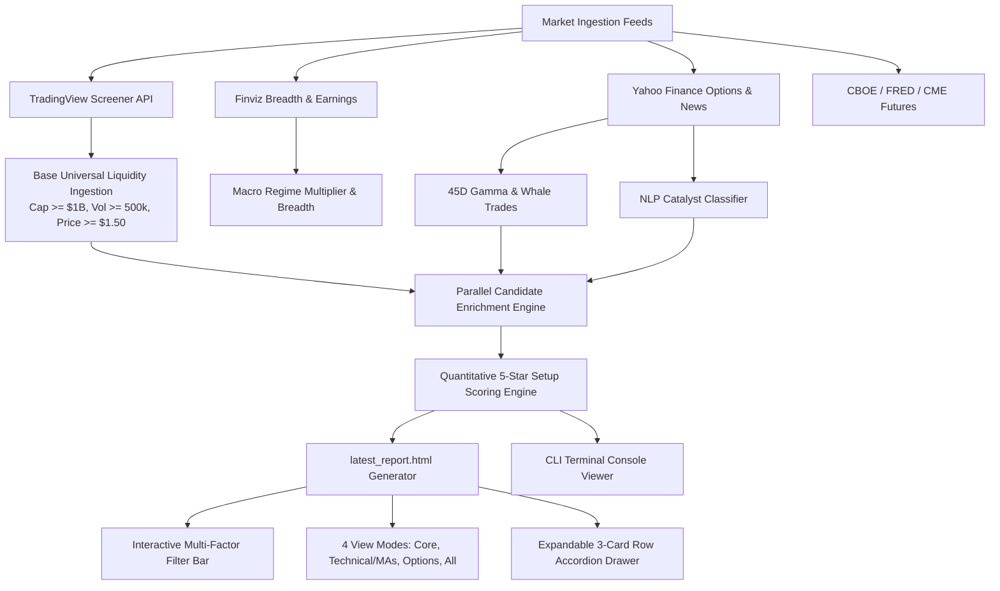
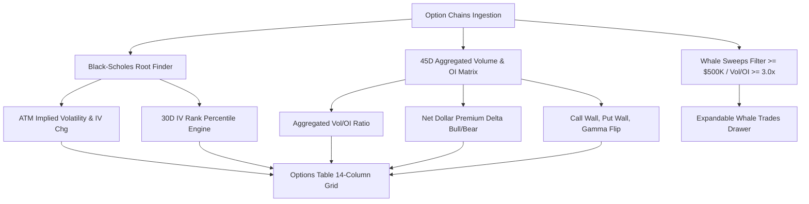

# Institutional Real-Time Intelligence Screener: Living Design & Technical Architecture Specification

**Document Version**: `3.0.0`  
**Last Updated**: `August 24, 2026`  
**Standard**: Multi-Factor Institutional Quantitative Architecture, Portfolio Manager, Fidelity CSV Sync, ATR Parity Sizing & 4D Macro Regime

---

## 1. High-Level Architecture Overview



---

## 2. Moving Average & Technical Level Formulas

All technical distances and moving averages are computed directly from the TradingView Screener API and session bars:

$$\text{Level Distance \%} = \frac{P - L}{L} \times 100\%$$

Where:
* $P$ = Current Session Price (`premarket_close` in Premarket, `close` in Regular, `postmarket_close` in Postmarket / Weekend).
* $L$ = Reference Level (`VWAP`, `SMA5`, `SMA20`, `SMA50`, `SMA200`, `Last Day High`, `Premarket High`, `Call Wall`, `Put Wall`, `Gamma Flip`).

### Technical Moving Average Fields:
1. **`VWAP`**: Volume-Weighted Average Price for the session ($\frac{\sum (P_i \times V_i)}{\sum V_i}$).
2. **`SMA5`**: 5-Day Simple Moving Average ($\frac{1}{5} \sum_{i=1}^5 \text{Close}_i$).
3. **`SMA20`**: 20-Day Simple Moving Average (Short-term momentum baseline).
4. **`SMA50`**: 50-Day Simple Moving Average (Institutional intermediate trend indicator).
5. **`SMA200`**: 200-Day Simple Moving Average (Secular macro bull/bear boundary).

---

## 3. Interactive Multi-Factor Filter Architecture

Client-side filtering is executed instantly in the browser without re-running python pipelines:
```javascript
function filterDayWatchlist() {
    const reqLastHigh = document.getElementById('filter-breakout-last').checked;
    const reqPmHigh = document.getElementById('filter-breakout-pm').checked;
    const minGap = parseFloat(document.getElementById('filter-gap').value) || 0.0;
    const minCat = parseFloat(document.getElementById('filter-catalyst').value) || 0.0;
    const minRvol = parseFloat(document.getElementById('filter-rvol').value) || 0.0;
    const minScore = parseFloat(document.getElementById('filter-score').value) || 0.0;
    const selSector = document.getElementById('filter-sector').value;
    ...
}
```

### Institutional Defaults:
* `> Last Day High` = `true`
* `> Premarket High` = `true`
* `% Chg` = `ALL`
* `Gap %` = `≥ +3.0%`
* `% Open` = `ALL`
* `% VWAP` = `ALL`
* `Catalyst Rating` = `≥ 2.0★ (Positive Only)`
* `Min RVOL` = `≥ 1.50x`
* `Min Setup Score` = `≥ 2.5★`
* `Sector` = `ALL`

---

## 4. Options Analytics & TradeAlgo Enhanced Engine

### 4.1 Architecture Diagram


### 4.2 Core Calculations:
* **Black-Scholes Implied Volatility Solver**: Bisection numerical solver computing exact contract and ATM IV when exchange bid/ask spreads are offline.
* **Persistent Cache (`data/cache/options_iv_cache.json`)**: Tracks historical ATM IV, daily delta (`IV Chg`), and 1-year IV extremes for accurate **IV Rank** (0–100%).
* **Default Table Sorting**: `initTable('options-table', 10, defaultSortCol=2, defaultSortDir='desc')` automatically sorts by Vol/OI ratio descending on browser load.

