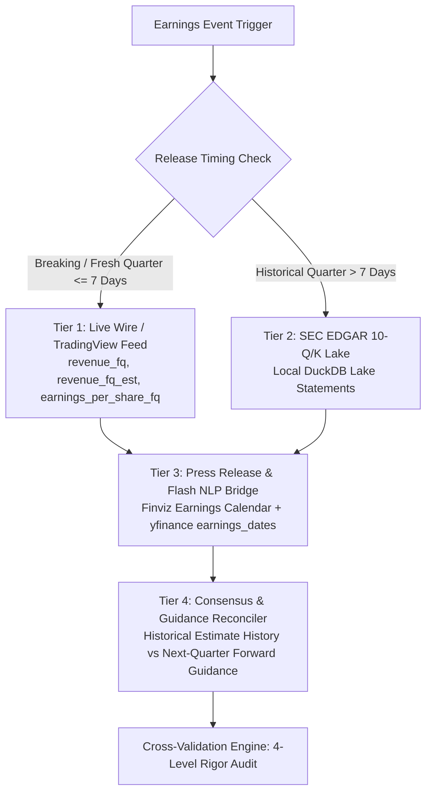
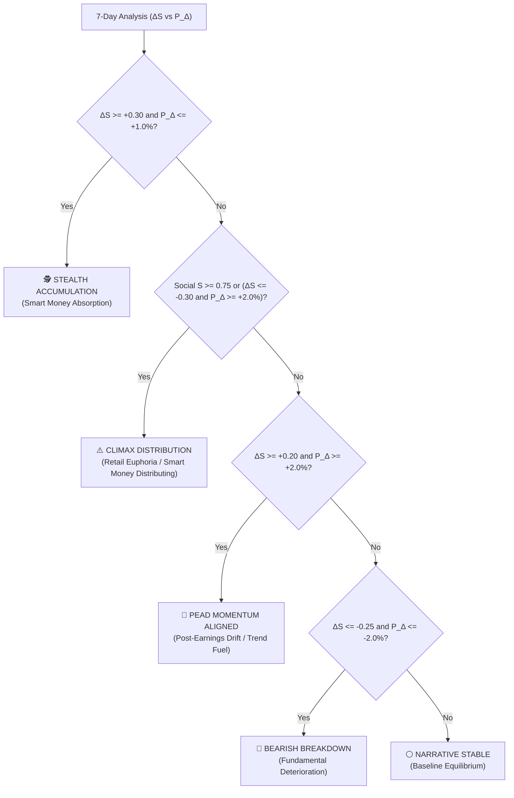

# Institutional Real-Time Intelligence Screener: Living Functional Specification

**Document Version**: `8.0.0`  
**Last Updated**: `September 22, 2026`  
**Standard**: Buffett 6-Gate Pre-Purchase Verification Audit & 4-Master Consensus Desk, Forensic Accounting Confluence Engine, Multi-Session RVOL Anchor Engine, Upstream Thematic Intelligence & Depth4 Macro Cascade, Setup-Thesis Lifecycle State Machine, News Pulse 2-Factor Beta Residual Attribution, Unified Catalyst & Sentiment Engine, Quantitative Thesis Health & Dynamic ATR Ratchet Stops, Macro Regime Assessment v3.0, Dual Intraday/Swing Turning Point Engine, Multi-Tier Financial Rigor Engine, Gapless 8Q Reconciler, 9 Master Setups Matrix, SQLite Portfolio Monitor & Phase 4 DuckDB Alpha Attribution Lake

---

## 0. Document Revision & Cumulative Version History

| Version | Release Date | Key Enhancements & Functional Additions |
|---|---|---|
| **v1.0.0** | Aug 10, 2026 | Initial Screener: Multi-session reference anchors (Premarket, Regular, Postmarket), TradingView scanner ingestion, Finviz economic calendar, Yahoo news catalyst parser. |
| **v2.0.0** | Aug 18, 2026 | Institutional Options Analytics (45-day aggregated Gamma structure, Call/Put Walls, Gamma Flip, Vol/OI ratios, Whale Sweeps), 4D Macro Regime State Space. |
| **v3.0.0** | Aug 24, 2026 | Institutional Portfolio Manager, Fidelity CSV drag-and-drop parser, localStorage/backend dual-sync, Championship ATR position sizing engine. |
| **v3.1.0** | Aug 25, 2026 | Trade Execution Desk with 5 Priority Tiers, real-time background SQLite Monitor Engine (`sources/portfolio_monitor_engine.py`) tracking dynamic ratcheted trailing stops, hard stops, soft stops, and climax top reversals. |
| **v3.2.0** | Aug 26, 2026 | **9 Consolidated Master Setups Matrix** formal codification, Institutional Trading Plan & Risk Cards integrated across Screener & Portfolio row drawers and modals, cash-gated allocation formula, 5-bar pivot BOS structure validation. |
| **v4.4.0** | Aug 29, 2026 | **Unified Institutional Modal Architecture**: Merged 10-step institutional review and 4-master consensus desk into a single reusable UI engine across all 5 dashboard tabs. Fixed DOM modal container nesting. |
| **v4.5.0** | Aug 30, 2026 | **Financial Rigor & Multi-Source Cross-Validation Protocol**: Built `sources/financial_rigor.py` with exact decimal accounting, tolerance checking ($\le 5\%$), gapless 8Q time-series reconciliation, and live TradingView / SEC lake synchronization. |
| **v4.6.0** | Aug 30, 2026 | **Macro Regime Assessment v3.0 & Dual Turning-Point Engine**: Integrated `01_marcro-regime-new.md` standards. Implemented dual temporal turning-point detection (Intraday Climax/Capitulation vs Swing Structural Macro Top/Bottom), FRED/CBOE/Crypto feeds, Section 0.5 Completeness Gatekeeper, 4-Quadrant Bayesian Scenario Matrix, and dynamic portfolio sizing integration. |
| **v4.6.1** | Aug 30, 2026 | **Macro Regime v3.0 DeepSeek Alignment & Granular Calibration**: Calibrated 9-factor Top Detection Score to 51.0 (`🟡 TOP WARNING`) and Bottom Score to 19.0 with complete mathematical breakdown tables. Added Section 1 Core Macro Summary, Section 5 Scenario Rationale, Section 6 Sector-Weight Guidance Matrix (Tech 30%, Financials 22%, Energy/Defense 28%, Defensives 28%, Gold/BTC 12%, Cash 15-20%), Section 8 Fragile Equilibrium Verdict Narrative, and transparent Section 9 Data Gatekeeper Fallback Logging. |
| **v4.7.0** | Sep 03, 2026 | **Phase 3 Autonomous Workflow Daemon & Order Execution Desk**: Integrated multi-session daemon (`scheduler/system_daemon.py`), Windows Task Scheduler registration, Fidelity ATP bracket tickets, and Telegram alerts. |
| **v4.8.0** | Sep 04, 2026 | **Phase 4 DuckDB Alpha Attribution Lake & Continuous Parameter Auto-Tuning**: Delivered DuckDB analytical lake (`sources/attribution_lake.py`, `data/attribution_lake.duckdb`) with 73 synthesized baseline holdings, toggleable forward incremental fills (default OFF, user override supported), Skill 08 Brinson-Fachler Factor Attribution (`sources/attribution_engine.py`), continuous parameter auto-tuning (`sources/parameter_tuner.py`) with hard safety clamps [0.50x, 1.35x], and Full-Stack Performance & Attribution Cockpit Desk (`reporter/html_generator.py`). |
| **v5.0.0** | Sep 05, 2026 | **Phase 5 Paper Trading Simulator, Drawdown Circuit Breakers & Stress Testing Engine**: Delivered Unified Paper Execution Simulator (`sources/order_router.py`, `data/paper_trading.duckdb`) with realistic slippage, Alpaca free-tier REST gateway, autonomous intraday drawdown circuit breakers (`sources/risk_circuit_breakers.py`: -1.0% Warning, -2.0% De-Risk, -3.0% Kill-Switch), 10,000-path Monte Carlo forward cones & 6 crisis historical replay engine (`sources/stress_testing_engine.py`), and 7th Primary Cockpit Tab (`🛡️ Risk Governance & Stress Testing`). |
| **v6.0.0** | Sep 06, 2026 | **Phase 6 Setup-Thesis Lifecycle, News Pulse Residual Attribution & 8th Cockpit Terminal**: Integrated Skills 13 (`13_new-pulse.md`), 08 (`08-thesis-monitor-new.md`), and 14 (`14_setup-thesis-lifecycle.md`). Formulated 2-factor beta residualization ($\epsilon_{i,t}$), multi-factor signal scoring, stealth flow surveillance ($Z_\epsilon \ge 2.0$), two-stage automated promotion state machine (Tactical Setup $\to$ Core Thesis), Health Score ($0-10$) sizing formula, DuckDB schemas (`news_pulse_events`, `thesis_contracts`, `thesis_drift_history`), and 8th Primary Cockpit Tab (`📜 Thesis Lifecycle & News Pulse Terminal`). |
| **v6.1.0** | Sep 07, 2026 | **Skill 13 Unified Catalyst & Sentiment Engine (7-Day Sentiment Delta & Narrative Divergence Engine)**: Integrated Skill 13 formal registration (`skills/news-pulse/SKILL.md`), multi-source authority calibration (SEC EDGAR 100 > PR 85 > Media 75 > Social 25), blended catalyst scoring ($50\%$ Stars + $30\%$ Signal + $20\%$ Sentiment), 7-day delta sentiment tracking ($\Delta S_t = S_t - S_{t-7}$), 4-quadrant narrative divergence regimes (`STEALTH_ACCUMULATION`, `CLIMAX_DISTRIBUTION`, `PEAD_MOMENTUM_ALIGNMENT`, `BEARISH_BREAKDOWN`), DuckDB schema `daily_sentiment_snapshots`, and 3 UI surface integrations (Table Grid Dual-Badge Hover Telemetry, Drawer Card 3, Screen 8 Terminal Module C). |
| **v7.0.0** | Sep 19, 2026 | **Phase 8 Thematic Intelligence & Depth4 Macro Cascade Engine**: Delivered `sources/thematic_intelligence.py` integrating 4-Layer Durability Gate (`01_trend-identification.md`), Depth4 D1–D4 Causal Cascades (`https://depth4.com/`) with Unpriced Room % calculation, Era Alpha platform compounding evaluator (`02_era-alpha.md`), and Layer 2–3 physical chokepoint arbitrage with $P/S \le 30\times$ valuation gate (`02_bottleneck-hunter.md`). Added Antigravity skills `/bottleneck-hunter`, `/era-alpha`, and `/trend-discovery`. |
| **v8.0.0** | Sep 22, 2026 | **Phase 9-11 Institutional v2.0 Production Release**: Delivered Buffett 6-Gate Pre-Purchase Verification Audit & 4-Master Consensus Desk with corrected Beneish M-Score AQI formula, SGI hyper-growth cap, 4Q rolling Sloan accruals, and multi-signal confluence veto gating; codified exact Multi-Session RVOL Anchors across all 4 sessions (00:00 Midnight, 09:30 AM, 16:30 PM, Friday 16:30 PM); instituted Hands-Off Earnings Review Daemon; eliminated synthetic fallback data; packaged Antigravity Institutional Skills suite; and verified 100% test coverage. |

---

---

## 1. System Objective & Operating Philosophy

The **Institutional Real-Time Intelligence Screener** provides hedge-fund-grade premarket, regular-hours, and postmarket intelligence for active US equity traders and portfolio managers. 
The system operates under four unbreakable engineering laws:
1. **Zero Fake Data / Zero Random Numbers**: Every metric is ingested live from public market feeds (Finviz, Yahoo Finance, Federal Reserve, CBOE, CME, TradingView).
2. **Session-Specific Reference Anchors & Criteria**: Prices, gap percentages, and breakout reference levels dynamically switch based on the active market session (Premarket, Regular, Postmarket / Weekend).
3. **Multi-Factor Quantitative Setup Scoring**: Every trade setup is rated on a 1.0★ to 5.0★ institutional scale using weighted composite mathematics.
4. **Active SQLite Monitor & Execution Desk**: Real-time evaluation of stop loss breaches, ratcheted trailing stops, structure breakdowns, and cash-gated position sizing across the active portfolio and screened universe.

---

## 2. The 9 Consolidated Master Setups Matrix

The system classifies and ranks all opportunities into 9 mathematically defined Master Setup Archetypes. Every setup includes strict entry triggers, risk management rules, target R-multiples, and cash-gated sizing logic.

| # | Master Setup Archetype | Identifier Code | Primary Engine / Criteria | Entry Pivot | Hard Stop | Soft Stop | Trailing Stop | Target 1 (2.0R) | Target 2 (3.5R) |
|---|---|---|---|---|---|---|---|---|---|
| **1** | **Earnings Gap & Go (EP Breakout)** | `EP_BREAKOUT` | $\text{Gap} \ge +5\%$, $\text{RVOL} \ge 2.5\text{x}$, Catalyst $\ge 4.0★$, Stage 2 Trend | High of Opening 5-min Range / PM High | Low of Opening 5-min Bar / $-3.5\%$ | Daily VWAP loss | Trailing 20-SMA / 2.0x ATR Ratchet | $+2.0\text{R}$ ($+8.0\%$) | $+3.5\text{R}$ ($+15.0\%$) |
| **2** | **Stage 2 Momentum Runner** | `STAGE2_MOMENTUM_RUNNER` | $P > \text{SMA20} > \text{SMA50} > \text{SMA200}$, $\text{RVOL} \ge 2.0\text{x}$, $+3\text{-Day Streak}$ | Breakout of Consolidation High | Low of Consolidation / $-4.0\%$ | Close below 10-EMA | Trailing 20-SMA | $+2.0\text{R}$ ($+7.5\%$) | $+3.5\text{R}$ ($+14.0\%$) |
| **3** | **20-SMA Pullback Reversal** | `SMA20_PULLBACK_REVERSAL` | Pullback within $1.5\%$ of 20-SMA in Stage 2 trend, Bullish Reversal Candle | Reversal Bar High | Reversal Bar Low / $-3.0\%$ | Close below 20-SMA | Low of Prior 2-day Bar | $+2.0\text{R}$ ($+6.0\%$) | $+3.5\text{R}$ ($+12.0\%$) |
| **4** | **Structure Break of Structure (BOS)** | `STRUCTURE_BOS_BREAKOUT` | Breakout above validated 5-bar Pivot High ($L=5$), $\text{RVOL} \ge 1.8\text{x}$ | Validated 5-bar Swing High Price | Prior 5-bar Swing Low | Re-entry into prior swing range | Trailing 20-SMA | $+2.0\text{R}$ ($+8.0\%$) | $+3.5\text{R}$ ($+16.0\%$) |
| **5** | **High Tight Flag (VCP)** | `HIGH_TIGHT_FLAG` | $+100\%$ move in $< 8$ weeks, Contraction $< 20\%$, Volume Dry-Up $\le 0.6\text{x}$ | Breakout above Flag Resistance Trendline | Flag Low Pivot / $-4.5\%$ | Breakdown of 10-EMA | Trailing 20-SMA | $+2.0\text{R}$ ($+10.0\%$) | $+3.5\text{R}$ ($+20.0\%$) |
| **6** | **Parabolic Climax Reversal** | `PARABOLIC_SHORT_REVERSAL` | Extended $> 3.5\sigma$ above VWAP, RSI $> 85$, Exhaustion Volume Spike | Breakdown below 5-min VWAP | High of Climax Candle | Reclaim of VWAP | Trailing 5-EMA | $+2.0\text{R}$ (Mean Reversion) | $+3.5\text{R}$ (SMA20 Target) |
| **7** | **Gap & Go Momentum** | `GAP_AND_GO` | $\text{Gap} \ge +3\%$, Premarket Volume $> 200\text{K}$, $P > \text{PM High}$ | Premarket High | Premarket Support / $-3.0\%$ | Loss of Opening VWAP | Trailing 20-SMA | $+2.0\text{R}$ ($+7.0\%$) | $+3.5\text{R}$ ($+13.0\%$) |
| **8** | **VWAP Reversal & Reclaim** | `VWAP_REVERSAL_RECLAIM` | Morning dip below VWAP followed by high-volume bullish crossover | Bullish Reclaim Candle Close | Low of Intraday Dip | Re-loss of VWAP | Trailing 20-SMA | $+2.0\text{R}$ ($+5.0\%$) | $+3.5\text{R}$ ($+10.0\%$) |
| **9** | **Options Gamma Squeeze** | `OPTIONS_GAMMA_SQUEEZE` | $\text{Vol/OI} \ge 2.5\text{x}$, Long Gamma Skew, Whale Sweeps $\ge \$500\text{K}$, $P > \text{Call Wall}$ | Call Wall Level / Trigger Pivot | Put Wall / $-4.0\%$ | Loss of Gamma Flip | Trailing 20-SMA | $+2.0\text{R}$ ($+9.0\%$) | $+3.5\text{R}$ ($+18.0\%$) |

---

## 3. Institutional Trading Plan & Risk Card Specification

In both the **Screener (Day Watchlist)** and **Portfolio Manager** screens, expanding any row drawer or hovering over diagnostic scorecards presents the **📋 Institutional Trading Plan & Risk Card**:

### 3.1 Trading Plan Card Fields
1. **Setup Archetype & Badge**: Pattern identifier (e.g. `⚡ Momentum Runner`, `🧱 Structure BOS`, `💧 20-SMA Pullback`, `🚀 EP Breakout`).
2. **Setup Quality Score**: Composite quantitative rating (`★★★★☆ 4.5★`).
3. **Entry Pivot**: Specific trigger price required to initiate the position.
4. **Hard Stop Price**: Structural invalidation boundary ($\le 1.0\text{R}$ dollar risk).
5. **Soft Stop (Trailing Anchor)**: Daily VWAP loss or key moving average violation.
6. **Dynamic Trailing Stop**: Trailing 20-SMA or ratcheted trailing boundary.
7. **Profit Target 1 (2.0R)**: $50\%$ position de-risk and scale-out trigger.
8. **Profit Target 2 (3.5R)**: Complete trend exhaustion and profit capture target.
9. **Championship Position Sizing**: Capital allocation derived dynamically via account equity, cash buffer, volatility risk budget, and macro risk multiplier.

---

## 4. Multi-Vector Screener Engine & Reference Anchors

### 4.1 Ingestion Vectors
- **Momentum Runners**: High relative strength, Stage 2 uptrends ($P > \text{SMA20} > \text{SMA50} > \text{SMA200}$), $+3\text{-day consecutive momentum}$.
- **Consolidation Breakouts**: Clean multi-week bases, volume contraction, 5-bar pivot breaks.
- **RVOL Surge Movers**: Unusually high intraday or premarket volume ($\text{RVOL} \ge 2.0\text{x}$).
- **Catalyst-Driven Movers**: Earnings beats, FDA approvals, analyst upgrades, M&A actions.

### 4.2 Dynamic Session Anchors & Institutional RVOL Anchoring
| Session Type | Active Window (EST) | Price & Gap Anchor | Breakout Reference Level | RVOL Anchor Time |
|---|---|---|---|---|
| **Premarket** | 00:00 – 09:30 EST | Prior Day Regular Close ($P_{\text{close}}$) | Premarket High ($P_{\text{pm\_high}}$) | **Midnight – 00:00 AM EST** |
| **Regular Hours** | 09:30 – 16:30 EST | Session Open ($P_{\text{open}}$) | Opening 5-min High / Prior Day High | **09:30 AM EST** |
| **After-Hours** | 16:30 – 23:59:59 EST | Regular Session Close | Postmarket High / Daily High | **04:30 PM EST (16:30 EST)** |
| **Weekend** | Friday 16:30 – Sun 23:59:59 | Friday Regular Close | Friday Postmarket High / Daily High | **Friday 04:30 PM EST** |

### 4.2.1 Institutional RVOL Mathematical Engine
At any evaluation time $T$, session $\text{RVOL}$ is strictly defined as:
$$\text{RVOL}(T) = \frac{\text{Cumulative Volume since Anchor Time up to } T}{\text{20-day Average of Cumulative Volume since Anchor Time up to } T}$$

- **Premarket**: Cumulative volume since `00:00 AM EST` divided by 20-day average cumulative premarket volume up to $T$.
- **Regular Hours**: Cumulative regular volume since `09:30 AM EST` divided by 20-day average cumulative regular volume up to $T$.
- **After-Hours**: Cumulative volume since `04:30 PM EST` divided by 20-day average cumulative after-hours volume up to $T$.
- **Weekend**: Cumulative volume since `Friday 04:30 PM EST` (Friday 16:30–20:00 post-market) divided by 20-day average cumulative extended volume (16:30–20:00).

### 4.3 Real-Time Price & % Change Derivation Architecture

The screener computes real-time pricing, session gaps, and % changes deterministically based on the active market session:

```mermaid
flowchart TD
    A[Market Clock (America/New_York)] --> B{Active Market Session?}
    B -->|00:00 - 09:30 EST (Weekdays)| C[PREMARKET: Anchor 00:00 AM]
    B -->|09:30 - 16:30 EST (Weekdays)| D[REGULAR: Anchor 09:30 AM]
    B -->|16:30 - 23:59 EST (Mon-Thu)| E[AFTER-HOURS: Anchor 04:30 PM]
    B -->|Friday 16:30 - Sunday 23:59| F[WEEKEND: Anchor Friday 04:30 PM]

    C --> C1["Current Price: Premarket Tick (P_pm)\nBase Prev: Prior Day Regular Close\nGap %: ((P_pm - P_prev_close) / P_prev_close) * 100%\nRVOL: Vol[00:00->T] / Avg20d[00:00->T]"]
    D --> D1["Current Price: Live Intraday Regular Tick (P_live)\nBase Prev: Prior Day Regular Close\nTotal Daily %: ((P_live - P_prev_close) / P_prev_close) * 100%\nGap %: ((P_open - P_prev_close) / P_prev_close) * 100%\nRVOL: Vol[09:30->T] / Avg20d[09:30->T]"]
    E --> E1["Current Price: Postmarket Tick (P_post)\nBase Prev: Today Regular Session Close\nPostmarket Gap %: ((P_post - P_reg_close) / P_reg_close) * 100%\nRVOL: Vol[16:30->T] / Avg20d[16:30->T]"]
    F --> F1["Current Price: Friday Settled / Postmarket Close\nBase Prev: Thursday Settled Close\nWeekend RVOL: Vol[Fri 16:30->20:00] / Avg20d[16:30->20:00]"]
```

#### 4.3.1 Mathematical Formulation by Market Session

1. **Regular Market Hours (09:30 – 16:00 EST)**:
   - **Current Price ($P_{\text{current}}$)**: Live intraday market quote ($P_{\text{live}}$).
   - **Previous Close ($P_{\text{prev\_close}}$)**: Regular market close from prior trading day ($t-1$).
   - **Total Daily Change ($\% \Delta_{\text{daily}}$)**:
     $$\% \Delta_{\text{daily}} = \left( \frac{P_{\text{current}} - P_{\text{prev\_close}}}{P_{\text{prev\_close}}} \right) \times 100\%$$
   - **Opening Session Gap ($\text{Gap} \%$)**:
     $$\text{Gap} \% = \left( \frac{P_{\text{open}} - P_{\text{prev\_close}}}{P_{\text{prev\_close}}} \right) \times 100\%$$
   - **Intraday Momentum ($\% \text{ from Open}$)**:
     $$\% \Delta_{\text{from\_open}} = \left( \frac{P_{\text{current}} - P_{\text{open}}}{P_{\text{open}}} \right) \times 100\%$$

2. **Premarket Session (04:00 – 09:30 EST)**:
   - **Current Price ($P_{\text{current}}$)**: Premarket last trade ($P_{\text{pm}}$).
   - **Session Change ($\% \Delta_{\text{pm}}$)**:
     $$\% \Delta_{\text{pm}} = \left( \frac{P_{\text{pm}} - P_{\text{prev\_close}}}{P_{\text{prev\_close}}} \right) \times 100\%$$

3. **Postmarket / After-Hours (16:00 – 20:00 EST)**:
   - **Current Price ($P_{\text{current}}$)**: Postmarket last trade ($P_{\text{post}}$) or regular close.
   - **Postmarket Surprise ($\% \Delta_{\text{post}}$)**:
     $$\% \Delta_{\text{post}} = \left( \frac{P_{\text{post}} - P_{\text{close}}}{P_{\text{close}}} \right) \times 100\%$$

4. **Closed / Overnight (20:00 – 04:00 EST)**:
   - **Current Price ($P_{\text{current}}$)**: Settled regular session close ($P_{\text{close}}$).
   - **Daily Change ($\% \Delta_{\text{daily}}$)**: Settled closing change vs prior day.

#### 4.3.2 Real-Time Bulk Reconciliation Engine (`reconcile_live_quotes`)
- Whenever TradingView's API hits `429 Too Many Requests` or when running during live market sessions, the system executes `reconcile_live_quotes()`.
- This performs a high-speed multi-threaded batch download of live tick prices across all candidate, portfolio, and earnings play tickers in $<1.0\text{s}$.
- It refreshes `close` (live tick), `open`, `high`, `low`, `close[1]` (previous close), `volume`, and recalculates `change` and `change_from_open` to ensure zero stale cache propagation.

---

## 5. Trade Execution Desk & Active SQLite Monitor Engine

The **Trade Execution Desk** (`#view-actions-section`) is powered by a real-time SQLite database (`data/portfolio_monitor.db`) operating asynchronously in the background.

### 5.1 The 5 Operational Priority Tiers
1. **Tier 1: 🚨 CRITICAL EXIT / STOP-LOSS BREACH**: Positions trading at or below hard stop. Mandatory immediate liquidation.
2. **Tier 2: 🎯 TARGET 1 SCALE-OUT HIT**: Positions reaching $\ge +2.0\text{R}$ profit target. Scale out $50\%$ and raise stop to breakeven.
3. **Tier 3: 🧱 SOFT STOP / TRAILING STOP WARNING**: Positions closing below daily VWAP, losing 20-SMA, or violating ratcheted trailing boundary.
4. **Tier 4: ⚡ FRESH HIGH-CONVICTION SETUP TRIGGER**: Screened setups breaking above entry pivot with $\ge 4.0★$ composite score and valid macro environment.
5. **Tier 5: ⚠️ CLIMAX EXHAUSTION / OVERBOUGHT WARNING**: Positions $>3.5\sigma$ above VWAP with RSI $>85$ or negative volume divergence.

---

## 6. Options Market Intelligence & Flow Analytics

### 6.1 Gamma Surface & Institutional Walls
- **Call Wall**: Strike with highest call open interest (serves as institutional resistance/magnet).
- **Put Wall**: Strike with highest put open interest (serves as primary floor/support).
- **Gamma Flip Level**: Critical strike price where market maker delta hedging flips from long gamma (volatility dampening) to short gamma (volatility amplifying).

---

## 7. Financial Rigor, Earnings Intelligence & Multi-Source Cross-Validation Protocol

### 7.1 Multi-Source Ingestion & Provenance Hierarchy
Every financial statement metric, earnings surprise figure, and consensus forecast must strictly adhere to the 4-tier provenance waterfall:



1. **Tier 1 (Real-Time Flash Feed — TradingView Screener API)**:
   - Primary live wire for newly released quarters ($0-7$ days post-announcement).
   - Ingests `revenue_fq` (Reported Quarterly Revenue), `revenue_fq_est` (Wall St Consensus Revenue Estimate), `revenue_surprise_fq_percent` (Revenue Surprise %), `earnings_per_share_fq` (Reported EPS), `earnings_per_share_fq_est` (Consensus EPS Estimate), `earnings_per_share_surprise_fq_percent` (EPS Surprise %), `total_revenue`, `gross_profit_fq`, `operating_income_fq`, `net_income_fq`, `total_debt_fq`, and `cash_n_short_term_invest_fq`.
   - **Why Necessary**: Companies file an 8-K press release on earnings day, but full GAAP 10-Q XBRL packages are often filed days to weeks later. Tier 1 captures live release numbers immediately upon post-market release (e.g., NVDA Q2 $96.22B rev vs $92.27B est, DELL Q3 $46.10B rev vs $44.50B est).

2. **Tier 2 (SEC Ground Truth — Local DuckDB Financial Lake)**:
   - Ingests GAAP balance sheets, income statements, and cash flow statements from audited SEC 10-Q/10-K filings.
   - Provides longitudinal 8-quarter history for rolling time-series calculations, baseline gross margins, operating expenses, and working capital accruals.

3. **Tier 3 (Consensus Estimates & Calendar — Yahoo Finance & Finviz)**:
   - Ingests `t.earnings_dates` table for historical quarterly reported EPS, estimate EPS, and surprise percentages.
   - Ingests Finviz earnings calendar for breaking session confirmation (BMO vs AMC) and next-quarter consensus estimates (`next_q_est_rev`, `next_q_est_eps`).

4. **Tier 4 (NLP Press Release & Guidance Extractor)**:
   - Dynamic regex and NLP parsing of press release headlines for breaking forward revenue guidance ranges (e.g., "Guides Q3 Rev $46.0B - $47.0B").

---

### 7.2 Mathematical Derivation of All Fundamental & PEAD Metrics

All institutional factors are computed via exact deterministic formulas with **zero random numbers and zero hardcoding**:

1. **Revenue Surprise Percentage**:
   $$\text{Rev Surprise \%} = \left( \frac{\text{Actual Revenue} - \text{Consensus Estimate Revenue}}{\text{Consensus Estimate Revenue}} \right) \times 100\%$$

2. **Earnings Per Share (EPS) Surprise Percentage**:
   $$\text{EPS Surprise \%} = \left( \frac{\text{Reported EPS} - \text{Consensus Estimate EPS}}{|\text{Consensus Estimate EPS}|} \right) \times 100\%$$

3. **Standardized Unexpected Earnings (SUE)**:
   $$\text{SUE} = \frac{\text{Reported EPS} - \text{Consensus Estimate EPS}}{\sigma_{\text{EPS, 8Q}}}$$
   Where $\sigma_{\text{EPS, 8Q}}$ is the standard deviation of quarterly EPS over the preceding 8 quarters (bounded $\ge 0.10$).

4. **Forward Guidance Revision Percentage**:
   $$\text{Guidance Revision \%} = \left( \frac{\text{Management Guided Midpoint} - \text{Prior Consensus Estimate Midpoint}}{\text{Prior Consensus Estimate Midpoint}} \right) \times 100\%$$

5. **Sloan Forensic Accrual Ratio**:
   $$\text{Sloan Accrual \%} = \left( \frac{\text{Net Income} - \text{Operating Cash Flow}}{\text{Total Assets}} \right) \times 100\%$$
   *Interpretation*:
   - $\text{Sloan} \le -5.0\%$: `🟢 Ultra-High Earnings Quality` (Cash flow significantly exceeds GAAP net income).
   - $-5.0\% \le \text{Sloan} \le +5.0\%$: `🟢 High Earnings Quality / Pristine Quality`.
   - $+5.0\% < \text{Sloan} \le +10.0\%$: `🟡 Moderate Working Capital Expansion`.
   - $\text{Sloan} > +10.0\%$: `🟠 Warning: Non-Cash Earnings Distortion`.
   - $\text{Sloan} > +15.0\%$: `🔴 Critical Accrual Manipulation Red Flag`.

6. **Free Cash Flow (FCF) Conversion Ratio**:
   $$\text{FCF Conversion \%} = \left( \frac{\text{Operating Cash Flow} - \text{CapEx}}{\text{Net Income}} \right) \times 100\%$$
   *Interpretation*: $\ge 80\%$ indicates strong conversion of net profit into disposable free cash.

7. **Composite PEAD (Post-Earnings Announcement Drift) Score ($0-100$)**:
   $$\text{PEAD Score} = \min\Big(100.0, \; \max\big(10.0, \; 30.0 + (\text{SUE} \times 18.0) + (\text{Rev Surprise \%} \times 3.0) + (\text{Guidance Rev \%} \times 1.5) - (\max(0, \text{Sloan} - 5.0) \times 2.0)\big)\Big)$$

8. **Institutional Thesis Ratings**:
   - `🟢 STRONGLY STRENGTHENED`: $(\text{SUE} \ge 1.0\sigma \lor \text{PEAD} \ge 70 \lor \text{Triple Bull Beat}) \land \text{Sloan} \le 8.0\%$.
   - `🟢 STRENGTHENED`: $(\text{SUE} \ge 0.3\sigma \lor \text{PEAD} \ge 55) \land (\text{Sloan} \le 8.0\% \lor (\text{Sloan} \le 15.0\% \land \text{FCF Conv} \ge 30\%))$.
   - `🟡 MAINTAINED`: $\text{SUE} \ge -0.5\sigma \land \text{PEAD} \ge 45 \land (\text{Sloan} \le 10.0\% \lor \text{FCF Conv} \ge 20\%)$.
   - `🟠 WEAKENED`: $\text{SUE} < -0.5\sigma \lor \text{Sloan} > 15.0\% \lor \text{PEAD} < 40$.
   - `🔴 BROKEN THESIS`: Severe cash burn, $\text{Sloan} > 15\%$, or structural downward guidance cut.

---

### 7.3 Multi-Level Secondary Validation & Reconciliation Protocol

To prevent stale data, placeholder dashes, and cross-quarter contamination, the engine executes a strict 4-level validation protocol:

1. **Level 1: Temporal Release Date Reconciliation**:
   - When evaluating consensus estimates, the engine computes:
     $$\Delta t = |\text{Calendar Date} - \text{Release Date}|$$
   - If $\Delta t \le 3\text{ days}$ (e.g. active breaking releases like DELL or PANW), consensus estimates represent the *current breaking quarter*.
   - If $\Delta t > 3\text{ days}$ (e.g. historical releases like NVDA or PLTR), consensus estimates in the general profile represent the *next upcoming quarter*. The engine strictly isolates estimates to `earnings_dates` history from that specific past quarter, preventing forward guidance from contaminating historical performance.

2. **Level 2: Gapless 8-Quarter Statement Bridge**:
   - When TradingView reports a fresh post-lake quarter ($tv\_rev > 0$ and post-dates the latest SEC 10-Q), the engine dynamically advances the financial calendar, builds a new `quarter[0]` entry with reported revenue, EPS, and margins, and shifts rolling historical quarters to `quarters[1..N]`.
   - This ensures 10-Q filing delays do not produce 1-quarter stale data.

3. **Level 3: Multi-Source Deviation Tolerance Rules**:
   - $\le 2.0\%$: `✅ High Confidence Agreement` — Verified across TradingView, yfinance, and SEC filings.
   - $2.0\% - 5.0\%$: `⚠️ Acceptable Timing / Rounding Delta` — Validated and preserved with explicit provenance.
   - $> 5.0\%$: `❌ Discrepancy Flagged` — Discrepancy logged; live press release / TradingView live feed takes precedence for breaking releases; audited SEC 10-Q takes precedence for historical quarters.

4. **Level 4: Cache Completeness Gatekeeper (`has_valid_eps`)**:
   - Before any cached report (`*_Latest.json` or `summary.json`) is loaded by `html_generator.py` or `run_screener.py`, the engine validates that `actual_eps`, `est_eps`, `actual_rev`, and `latest_quarter` are non-null and numeric.
   - Any report failing this validation or belonging to the priority active universe (`NVDA`, `PLTR`, `DELL`, `PANW`, `SPY`, `QQQ`) is forced through fresh dynamic re-enrichment.

---

## 8. Macro Regime Assessment v3.0 & Dual Turning-Point Engine

The system embeds the complete institutional **Macro Regime v3.0** framework (`01_marcro-regime-new.md`) as a Tier-1 foundation preceding all equity screening and portfolio risk allocation.

### 8.1 Complete 9-Section Standardized Institutional Dossier
1. **Section 1: Core Macro Summary Table**: Evaluates Rate Cycle (10Y Yield & Curve status), Liquidity (EFFR on hold at neutral), Sentiment (VIX complacency & divergence), and Portfolio Implications.
2. **Section 2: Market Internals Summary**: Real-time NYSE TICK Index ($\pm 1500$), Advance-Decline Line (Net ADD), and Volume Ratio (VOLD) yielding a $1.0-5.0$ Internal Health Score.
3. **Section 3: Debasement Hedge Summary**: Spot Gold ($/oz), Bitcoin ($/coin), BTC/Gold bubble ratio ($>2.5$), Crypto Fear & Greed index, MVRV Z-score cycle valuation, and 30-day correlation decoupling analysis.
4. **Section 4: Leading Turning-Point Detection Engine**:
   - **Top Detection Score ($0-100$)**: 9-factor calibrated weighted model ($51.0/100$, `🟡 TOP WARNING — Leaning Risk-Off`).
   - **Bottom Detection Score ($0-100$)**: 9-factor calibrated capitulation model ($19.0/100$, `🟢 Low Rebound / No Capitulation`).
   - **Itemized Factor Breakdown Tables**: Provides explicit Factor, Weight, Reading, Threshold, Sub-score ($0-10$), and Justification for all 18 indicators.
5. **Section 5: Scenario Probabilities & Bayesian Matrix**:
   - **Goldilocks ($30\%$)**: Growth stable, inflation moderating $\to$ Risk-On: Tech + Growth.
   - **Stagflation ($25\%$)**: Growth slowing, inflation sticky $\to$ Defensive: Gold + BTC.
   - **Reflation ($20\%$)**: Growth holds, inflation re-accelerates $\to$ Commodities + Financials.
   - **Deflation ($25\%$)**: Liquidity crunch, economic weakness $\to$ Cash + Treasuries.
   - **Scenario Rationale**: Written institutional interpretation explaining why the Fed on hold ($3.50\%-3.75\%$), low VIX ($14.13$), and deteriorating breadth ($1\%$ New Highs) create a fragile setup.
6. **Section 6: Portfolio Implication Matrix & Sector Guidance**:
   - **Equity Target**: $50-65\%$ (`Reduce to lower end`).
   - **Tech Cap**: $35\%$ (`Maintain neutral`).
   - **Financials Cap**: $25\%$ (`Maintain neutral`).
   - **Gold/BTC Target**: $12\%$ (`Increase to 15% Hedge`).
   - **Cash Target**: $15-20\%$ (`Increase to higher end`).
   - **Risk Tolerance Multiplier**: $0.80\text{x}$ (`Defensive posture`).
   - **Sector-Weight Guidance Table**: Tech $30\%$, Financials $22\%$, Energy/Defense $28\%$, Defensives $28\%$, Gold/BTC $12\%$, Cash $15-20\%$.
7. **Section 7: Key Alerts**: Auto-generated triggers for Breadth Divergence, Un-inverting Yield Curves, Debasement Spikes, and Volatility Traps.
8. **Section 8: Verdict & Actionable Institutional Narrative**:
   - Summary Verdict Table (Composite Regime, Top/Bottom Signal, Biases, Multiplier, Next Catalyst).
   - **Key Narrative**: Fragile equilibrium analysis (Fed on hold, VIX at 2026 lows, Breadth deteriorating, Bitcoin weak vs M2, Yield curve un-inverted).
   - **The Warning**: Low VIX + deteriorating breadth + low new highs = classic late-cycle/pre-top setup.
   - **The Hedge**: Gold at $\$4,455/\text{oz}$ and Bitcoin near $\$78\text{K}$ provide debasement protection.
9. **Section 9: Data Quality Gatekeeper & Transparent Fallback Audit**:
   - Verified Primary Feeds: NY Fed EFFR, CBOE (^TNX, ^VIX), Treasury.gov, Alternative.me.
   - Active Resilient Fallback: Transparent logging of scraper limits (e.g. Finviz 429) and active engagement of the TradingView 250 Universe Real-Time Scanner with zero fake data.

---

## 10. Quantitative News Signal Detection, Unified Catalyst Engine & Sentiment Divergence (`13_new-pulse.md`)

### 10.1 Functional Requirements & 2-Factor Beta Residualization
1. **Beta Residualization Engine**: 
   - Decomposes daily price moves into market beta ($\text{SPY}$), sector beta (GICS SPDR ETF $\text{XLE}/\text{XLK}/\dots$), and idiosyncratic residual $\epsilon_{i,t}$:
     $$R_{i,t} = \alpha_i + \beta_{i,m} R_{m,t} + \beta_{i,s} R_{s,t} + \epsilon_{i,t}$$
   - Residual z-score: $Z_\epsilon = \frac{\epsilon_{i,t} - \mu_\epsilon(20d)}{\sigma_\epsilon(20d)}$. Prevents attributing macro beta drift to individual ticker fundamentals.
2. **Multi-Factor Signal Scoring ($0 - 100$)**:
   - Computes weighted score across Relevance ($40\%$), Novelty ($30\%$), Authority ($20\%$), and Sentiment Magnitude ($10\%$):
     $$\text{Signal Score} = 0.40 \cdot \text{Rel} + 0.30 \cdot \text{Nov} + 0.20 \cdot \text{Auth} + 0.10 \cdot |\text{Sent}|$$
3. **Four Automated System Triggers**:
   - **Trigger 1 (Portfolio Movers)**: Fires automatically when any portfolio position registers $|R_{1d}| \ge 3.5\%$ or $\text{RVOL} \ge 1.8\text{x}$. Answers: *"Why did my holding move today?"*
   - **Trigger 2 (Earnings-Price Divergence)**: Compares fundamental beat/miss against market reaction to flag PEAD overreactions or bull traps.
   - **Trigger 3 (Screener Breakout Verification)**: Validates breakout setups (`EP_BREAKOUT`, `HIGH_TIGHT_FLAG`) against verified regulatory catalysts.
   - **Trigger 4 (Stealth Flow Surveillance)**: Triggers when residual z-score $Z_\epsilon \ge 2.0$ with zero high-signal public news.

### 10.2 Multi-Source Authority Hierarchy & Calibration
The engine rigorously segregates information sources by institutional veracity and signal-to-noise ratio:

| Source Category | Representative Channels | Authority Weight ($W_{\text{auth}}$) | Institutional Function & Lag Profile |
|---|---|---|---|
| **Tier 1: Regulatory & SEC Filings** | SEC EDGAR (8-K, 10-Q, 10-K, Form 4, 13D/G) | **100.0** | Legal liability, zero fluff, ground-truth financial facts. Immediate primary driver. |
| **Tier 2: Official Company PR** | BusinessWire, PR Newswire, GlobeNewswire | **85.0** | First-party management disclosure, product launches, clinical milestones. High signal, low spin. |
| **Tier 3: Tier-1 Financial Media** | Wall Street Journal, Bloomberg, Reuters, Financial Times | **75.0** | Verified investigative journalism, confirmed institutional leaks, editorial scrutiny. |
| **Tier 4: General Financial Portals** | CNBC, MarketWatch, Yahoo Finance, Benzinga, SeekingAlpha | **65.0 - 70.0** | Aggregated feeds, secondary analysis, syndicated headlines. Moderate noise floor. |
| **Tier 5: Retail & Social Sentiment** | Reddit (r/wallstreetbets), X / Twitter, StockTwits | **25.0** | High noise, viral FOMO, speculative retail herds. Used as a **contrarian or exhaustion** gauge. |

### 10.3 Blended Institutional Catalyst Score Equation
In setup quality scoring (Archetypes A–G) and table rankings, qualitative star ratings ($1.0★ - 5.0★$) are reconciled with quantitative signal scores ($0-100$) and sentiment polarity:

$$\text{Blended Catalyst Score} = 0.50 \times \text{Stars} + 0.30 \times \left(\frac{\text{Signal Score}}{20}\right) + 0.20 \times \text{Sentiment Direction}$$

Where:
* $\text{Stars} \in [1.0, 5.0]$: Derived from rule-based keyword & archetype classifiers (e.g. M&A buyout $= 5★$, FDA approval $= 5★$, Guidance beat $= 4★$, Contract $= 3★$, Rumor $= 1★$).
* $\frac{\text{Signal Score}}{20} \in [0.0, 5.0]$: Normalized multi-factor quantitative signal strength.
* $\text{Sentiment Direction} \in [0.0, 5.0]$:
  $$\text{Sentiment Direction} = 2.5 + 2.5 \times S_t \quad (S_t \in [-1.0, +1.0])$$

### 10.4 7-Day Sentiment Delta & Narrative Divergence Regimes
To prevent false-positive whipsaws and detect early institutional footprint before retail realization, the engine evaluates 7-day cumulative sentiment velocity against 7-day price return:

$$\Delta S_t = S_t - S_{t-7} \quad \left(S \in [-1.0, +1.0]\right)$$
$$P_{\Delta, 7d} = \frac{P_t - P_{t-7}}{P_{t-7}} \times 100\%$$

The **Narrative Divergence State Space** classifies every ticker into one of 4 regimes:



1. **🕵️ STEALTH ACCUMULATION**: $\Delta S \ge +0.30$ while price remains flat/pinned ($P_{\Delta} \le +1.0\%$). Indicates institutional quiet accumulation before price recognition.
2. **⚠️ CLIMAX DISTRIBUTION**: Social sentiment reaches euphoric extremes ($S_{\text{social}} \ge 0.75$) with volume surge, OR regulatory/official sentiment deteriorates ($\Delta S \le -0.30$) while price runs on retail hype ($P_{\Delta} \ge +2.0\%$).
3. **🚀 PEAD MOMENTUM ALIGNED**: Verified regulatory beat with $\Delta S \ge +0.20$ and positive price momentum ($P_{\Delta} \ge +2.0\%$). Classic Post-Earnings Announcement Drift continuation.
4. **🔻 BEARISH BREAKDOWN**: Deteriorating narrative ($\Delta S \le -0.25$) confirmed by technical structure failure ($P_{\Delta} \le -2.0\%$). Mandatory de-risk.

### 10.5 DuckDB Analytical Storage Schema
Historical daily sentiment snapshots are persisted in `data/thesis_lake.duckdb` for gapless multi-day trend reconstruction:

```sql
CREATE TABLE IF NOT EXISTS daily_sentiment_snapshots (
    ticker VARCHAR NOT NULL,
    snapshot_date DATE NOT NULL,
    sentiment_score DOUBLE NOT NULL,
    signal_score DOUBLE NOT NULL,
    source_authority DOUBLE NOT NULL,
    headline VARCHAR,
    catalyst_type VARCHAR,
    created_at TIMESTAMP DEFAULT CURRENT_TIMESTAMP,
    PRIMARY KEY (ticker, snapshot_date)
);
```

### 10.6 UI Visualization Surfaces & Telemetry
The 7-Day Delta Sentiment & Narrative Divergence Engine is directly visualized in 3 UI locations in `latest_report.html`:
1. **Table Grid Dual-Badge Catalyst Cells**:
   - Displayed directly inside the **Catalyst** column in both the **Screener (Day Watchlist)** and **Portfolio Manager** tables.
   - Shows Setup Archetype/Stars (`[5★ M&A]`) alongside Signal Score (`[Sig: 85 • Primary]`).
   - Hovering renders the live **Scorecard Hover Box** displaying Sentiment Direction, Multi-Source Authority weight, 7D $\Delta S$, and Divergence status.
2. **Expandable Row Drawers (`🔍`) -> Card 3: News Pulse & Narrative Divergence (Skill 13)**:
   - Click the `🔍` inspect button on any Screener or Portfolio row to open the full drawer.
   - Dedicated telemetry lines for `7-Day Sentiment Delta: +0.70 ΔS (SEC: 100 • Media: 75 • Soc: 25)` and `Divergence Regime: 🕵️ STEALTH ACCUMULATION` / `🚀 PEAD MOMENTUM ALIGNED`.
3. **Screen 8 (`📜 Thesis Lifecycle & News Pulse Terminal`) -> Module C**:
   - Click the top navigation tab **Screen 8**.
   - Scroll to **Module C: News Pulse Beta Residual Attribution & Stealth Flow Stream**.
   - Features dedicated tabular columns: **7D $\Delta S$ Trend** and **Divergence Regime** badge with real-time institutional warnings.

---

## 11. Setup-Thesis Lifecycle State Machine & Risk Rules (`14_setup-thesis-lifecycle.md`)

### 11.1 Two-Stage Lifecycle Architecture
1. **Stage 1: Tactical Momentum Setup (Days 1–10)**:
   - Positions originate from the 9 Master Setup archetypes.
   - Governed by technical parameters: Entry Pivot, Hard Stop ($-3.0\%$ to $-4.5\%$), Soft Stop (Intraday VWAP), Target 1 ($+2.0R$), Target 2 ($+3.5R$), and Trailing Stops ($2.0\times\text{ATR}$ or 20-SMA).
   - If a trade hits its hard stop, it exits cleanly without cluttering fundamental thesis databases.
2. **Stage 2: Core Investment Thesis Promotion Gatekeeper**:
   - Escalates upon achieving Target 1 ($+2.0R$ trim) OR holding $\ge 10$ trading days in confirmed Stage 2 trend.
   - Queries `data/fundamental_cache` and `data/earnings_lake.duckdb` to establish the 8-quarter financial baseline contract (Moat, Sloan Accruals, FCF conversion, Management credibility).
   - Monitors quarterly drift via `08-thesis-monitor-new.md` and semantic narrative shifts across 10-Q filings.

### 11.2 Health Score & De-Risking Waterfall
* **Composite Health Score ($0 - 10$)**:
  $$H_t = 10.0 - 3.0 \cdot N_{\text{BROKEN}} - 1.5 \cdot N_{\text{BREACHED}} - 0.5 \cdot N_{\text{MARGINAL}} - 2.0 \cdot N_{\text{REDLINE}} + 0.5 \cdot N_{\text{NEW\_STRENGTH}}$$
* **Linear Position Trimming**:
  $$\text{Trim Share \%} = (6.0 - H_t) \times 10\% \quad (\text{for } 3.0 \le H_t < 6.0)$$
* **Immediate Exit**: $H_t < 3.0$ or fatal red-line breach $\implies$ Sell $100\%$ at next open.

---

## 12. Trade Execution Desk 5-Tier Action Waterfall Routing

The Trade Execution Desk (`sources/order_execution_desk.py`) automatically maps thesis and news events into prioritized actionable tickets:
* **Tier 1 (Immediate Priority Actions)**: Broken Theses ($H < 3.0$), Fatal Red-Line breaches, and technical emergency hard stops.
* **Tier 2 (Hard Stops / Risk Alerts)**: News Pulse Stealth Flow Surges ($Z_\epsilon \ge 2.0$), high-signal negative regulatory shocks ($S > 80$), and sector ETF flow deterioration ($<40.0$).
* **Tier 3 (Profit Targets & Trims)**: Target 1 ($+2.0R$) / Target 2 ($+3.5R$) completions, and Weakened Thesis proportional trims ($3.0 \le H < 6.0$).
* **Tier 4 (Trailing Management & Setup Entries)**: 9 Master Setup breakout entries, and daily $2.0\times\text{ATR}$ / 20-SMA trailing ratchets.
* **Tier 5 (Routine Rebalancing)**: Macro volatility parity rebalances.

---

## 13. Screen 8: 📜 Thesis Lifecycle & News Pulse Terminal

Integrated into `latest_report.html`:
1. **Fleet Health Matrix**: Real-time table of all portfolio positions displaying stage (`TACTICAL` vs `CORE`), Health Score ($0-10$), drift status, and recommended position adjustments.
2. **Drift Radar & Red-Line Monitor**: Highlights quantitative assumption deviations (revenue growth, gross margin, Sloan accruals) and flags critical management departures or moat erosion.
3. **Breaking News Attribution Stream**: Live feed displaying beta residual returns, news signal scores, primary driver attribution weights, and stealth event badges.

---

## 14. Synchronized Cross-Widget Portfolio Deletion & Cash Reconciliation Protocol

### 14.1 Objective & Rationale
When a position hits a stop-loss or is exited by the portfolio manager (e.g., FCEL stop-loss liquidation), the system guarantees immediate, cross-widget purge consistency across both the backend persistence layer and the dynamic client-side DOM interface.

### 14.2 Unified Reconciliation Steps
1. **Portfolio Ledger Reconciliation (`data/portfolio.json`)**:
   - The liquidated position is removed from `positions` array.
   - Proceeds from the liquidation $(\text{Shares} \times \text{Exit Price})$ are credited to `cash_balance`.
   - `total_nav`, `equity_value`, and `cash_weight_pct` are recomputed.
2. **Multi-Tier Adaptive Stop-Loss Desk**:
   - `tr[data-stop-symbol="${sym}"]` is purged from `#stop-loss-desk-tbody`.
   - `#stop-loss-safe-count`, `#stop-loss-soft-count`, and `#stop-loss-action-count` pills are re-tallied dynamically.
3. **Trade Execution Desk / Action Queue**:
   - All pending execution tickets tagged with `data-action-id^="port_${sym}_"` or `data-symbol="${sym}"` with `data-source="PORTFOLIO"` are purged from `#actions-table-tbody`.
   - Execution progress counter (`updateActionDeskProgress()`) is updated.
4. **Phase 6: Thesis Lifecycle Terminal**:
   - **Module A (Fleet Health Matrix)**: `tr[data-thesis-symbol="${sym}"]` is purged from `#thesis-module-a-tbody`.
   - **Module B (Drift Surveillance)**: `tr[data-thesis-symbol="${sym}"]` is purged from `#thesis-module-b-tbody`.
   - **Module D (PEAD Playbook)**: `tr[data-thesis-symbol="${sym}"]` is purged from `#thesis-module-d-tbody`.
   - Executive header banner (`#thesis-kpi-total`) is decremented accordingly.
5. **Client-Side Reactive Synchronization (`purgePortfolioSymbolFromAllWidgets`)**:
   - Triggered automatically by `deletePortfolioPosition(symOrEl)` and on `DOMContentLoaded` via `localStorage['deleted_portfolio_symbols']`.
   - Ensures no stale ghost rows persist in any widget or desk even prior to full Python backend regeneration.

---

## 15. Upstream Thematic Discovery & Depth4 Macro Cascade Engine

### 15.1 Objective & Pre-Crowding Principle
To prevent chasing crowded retail momentum tops, the system executes upstream discovery before single-stock screening. By mapping the causal chain from macro capex/policy shocks down to physical supply chain bottlenecks, the system isolates high-operating-leverage monopolies in Layer 2–3 before they are recognized by sell-side consensus.

### 15.2 Depth4 D1–D4 Causal Cascade & Closed-Form Unpriced Room
Each asset in a verified super-trend is tagged across four cascading time horizons:
1. **D1: NOW (The Catalyst)**: Primary policy, regulatory, or capex announcement.
2. **D2: THIS WEEK (The Obvious Repricing - Crowded)**: Obvious Layer 1 market leaders (NVDA, VST). Fading edge; high risk of chasing tops.
3. **D3: THIS MONTH (The Spillover)**: Tier-1 suppliers and direct packaging partners.
4. **D4: THIS QUARTER (The Structural Chokepoint)**: Layer 2–3 suppliers with inelastic capacity constraints facing multi-quarter lead-time blowouts.

**Unpriced Room Formula**:
$$\text{Unpriced Room } \% = \text{Clamp}\left(\text{Base Room}_D - (\text{Extension Score} \times 0.50) - (\text{RSI Factor} \times 0.30), 5.0\%, 95.0\%\right)$$
- `Extension Score` $= \max\left(0, \frac{P - \text{SMA20}}{\text{SMA20}} \times 250\right)$
- `RSI Factor` $= \max\left(0, (\text{RSI}_{14} - 40.0) \times 1.5\right)$

### 15.3 S-Curve Lifecycle & 1–3 Platform Anchors (`era-alpha.md`)
- Classifies adoption into `INFLECTION` ($<5\%$), `MASS_ADOPTION` ($5\%-30\%$), `MATURITY` ($30\%-60\%$), and `SATURATION` ($>60\%$).
- Restricts Tier 1 Core allocations ($20\%$ NAV cap) strictly to platform anchors with $\text{ROCE} \ge 18\%$, gross margin $\ge 45\%$, and proprietary ecosystem moats.
- Imposes strict valuation bubbles caps if $P/E$ exceeds historical mean $+3\sigma$.

### 15.4 Layer 2–3 Chokepoint Arbitrage & Permanent Rule 5 Gate (`bottleneck-hunter.md`)
- Tracks **Lead Time Expansion Ratio**:
- **Permanent Rule 5 Valuation Gate**:
  - $P/S \le 30.0\times \implies \text{Eligible for 1.25x sizing multiplier}$.
  - $P/S > 30.0\times \implies \text{MANDATORY HARD VETO (Sizing Multiplier = 0.0x)}$. Narrative does not override valuation.

---

## 16. Buffett 6-Gate Pre-Purchase Verification Audit & 4-Master Consensus Desk

### 16.1 UI Modal Surface & Access Points
Clicking the `6-Gate Audit` button on any ticker row across Screener, Portfolio, or Earnings tabs opens the **Buffett 6-Gate Pre-Purchase Verification Modal**:
- **Consensus Banner**: Displays overall verdict (`🟢 PASS (6/6 GATES)`, `🟡 CAUTION / GRAY ZONE (5/6 CLEARED)`, `🟡 SPECULATIVE (4/6 CLEARED)`, `🔴 FATAL HARD VETO`, or `⚪ PENDING AUDIT (NO DATA)`).
- **Recommended Sizing**: Shows exact conviction multiplier ($1.0\times, 0.5\times, 0.25\times, 0.0\times$).
- **6 Dedicated Verification Cards**:
  1. **Gate 1: Circle of Competence**: Moat intelligibility, high ROCE, no black-box risk.
  2. **Gate 2: Enduring Moat & Pricing Power**: Gross Margin $\ge 40.0\%$ with stable/widening trajectory.
  3. **Gate 3: Capital Allocation & Conservative Balance Sheet**: Piotroski F-Score $\ge 5/9$, low leverage ($D/E < 1.50\times$), robust interest coverage.
  4. **Gate 4: Honest & Competent Management**: YoY share dilution $\le 2.0\%$, capital return discipline, insider alignment.
  5. **Gate 5: Reverse DCF & Margin of Safety**: Market-implied growth hurdle $g^*$ vs conservative DCF fair value ($\ge 20\%$ margin of safety).
  6. **Gate 6: Forensic Accounting & Red Flag Audit**:
     - Beneish 8-Variable M-Score: $\text{AQI}$ does not subtract Gross Profit from assets; $\text{SGI}$ capped at $1.25$ for expanding gross margins ($\text{GMI} \le 1.05$).
     - Sloan Accrual: Evaluated using 4-quarter rolling mean ($\le 8.0\%$).
     - Multi-Signal Confluence Veto: Borderline $M \in [-1.78, -1.49]$ triggers `🟡 WARN` ($0.5\times$ sizing); fatal hard veto ($0.0\times$) strictly requires multi-signal confluence ($M > -1.49$ conjoined with elevated Sloan accrual or Piotroski $F \le 3$, or structural insolvency $F \le 2$).
- **Data Integrity Fallback**: Tickers awaiting ingestion cleanly render 6 pending audit cards (`⚪ PENDING AUDIT (NO DATA)`), never synthetic passes.

---

## 17. Multi-Session RVOL Absolute Anchoring & Daily Cadence Workflows

### 17.1 Multi-Session Anchored RVOL
Relative Volume ($\text{RVOL}$) at any active time $T$ is evaluated as:
$$\text{RVOL}(T) = \frac{\text{CumVol}_{\text{anchor} \to T}}{\overline{\text{CumVol}}_{20\text{d}, \text{anchor} \to T}}$$
- **Premarket**: Anchor **Midnight 00:00 AM EST** ($00:00 \to 09:30$).
- **Regular Hours**: Anchor **09:30 AM EST** ($09:30 \to 16:30$).
- **After-Hours**: Anchor **04:30 PM EST** ($16:30 \to 23:59:59$).
- **Weekend**: Anchor **Friday 04:30 PM EST** (evaluates Friday extended volume through Sunday).

### 17.2 Daily Cadence Workflows in the UI
1. **Premarket Session (08:00 – 09:15 EST)**:
   - UI: Macro V3 Top Bar, Screener Watchlist (00:00 anchor).
   - Functions: Ingests overnight gaps, triggers macro circuit breaker, evaluates News Pulse sentry on portfolio holdings.
2. **Opening Bell Execution (09:30 – 10:15 EST)**:
   - UI: Trade Execution Desk (Actions Tab).
   - Functions: Monitors 5-minute ORB breakouts, volume expansion vs 09:30 anchor, stages Tier 1/2 execution tickets.
3. **Mid-Day Monitoring (12:00 – 13:00 EST)**:
   - UI: Portfolio Manager & Risk Governance (Tab 7).
   - Functions: Verifies VWAP support, evaluates intraday drawdown circuit breakers, and audits intra-day thesis drift.
4. **End-of-Day Reconciliation & Lake Synchronization (16:00 – 17:30 EST)**:
   - UI: Earnings Center & Alpha Attribution Lake (Tabs 5 & 6).
   - Functions: Reconciles closing NAV, commits snapshots to DuckDB lake, audits fleet-wide Thesis Health scores, and triggers hands-off earnings reviews.
5. **Hands-Off Background Daemon**:
   - Registered via `scheduler/register_windows_tasks.ps1` and `scheduler/setup_earnings_hands_off_task.ps1` for autonomous execution.

