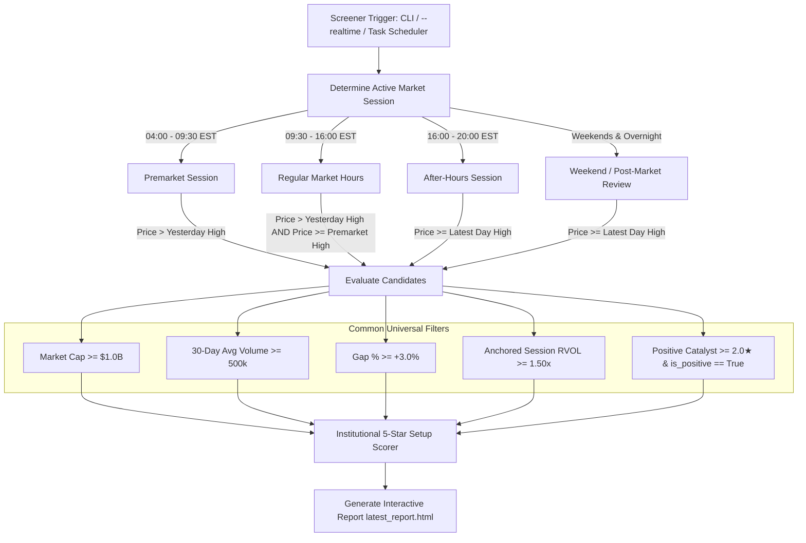

# Institutional Real-Time Intelligence Screener - System Architecture & Specification

## Living Document Version History

| Version | Date | Changes & Enhancements | Author / Status |
|---|---|---|---|
| **v1.0.0** | 2026-08-20 | Initial automated premarket screening engine @ 8:45 AM EST. Dual Day & Swing trading watchlists. Macro Regime (01_macro-regime.md) parser. | Production |
| **v2.0.0** | 2026-08-21 | Added 45-Day Aggregated Institutional Options Structure (GEX, Call/Put Walls, Whale Flow Drawers) and 100% Dynamic Analyst Actions discovery. Fixed pagination. | Production |
| **v3.0.0** | 2026-08-22 | 24/7 Real-Time Screener, Multi-session RVOL & breakout price gatekeeping, NLP Catalyst Intelligence, 17 columns, sorting. | Production |
| **v3.1.0** | 2026-08-22 | **Cross-Asset Futures, Market Breadth & Multi-Asset Model**: Ingested live ES, NQ, Gold, BTC. Integrated TradingView breadth aggregator (A/D %, 52W NH/NL, % > SMA50/200). Formulated 4-asset allocation engine (Equity, Gold, Bitcoin, Cash) and dynamic sector caps. | Active Standard |

---

## 1. System Overview
A real-time automated institutional market screening engine and interactive dashboard running 24/7. The system continuously evaluates US equities against institutional criteria, calculates statistical setup quality scores, arbitrates multi-source news catalysts, maps 45-day options gamma structures, and produces standalone interactive HTML and terminal reports with zero fake data.

---

## 2. Multi-Session Gatekeeping Protocol

---

## 3. Core Watchlist Schema (17 Institutional Columns)

The primary watchlist contains 17 standardized columns:

| Column # | Field Name | Data Source / Calculation | Format Example |
|---|---|---|---|
| 1 | **Ticker** | TradingView Scanner | Clickable Finviz Link `NVDA` |
| 2 | **Setup Score** | Setup Scorer Algorithm | `★★★★☆ 4.2★` (Pill Badge) |
| 3 | **Price** | Session Real-Time Price | `$125.50` |
| 4 | **Gap %** | % Change vs Previous Close | `+4.80%` (Green Pill) |
| 5 | **% from Open** | $(P - \text{Open}) / \text{Open} \times 100$ | `+1.20%` / `-0.50%` |
| 6 | **RVOL** | 20-Day Anchored Session RVOL | `2.40x` (Green if $\ge 2.0\text{x}$) |
| 7 | **Last Day High** | Yesterday High + Distance % | `$122.00 (-2.8%)` |
| 8 | **Premarket High** | Premarket High + Distance % | `$124.00 (-1.2%)` |
| 9 | **Sector** | TradingView Classification | `Technology` |
| 10 | **Industry** | TradingView Classification | `Semiconductors` |
| 11 | **Catalyst** | NLP News Classifier (1★-5★) | `[Earnings] ⭐⭐⭐⭐⭐ Beat & Raise Q2` |
| 12 | **Analyst Rating** | Finviz/Yahoo Feed | `Upgrade: Strong Buy ($145)` |
| 13 | **Call Wall** | 45-Day GEX Magnet + Distance % | `$135.00 (+7.6%)` |
| 14 | **Put Wall** | 45-Day GEX Floor + Distance % | `$115.00 (-8.4%)` |
| 15 | **Gamma Flip** | Zero-Gamma Level + Distance % | `$120.00 (-4.4%)` |
| 16 | **Gamma Skew** | Net GEX Delta Bias | `Bullish (Long Gamma)` |
| 17 | **P/C Ratio** | 45-Day Options Vol Ratio | `0.45` |

---

## 4. Module Map & Responsibilities

- `config.py`: Thresholds, timezone definitions, refresh intervals, session hour boundaries.
- `run_screener.py`: Multi-threaded orchestrator, session detection, real-time loop runner.
- `sources/tradingview_scanner.py`: Screener engine querying all US equities via TradingView API.
- `sources/rvol_calculator.py`: Multi-session anchored Relative Volume engine (20-day historical 5m bars).
- `sources/catalyst_detector.py`: Multi-stream news classifier, 1★-5★ rating, dilution disqualifier.
- `sources/setup_scorer.py`: Institutional 5-Star Setup Quality index calculator.
- `sources/macro_regime.py`: Real-time implementation of `01_macro-regime.md` rules and portfolio matrix.
- `sources/economic_calendar.py`: Real-time US economic events from Finviz and ForexFactory.
- `sources/earnings_calendar.py`: Finviz 3-day active earnings calendar (Yesterday AMC, Today BMO/AMC, Tomorrow).
- `sources/analyst_ratings.py`: Dynamic discovery of yesterday & today analyst upgrades and price targets.
- `sources/options_flow.py`: 45-day aggregated options structure, GEX, Call/Put walls, whale flow drawers.
- `sources/fallback_manager.py`: Resilient HTTP connection pool, exponential backoff, rate limit handling.
- `reporter/html_generator.py`: Generates responsive dark-mode interactive HTML report with client-side sorting & pagination.
- `reporter/terminal_viewer.py`: ASCII-safe rich terminal console dashboard.
- `tests/test_suite.py`: Comprehensive unit test suite covering all modules.
