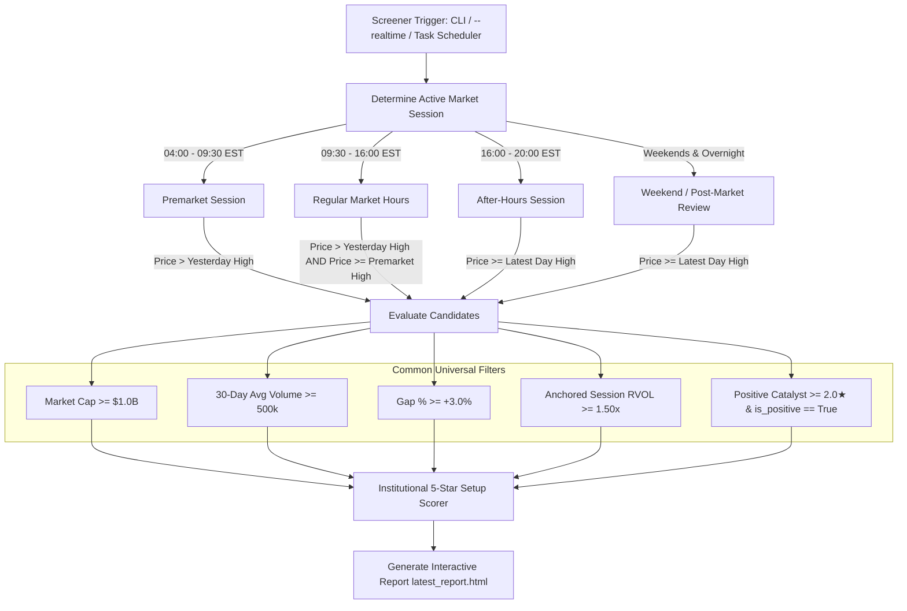

# Institutional Real-Time Intelligence Screener - System Architecture & Specification

## Living Document Version History

| Version | Date | Changes & Enhancements | Author / Status |
|---|---|---|---|
| **v1.0.0** | 2026-08-20 | Initial automated premarket screening engine @ 8:45 AM EST. Dual Day & Swing trading watchlists. Macro Regime (01_macro-regime.md) parser. | Production |
| **v2.0.0** | 2026-08-21 | Added 45-Day Aggregated Institutional Options Structure (GEX, Call/Put Walls, Whale Flow Drawers) and 100% Dynamic Analyst Actions discovery. Fixed pagination. | Production |
| **v3.0.0** | 2026-08-22 | 24/7 Real-Time Screener, Multi-session RVOL & breakout price gatekeeping, NLP Catalyst Intelligence, 17 columns, sorting. | Production |
| **v3.1.0** | 2026-08-22 | **Cross-Asset Futures, Market Breadth & Multi-Asset Model**: Ingested live ES, NQ, Gold, BTC. Integrated TradingView breadth aggregator (A/D %, 52W NH/NL, % > SMA50/200). Formulated 4-asset allocation engine (Equity, Gold, Bitcoin, Cash) and dynamic sector caps. | Production |
| **v4.6.0** | 2026-08-30 | **Macro Regime Assessment v3.0 Full Integration Plan**: Integrated complete `01_marcro-regime-new.md` framework. Added Section 0.5 Completeness Gatekeeper, continuous sigmoidal 0-100 Top/Bottom scores, dual-horizon Intraday vs Swing differentiation, Bayesian 4-quadrant scenario matrix, and interactive HTML cockpit. | Production |
| **v5.0.0** | 2026-09-03 | **Phase 3 System Daemon & Execution Automation**: Integrated autonomous multi-session daemon (`scheduler/system_daemon.py`), Windows Task Scheduler registration (`register_windows_tasks.ps1`), Fidelity Active Trader Pro (ATP) OTOCO Bracket & Web Fast ticket engine (`sources/order_execution_desk.py`), Multi-Channel Alert Dispatcher (`sources/alert_dispatcher.py`) with Telegram Bot Webhook API & desktop toasts, and live Cockpit session telemetry. | Production |
| **v6.0.0** | 2026-09-04 | **Phase 4 Alpha Attribution Lake & Continuous Parameter Auto-Tuning**: Delivered DuckDB analytical lake (`sources/attribution_lake.py`, `data/attribution_lake.duckdb`) with 73 synthesized baseline holdings, toggleable forward incremental fills (default OFF, user override supported), Skill 08 Brinson-Fachler Factor Attribution (`sources/attribution_engine.py`), and continuous parameter auto-tuning (`sources/parameter_tuner.py`) with hard safety clamps [0.50x, 1.35x]. Integrated 6th primary tab in web cockpit (`reporter/html_generator.py`). | Production |
| **v7.0.0** | 2026-09-05 | **Phase 5 Paper Trading Simulator, Drawdown Circuit Breakers & Stress Testing Engine**: Delivered Unified Paper Execution Simulator (`sources/order_router.py`, `data/paper_trading.duckdb`) with realistic slippage, Alpaca free-tier REST gateway, autonomous intraday drawdown circuit breakers (`sources/risk_circuit_breakers.py`: -1.0% Warning, -2.0% De-Risk, -3.0% Kill-Switch), 10,000-path Monte Carlo forward cones & 6 crisis historical replay engine (`sources/stress_testing_engine.py`), and 7th Primary Cockpit Tab (`🛡️ Risk Governance & Stress Testing`). | Production |
| **v9.0.0** | 2026-09-19 | **Phase 8 Upstream Thematic Discovery & Depth4 Macro Cascade Engine**: Delivered `sources/thematic_intelligence.py` integrating 4-Layer Durability Gate (`01_trend-identification.md`), Depth4 D1–D4 Causal Cascades (`https://depth4.com/`) with Unpriced Room % calculation, Era Alpha platform compounding evaluator (`02_era-alpha.md`), and Layer 2–3 physical chokepoint arbitrage with $P/S \le 30\times$ valuation gate (`02_bottleneck-hunter.md`). Added Antigravity skills `/bottleneck-hunter`, `/era-alpha`, and `/trend-discovery`. | Production |
| **v10.0.0** | 2026-09-22 | **Phase 9-11 Institutional v2.0 Milestone Release**: Delivered Buffett 6-Gate Pre-Purchase Verification Audit & 4-Master Consensus Desk with Beneish M-Score formula correction, SGI hyper-growth cap, 4Q rolling Sloan accruals, and multi-signal confluence veto gating; codified exact Multi-Session RVOL Anchors across all 4 sessions (00:00 Midnight, 09:30 AM, 16:30 PM, Friday 16:30 PM); instituted Hands-Off Earnings Review Daemon; packaged Antigravity Institutional Skills ecosystem (`/bottleneck-hunter`, `/era-alpha`, `/trend-discovery`, `/news-pulse`, `/deep-research`, `/earnings-review`); and verified 100% green test suite. | Active Production v2.0 |

---

## 1. System Overview
A real-time automated institutional market screening engine and interactive dashboard running 24/7. The system continuously evaluates US equities against institutional criteria, calculates statistical setup quality scores, arbitrates multi-source news catalysts, maps 45-day options gamma structures, and produces standalone interactive HTML and terminal reports with zero fake data.

---

## 2. Multi-Session Gatekeeping Protocol

---

## 3. Core Watchlist Schema (17 Institutional Columns)

The primary watchlist contains 17 standardized columns:

| Column # | Field Name | Data Source / Calculation | Format Example |
|---|---|---|---|
| 1 | **Ticker** | TradingView Scanner | Clickable Finviz Link `NVDA` |
| 2 | **Setup Score** | Setup Scorer Algorithm | `★★★★☆ 4.2★` (Pill Badge) |
| 3 | **Price** | Session Real-Time Price | `$125.50` |
| 4 | **Gap %** | % Change vs Previous Close | `+4.80%` (Green Pill) |
| 5 | **% from Open** | $(P - \text{Open}) / \text{Open} \times 100$ | `+1.20%` / `-0.50%` |
| 6 | **RVOL** | 20-Day Anchored Session RVOL | `2.40x` (Green if $\ge 2.0\text{x}$) |
| 7 | **Last Day High** | Yesterday High + Distance % | `$122.00 (-2.8%)` |
| 8 | **Premarket High** | Premarket High + Distance % | `$124.00 (-1.2%)` |
| 9 | **Sector** | TradingView Classification | `Technology` |
| 10 | **Industry** | TradingView Classification | `Semiconductors` |
| 11 | **Catalyst** | NLP News Classifier (1★-5★) | `[Earnings] ⭐⭐⭐⭐⭐ Beat & Raise Q2` |
| 12 | **Analyst Rating** | Finviz/Yahoo Feed | `Upgrade: Strong Buy ($145)` |
| 13 | **Call Wall** | 45-Day GEX Magnet + Distance % | `$135.00 (+7.6%)` |
| 14 | **Put Wall** | 45-Day GEX Floor + Distance % | `$115.00 (-8.4%)` |
| 15 | **Gamma Flip** | Zero-Gamma Level + Distance % | `$120.00 (-4.4%)` |
| 16 | **Gamma Skew** | Net GEX Delta Bias | `Bullish (Long Gamma)` |
| 17 | **P/C Ratio** | 45-Day Options Vol Ratio | `0.45` |

---

## 4. Module Map & Responsibilities

- `config.py`: Thresholds, timezone definitions, refresh intervals, session hour boundaries.
- `run_screener.py`: Multi-threaded orchestrator, session detection, real-time loop runner.
- `sources/tradingview_scanner.py`: Screener engine querying all US equities via TradingView API.
- `sources/rvol_calculator.py`: Multi-session anchored Relative Volume engine (20-day historical 5m bars).
- `sources/catalyst_detector.py`: Multi-stream news classifier, 1★-5★ rating, dilution disqualifier.
- `sources/setup_scorer.py`: Institutional 5-Star Setup Quality index calculator.
- `sources/macro_regime.py`: Real-time implementation of `01_macro-regime.md` rules and portfolio matrix.
- `sources/economic_calendar.py`: Real-time US economic events from Finviz and ForexFactory.
- `sources/earnings_calendar.py`: Finviz 3-day active earnings calendar (Yesterday AMC, Today BMO/AMC, Tomorrow).
- `sources/analyst_ratings.py`: Dynamic discovery of yesterday & today analyst upgrades and price targets.
- `sources/options_flow.py`: 45-day aggregated options structure, GEX, Call/Put walls, whale flow drawers.
- `sources/fallback_manager.py`: Resilient HTTP connection pool, exponential backoff, rate limit handling.
- `reporter/html_generator.py`: Generates responsive dark-mode interactive HTML report with client-side sorting & pagination.
- `reporter/terminal_viewer.py`: ASCII-safe rich terminal console dashboard.
- `tests/test_suite.py`: Comprehensive unit test suite covering all modules.

---

## 5. Macro Regime Assessment v3.0 Implementation Blueprint

### 5.1 Architecture & Pipeline Delivery (Phased Plan)
1. **Phase 1: Ingestion & Multi-Source Verification (`sources/macro_regime.py`)**:
   - Ingest FRED series: `T10Y3M` (10y-3m), `T10Y2Y` (10y-2y), `M2SL` (M2 YoY Growth), `BAMLH0A0HYM2` (HY Credit Spread), `WALCL` (Fed Balance Sheet).
   - Ingest CBOE & Exchange feeds: `^VIX`, `^VIX3M` (Term structure), `^TICK` (NYSE TICK), `^ADD` (NYSE Advance/Decline), Put/Call Ratio (`PCR`).
   - Ingest Debasement feeds: `GC=F` (Gold), `BTC-USD` (Bitcoin), 30-day rolling correlation, Crypto Fear & Greed API (Alternative.me), MVRV Z-Score estimator.
   - Enforce Section 0.5 Data Completeness Gatekeeper ($0-2$ minor, $3-5$ reduced conviction, $6+$ halt).
2. **Phase 2: Quant Scoring & Probability Engines (`sources/macro_regime.py`)**:
   - Continuous Sigmoidal Top Detection Score ($0-100$) across 9 weighted factors.
   - Continuous Sigmoidal Bottom Detection Score ($0-100$) across 9 weighted factors.
   - Market Internals 4-factor composite score ($1.0 - 5.0$).
   - 4-Quadrant Bayesian Macro Scenario Probability Matrix (Goldilocks, Reflation, Stagflation, Deflation, Regime Failure).
   - Section 7 Alert Rules (`🔴 TOP ALERT`, `🟢 BOTTOM ALERT`, `⚠️ VOLATILITY TRAP`, `⚠️ DEBASEMENT HEDGE ALERT`).
3. **Phase 3: Portfolio Manager & Scorer Coupling**:
   - Dynamic Risk Multiplier ($0.50x - 1.20x$) scaling candidate scores in `sources/setup_scorer.py`.
   - Dynamic Sector Caps (Tech, Financials, Energy/Defense, Defensives, Cash) enforced in `sources/portfolio_manager.py`.
4. **Phase 4: Full-Stack HTML Visualization (`reporter/html_generator.py`)**:
   - Dual Top/Bottom Speedometer / Arc Gauges with conviction badges.
   - Live Market Internals Cockpit (TICK needle $\pm 1500$, ADD meter, VOLD ratio).
   - Debasement Separation & Correlation Radar.
   - 4-Quadrant Scenario Probability Distribution Bar.
   - Standardized Section 8 Markdown Export for AI skill verification and CLI output.
5. **Phase 5: Quality Gate Test Suite (`tests/test_macro_v3.py`)**:
   - Comprehensive unit and integration tests verifying all 9 top/bottom factors, gatekeeper threshold enforcement, allocation sanity ($100\%$ sum), and live feed resilience.

---

## 6. Phase 6: Setup-Thesis Lifecycle & News Pulse Implementation Blueprint

### 6.1 Subsystem Architecture & Deliverables
1. **Module 1: 2-Factor News Pulse Attribution Engine (`sources/news_pulse.py`)**:
   - Calculates rolling 60-day OLS betas for SPY and Sector ETFs.
   - Computes Idiosyncratic Residual Return $\epsilon_{i,t} = R_{i,t} - (\alpha + \beta_{\text{SPY}} R_{\text{SPY}} + \beta_{\text{Sec}} R_{\text{Sec}})$.
   - Computes multi-factor Signal Score ($0-100$) across Relevance, Novelty, Authority, and Sentiment.
   - Evaluates Stealth Event condition ($Z_\epsilon \ge 2.0$ with Signal $<50$).
   - Manages four automated triggers: Portfolio Movers ($|R_{1d}| \ge 3.5\%$), Post-Earnings Divergence, Breakout Verification, and Stealth Flow.
2. **Module 2: Setup-Thesis Lifecycle State Machine (`sources/setup_thesis_lifecycle.py`)**:
   - Manages two-stage progression: Stage 1 (`TACTICAL_SETUP`) $\to$ Stage 2 (`CORE_THESIS`).
   - Automatically promotes trades reaching Target 1 (+2.0R trim) or held $\ge 10$ days in Stage 2 trend with healthy Sloan accruals.
   - Evaluates Composite Health Score ($0-10$) and computes linear trim percentages: $\text{Trim \%} = (6.0 - H) \times 10\%$.
   - Integrates volatility-adjusted dynamic stops ($2.0\times\text{ATR}$ scaled by Sector and IV Rank).
3. **Module 3: Database Lake & Sync (`sources/thesis_lake.py`)**:
   - Creates and populates DuckDB tables: `news_pulse_events`, `thesis_contracts`, `thesis_drift_history`.
   - Synchronizes live fields (`lifecycle_stage`, `thesis_health_score`, `drift_status`) into SQLite `position_tracker`.
4. **Module 4: Trade Execution Desk Routing (`sources/order_execution_desk.py`)**:
   - Routes Broken Theses ($H < 3.0$) and Fatal Red-Lines to Tier 1 Immediate Sells.
   - Routes Stealth Surges ($Z_\epsilon \ge 2.0$) to Tier 2 Risk Alerts.
   - Routes Weakened Thesis trims to Tier 3 Profit Targets & Trims.
5. **Module 5: Cockpit Screen 8 & Drawer Upgrades (`reporter/html_generator.py`)**:
   - Builds Tab 8: `📜 Thesis Lifecycle & News Pulse Terminal` with Fleet Health Matrix, Drift Radar, and News Stream.
   - Upgrades Row Drawer Card 3 with News Signal Scores and Card 4 with Lifecycle & Health Score badges.
6. **Module 6: Autonomous 3-Session Daemon Integration (`scheduler/system_daemon.py`)**:
   - Premarket (08:00 ET): overnight news signal scoring and PR pump filtering.
   - Intraday (09:30 - 16:00 ET): portfolio mover attribution and stealth surveillance.
   - Postmarket (16:30 ET): 10-Q ingestion, post-earnings divergence calculation, and thesis drift updates.
7. **Module 7: Test Suite (`tests/test_thesis_news_lifecycle.py`)**:
   - Unit and integration tests verifying beta residuals, stealth triggers, two-stage promotion, and execution desk waterfall routing.

---

## 7. Phase 2: Interactive UI-Driven Portfolio Desk & Flow Multiplier Implementation

### 7.1 Deliverables & Technical Changes
1. **Interactive UI Desk (`reporter/html_generator.py`)**:
   - Implemented `trimPortfolioPosition(symOrEl, pct)` client JS function with automated NAV, cash, weight, stop loss, and concentration tier recalculation via `recomputePortfolioMetrics()`.
   - Added inline `[✂️ 50%]` quick trim button to every holding row in both Python template and reactive client DOM.
   - Added direct web `[➕ Add Position]` button for adding custom assets with automatic quote lookup from watchlists.
   - Added `[💾 Save to Disk (portfolio.json)]` button with modern File System Access API (`showSaveFilePicker`) and instant fallback to download.
2. **Multi-Context Flow Multiplier ($M_{\text{flow}}$) Sizing Integration**:
   - **Engine Layer (`sources/sector_flow_engine.py`)**:
     - Assigned discrete flow multipliers: $1.25\times$ (Accumulation/Expansion, score $\ge 54.0$), $1.00\times$ (Neutral, score $46.0 - 53.9$), $0.75\times$ (Rotating Out, score $32.0 - 45.9$), $0.70\times$ (Distribution, score $< 32.0$).
     - Attached `flow_multiplier` and `flow_mult_str` to sector and stock flow detail outputs.
   - **Portfolio Manager (`sources/portfolio_manager.py`)**:
     - Enriched positions with `p["sector_flow_mult"]` in `enrich_live_metrics()`.
   - **Execution Desk (`sources/portfolio_monitor_engine.py`)**:
     - Action Desk displays full formulaic sizing breakdown: `Base Shares × Regime × Flow Mult = Final Shares ($Risk)`.
   - **Portfolio Live Book (`reporter/html_generator.py`)**:
     - Holding rows display parent ETF badge with explicit flow multiplier: `[XLK: 1.25x 🟢]`, `[XLE: 0.70x 🔴]`.
   - **4D Macro & Allocations (`reporter/html_generator.py`)**:
     - 11 GICS Sector Heatmap Table features dedicated `Flow Mult (M_flow)` column with strategy tilts (+25% / -30%).
