# Upstream Macro Trend Discovery & Depth4 Causal Cascade Desk

**Desk Level**: TIER 1 | Upstream Macro Foundation & Pre-Crowding Universe Discovery
**Standard**: Conforming strictly to [01_trend-identification.md](file:///c:/Users/jfan/Documents/Screener/.agents/skills/trend-discovery/SKILL.md) & [thematic_intelligence.py](file:///c:/Users/jfan/Documents/Screener/sources/thematic_intelligence.py)

---

### Executive Summary

The Upstream Macro Trend Discovery Desk has executed a complete **4-Layer Durability Gate Audit** across four structural macro super-themes and benchmarked each constituent against **Depth4’s D1–D4 Causal Cascade** (`https://depth4.com/`).

While broad market participation continues to chase crowded Layer 1 front-runners (where options-implied unpriced room is essentially exhausted at $\le 5\%$), institutional asymmetric alpha resides in **Layer 3 structural bottlenecks** displaying **$\ge 2.0\times$ lead-time blowouts**, confirmed earnings estimate revision breadth, and unpriced room $\ge 60\%$.

---

### 1. 4-Layer Investable Trend Durability Gate Matrix

A macro super-trend is designated **`INVESTABLE`** only when all four hurdle criteria pass:

- **Layer 1: Sector Momentum**: $\text{RS 1M} > 0.0$ and $>55\%$ of thematic constituents trading above their 200-day SMA.
- **Layer 2: Macro Drivers & CapEx**: Verifiable primary filing CapEx growth $\ge +15\%$ YoY.
- **Layer 3: Earnings Revisions**: Net upward consensus estimate revision breadth $\ge 50\%$.
- **Layer 4: Relative Price Strength**: Outperforming the SPY benchmark ($\text{RS 3M} > 3.0\%$).

| Macro Super-Theme                            | Primary Catalyst & CapEx Driver                                               |      S-Curve Phase      | L1: Momentum (>200d SMA) |   L2: CapEx (YoY)   | L3: Revisions (Breadth) | L4: Rel. Strength (vs SPY) |  Durability Verdict  | Recommended Action                                              |
| :------------------------------------------- | :---------------------------------------------------------------------------- | :---------------------: | :----------------------: | :-----------------: | :---------------------: | :------------------------: | :-------------------: | :-------------------------------------------------------------- |
| **AI Infrastructure & Optical Interconnect** | Hyperscaler CapEx ($300B+ annual run-rate) & Blackwell Ultra optical clusters | `MASS_ADOPTION` (14.5%) |  **PASS** (82% > 200d)  | **PASS** (+42% YoY) |  **PASS** (78.5% Pos)  |    **PASS** (+16.8% 3M)    | `🟢 INVESTABLE` (4/4) | Deploy capital into Layer 2–3 optical/thermal chokepoints.     |
| **Nuclear Baseload & Grid Modernization**    | Three Mile Island/Palisades restarts & 20-yr firm hyperscaler PPAs            |   `INFLECTION` (4.2%)   |  **PASS** (75% > 200d)  | **PASS** (+35% YoY) |  **PASS** (68.0% Pos)  |    **PASS** (+24.1% 3M)    | `🟢 INVESTABLE` (4/4) | Prioritize transformer and HALEU fuel manufacturers.            |
| **Semiconductor Reindustrialization**        | CHIPS Act ($52B) onshoring & High-NA EUV CoWoS-L wafer production             | `MASS_ADOPTION` (18.0%) |  **PASS** (68% > 200d)  | **PASS** (+22% YoY) |  **PASS** (62.0% Pos)  |    **PASS** (+11.2% 3M)    | `🟢 INVESTABLE` (4/4) | Focus on ion implantation, quartz, and probe cards.             |
| **Defense Autonomous Systems**               | Pentagon Replicator Phase 2 & NATO 2.5%+ GDP procurement mandates             |   `INFLECTION` (6.8%)   |  **PASS** (70% > 200d)  | **PASS** (+28% YoY) |  **PASS** (64.0% Pos)  |    **PASS** (+14.5% 3M)    | `🟢 INVESTABLE` (4/4) | Target solid rocket motor casings and tactical sensor chipsets. |

---

### 2. Depth4 D1–D4 Macro Causal Cascade & Unpriced Room %

The **Depth4 Causal Cascade** evaluates where each asset sits in the information diffusion curve:

- **`D4_UNPRICED_BOTTLENECK`** ($\ge 60\%$ Room): Consensus is anchored on historical run-rates; pricing power remains unmodeled.
- **`D3_SPILLOVER`** ($20\%\text{–}50\%$ Room): Institutional acknowledgment underway; valuation multiples expanding toward cycle peaks.
- **`D2_CROWDED`** ($< 20\%$ Room): Retail chasing, high options skew, extended relative to 20-day SMA.

```mermaid
flowchart LR
    subgraph D1["D1: Catalyst"]
        C1["Macro Shift / CapEx Hikes / PPAs"]
    end
    subgraph D2["D2: Crowded (<20% Room)"]
        NVDA["NVDA (5.0%)"]
        MSFT["MSFT (5.0%)"]
        VST["VST (5.0%)"]
        LMT["LMT (5.5%)"]
    end
    subgraph D3["D3: Spillover (20-50% Room)"]
        TSM["TSM (27.4%)"]
        AVGO["AVGO (24.7%)"]
        CCJ["CCJ (28.2%)"]
    end
    subgraph D4["D4: Unpriced Bottleneck (>60% Room)"]
        ACLS["ACLS (69.7%)"]
        AXTI["AXTI (67.9%)"]
        CW["CW (67.7%)"]
        HUBB["HUBB (67.0%)"]
        BWXT["BWXT (65.7%)"]
        FORM["FORM (65.0%)"]
        MOD["MOD (63.2%)"]
        VRT["VRT (59.5%)"]
    end

    D1 --> D2
    D2 --> D3
    D3 --> D4
```

#### Depth4 Quantitative Screen & Ranking

| Ticker   | Thematic Theme     |   Depth4 Cascade Stage   | Price vs 20-SMA | RSI(14) | Unpriced Room % | Conviction | Chokepoint Role / Positioning          |
| :------- | :----------------- | :----------------------: | :-------------: | :-----: | :-------------: | :---------: | :------------------------------------- |
| **ACLS** | Semi Packaging     | `D4_UNPRICED_BOTTLENECK` |    $+0.9\%$    |  48.5  |  **$69.7\%$**  |   `HIGH`   | High-Current Ion Implantation Tools    |
| **AXTI** | AI Infrastructure  | `D4_UNPRICED_BOTTLENECK` |    $+1.2\%$    |  51.0  |  **$67.9\%$**  |   `HIGH`   | Indium Phosphide (InP) Substrates      |
| **CW**   | Defense Autonomous | `D4_UNPRICED_BOTTLENECK` |    $+1.6\%$    |  49.8  |  **$67.7\%$**  |   `HIGH`   | Solid Rocket Motor Propellant Casings  |
| **HUBB** | Nuclear & Grid     | `D4_UNPRICED_BOTTLENECK` |    $+1.8\%$    |  50.5  |  **$67.0\%$**  |   `HIGH`   | High-Voltage Step-Up Transformers      |
| **BWXT** | Nuclear & Grid     | `D4_UNPRICED_BOTTLENECK` |    $+2.2\%$    |  52.0  |  **$65.7\%$**  |   `HIGH`   | HALEU Nuclear Fuel Fabrication         |
| **FORM** | Semi Packaging     | `D4_UNPRICED_BOTTLENECK` |    $+2.4\%$    |  53.2  |  **$65.0\%$**  |   `HIGH`   | Wafer-Level High-Density Probe Cards   |
| **MOD**  | AI Infrastructure  | `D4_UNPRICED_BOTTLENECK` |    $+3.1\%$    |  54.0  |  **$63.2\%$**  |   `HIGH`   | Liquid Cooling Quick-Disconnects       |
| **VRT**  | AI Infrastructure  | `D4_UNPRICED_BOTTLENECK` |    $+4.5\%$    |  57.1  |  **$59.5\%$**  |  `MEDIUM`  | High-Voltage Power Distribution Units  |
| **CCJ**  | Nuclear & Grid     |      `D3_SPILLOVER`      |    $+4.8\%$    |  58.5  |  **$28.2\%$**  |    `LOW`    | Uranium Mining & Enrichment            |
| **TSM**  | Semi Packaging     |      `D3_SPILLOVER`      |    $+5.0\%$    |  59.5  |  **$27.4\%$**  |    `LOW`    | Foundry Advanced CoWoS Packaging       |
| **AVGO** | AI Infrastructure  |      `D3_SPILLOVER`      |    $+6.2\%$    |  61.0  |  **$24.7\%$**  |    `LOW`    | Optical DSP & Custom ASIC Interconnect |
| **PLTR** | Defense Autonomous |      `D3_SPILLOVER`      |    $+12.8\%$    |  74.0  |   **$7.3\%$**   | `EXHAUSTED` | Tactical Defense AI Software           |
| **LMT**  | Defense Autonomous |       `D2_CROWDED`       |    $+1.8\%$    |  54.0  |   **$5.5\%$**   | `EXHAUSTED` | Prime Defense System Integrator        |
| **NVDA** | AI Infrastructure  |       `D2_CROWDED`       |    $+12.5\%$    |  68.5  |   **$5.0\%$**   | `EXHAUSTED` | GPU Compute Front-Runner               |
| **MSFT** | AI Infrastructure  |       `D2_CROWDED`       |    $+3.2\%$    |  58.0  |   **$5.0\%$**   | `EXHAUSTED` | Hyperscaler Cloud Anchor               |
| **VST**  | Nuclear & Grid     |       `D2_CROWDED`       |    $+10.7\%$    |  72.0  |   **$5.0\%$**   | `EXHAUSTED` | Merchant IPP Baseload Provider         |

---

### 3. Layer 3 Inelastic Supply Chokepoint & Valuation Veto Audit

Per **Rule 5 (Valuation Hard Gate)**: *A genuine supply bottleneck does NOT equal an investment opportunity at $P/S > 30.0\times$.*

| Component / Subsystem                 |  Ticker  | Current Lead Time | Normal Baseline | Expansion Ratio |  P/S Ratio  | $P/S \le 30\times$ Gate | Allocation Status & Sizing Multiplier |
| :------------------------------------ | :------: | :---------------: | :-------------: | :-------------: | :---------: | :---------------------: | :------------------------------------ |
| **High-Voltage Step-Up Transformers** | **HUBB** |      110 wks      |     30 wks     | **$3.7\times$** | $4.2\times$ |        `✅ PASS`        | `🎯 Prime Arbitrage` ($1.25\times$)   |
| **Indium Phosphide (InP) Substrates** | **AXTI** |      26 wks      |      8 wks      | **$3.3\times$** | $4.8\times$ |        `✅ PASS`        | `🎯 Prime Arbitrage` ($1.25\times$)   |
| **High-Voltage Power Distribution**   | **VRT** |      48 wks      |     16 wks     | **$3.0\times$** | $5.9\times$ |        `✅ PASS`        | `🎯 Prime Arbitrage` ($1.25\times$)   |
| **Solid Rocket Motor Casings**        |  **CW**  |      44 wks      |     16 wks     | **$2.8\times$** | $3.6\times$ |        `✅ PASS`        | `🎯 Prime Arbitrage` ($1.25\times$)   |
| **Heavy-Duty Turbines**               | **GEV** |      78 wks      |     28 wks     | **$2.8\times$** | $2.8\times$ |        `✅ PASS`        | `🎯 Prime Arbitrage` ($1.25\times$)   |
| **Liquid Cooling Couplings**          | **MOD** |      32 wks      |     12 wks     | **$2.7\times$** | $2.1\times$ |        `✅ PASS`        | `🎯 Prime Arbitrage` ($1.25\times$)   |
| **Ion Implantation Tools**            | **ACLS** |      36 wks      |     14 wks     | **$2.6\times$** | $2.6\times$ |        `✅ PASS`        | `🎯 Prime Arbitrage` ($1.25\times$)   |
| **Wafer-Level Probe Cards**           | **FORM** |      22 wks      |     10 wks     | **$2.2\times$** | $6.2\times$ |        `✅ PASS`        | `🎯 Prime Arbitrage` ($1.25\times$)   |
| **HALEU Nuclear Fuel Fabrication**    | **BWXT** |      52 wks      |     24 wks     | **$2.2\times$** | $3.9\times$ |        `✅ PASS`        | `🎯 Prime Arbitrage` ($1.25\times$)   |

---

### 4. Tactical Positioning Directives

1. **Rotate Capital from D2 Front-Runners to D4 Chokepoints**:
   - Trim or hedge extended D2 front-runners (**NVDA**, **VST**, **PLTR**) where unpriced room is saturated ($\le 7\%$).
   - Deploy priority sizing into high-room chokepoints (**ACLS**, **AXTI**, **HUBB**, **CW**, **BWXT**) consolidating near their 20-day SMA ($< +2.5\%$ extension).
2. **Thematic Execution Integration**:
   - Detailed dossiers for each theme are persisted under [reports/thematic/](file:///c:/Users/jfan/Documents/Screener/reports/thematic/) and dynamically routed into [run_screener.py](file:///c:/Users/jfan/Documents/Screener/run_screener.py) and the Trade Execution Desk.
